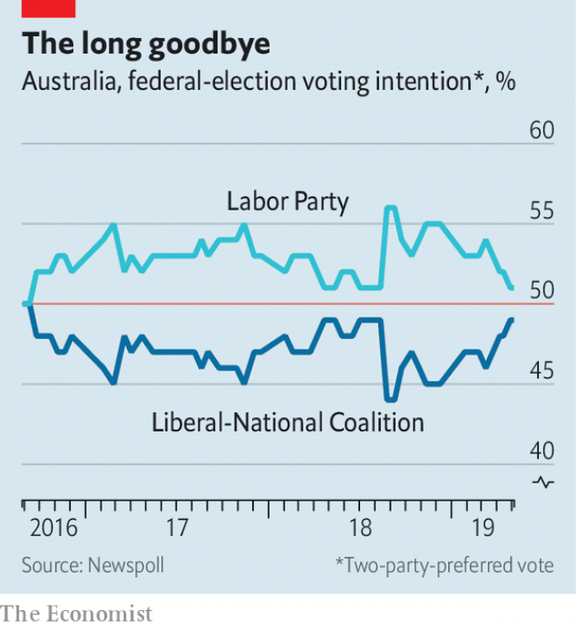

###### No takers

# Australia’s voters are poised to punish the government 

##### Squabbling, scare-mongering and policy paralysis have gone down badly 

 

> May 9th 2019 

IT IS BECOMING the party of mishaps, if not of mean-spiritedness. Ahead of an election on May 18th the ruling, right-of-centre Liberal Party has been obliged to disavow two of its parliamentary candidates for Islamophobia. Another stepped down after it emerged that he had called on the party to expel gay members. A fourth candidate was censured, but not dumped, for suggesting that women lack the “business skills” to earn as much as men. 

Australia’s main opposition party, Labor, faces similar scandals: it ditched two of its would-be MPs this month for sexist and anti-Semitic slurs. But it does not already have a reputation for prejudice and division. Last year the Liberals’ parliamentary caucus toppled its moderate leader, Malcolm Turnbull, in a right-wing coup. Female Liberal MPs have since made headlines by accusing their male colleagues of intimidation and misogyny. The new leadership has tried to revive the party’s prospects by fanning paranoia about the trickle of illegal immigrants who attempt to reach Australia’s northern shores by boat from Indonesia and by promising to cut legal immigration, too. It also insists that Labor’s plans to reduce emissions of greenhouse gases will wreck the economy. 

Both themes have brought the Liberals and their coalition partners, the Nationals, success in the past. But voters seem less receptive this time. The Liberals lost the recent by-election for Mr Turnbull’s previously safe seat to an independent who campaigned for more resolute action on climate change and more humane treatment of refugees. The coalition has been lagging behind in the polls for three years (see chart). Defections and the loss of Mr Turnbull’s seat have already cost the government its majority. It does not just have to contend with Labor: several more conservative strongholds are under threat from independents. 

 

Although the economy has grown without interruption for 28 years, many feel left behind. House prices have soared, while wages have grown more slowly and, recently, barely at all. The Liberals’ solution is to slash income taxes, yet its cuts would benefit mostly the wealthy, argues John Daley of the Grattan Institute, a think-tank. 

Labor has promised to match the Liberals’ tax cuts for the middle class and expand them for low-earners. But it wants to close loopholes that go mainly “to the top end of town”, as Mr Shorten puts it. That includes paring back lavish tax breaks for investing in property and the even more generous treatment of income from dividends for certain taxpayers. The money would go on health care and education, as well as an expansion of subsidies for child care. 

All this is sensible enough, but does not seem to energise many voters. Many are up in arms about climate change, however. Those living on drought-afflicted farms or on the coast by the heat-stricken Great Barrier Reef feel its effects most keenly, but even urban voters are anxious. Yet the Liberals have axed funding for research on it and scrapped initiatives to counter it. Emissions of greenhouse gases have risen, but the government has used accounting tricks to pretend that it is on track to reduce them as promised. Its plan to enshrine reduction targets for power generation in law was jettisoned with Mr Turnbull. 

Australia’s politicians have been at war over climate change for a decade. The Liberals dismantled a carbon tax put in place by Labor as soon as they came to power six years ago. Labor says it will try again. It wants to resurrect Mr Turnbull’s plan to cut emissions from power plants, but with a more ambitious goal, of a 45% reduction by 2030. To that end, it plans to spend A$10bn ($7bn) to boost renewable energy. It has also said it will impose emissions standards for vehicles, to speed the switch to electric cars. 

Labor also promises to get to grips with another fraught subject on which the coalition’s policy has been prevarication: the miserable circumstances and contested rights of Aboriginals. Their tiny share of the population gives them little power to shape policies which affect them, explaining, in part, why they fare so poorly on measures of well-being. In 2017 a gathering of Aboriginal elders called for the creation of an indigenous “voice to parliament”, but the Liberals flatly rejected the idea. Labor has pledged to hold a referendum on amending the constitution to create such a body. It would put an Aboriginal in charge of indigenous affairs for the first time in Australia’s history. 

Voters do not seem enthused about Labor, however. Bill Shorten, its leader, is less popular than the prime minister, Scott Morrison (pictured, previous page). Many on the left are disillusioned by the party’s caution. It is almost as hostile to boat people as the coalition and refuses to oppose the development of a huge coal mine in Queensland despite its professed greenery. 

Whichever party wins, the new government will have to grapple with a splintered upper house, which makes it increasingly hard to adopt controversial legislation. The churn of prime ministers has caused Australian politics to “lose its mojo”, says Michael Fullilove of the Lowy Institute, another think-tank. The way to relocate it, he says, is to elect “a stable government with a prime minister who can serve for a decent amount of time”. On this note, there is hope. Both parties have changed their rules to make it harder for their MPs to turf out their leaders. The next prime minister might even last until the next election. 

