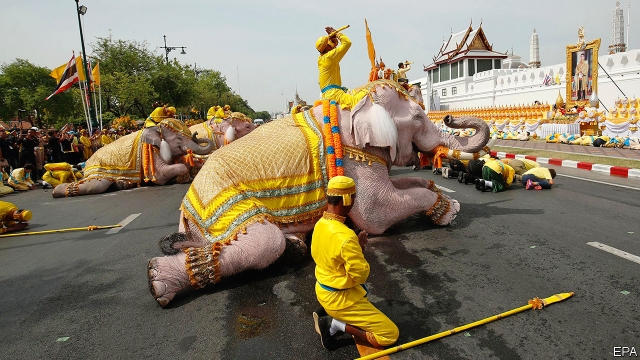

###### Crown and spectre

# Thailand’s junta marks the king’s coronation with more election-rigging 

##### A new formula for allocating seats magically undoes the opposition’s victory 

 

> May 9th 2019 

THAIS DO NOT see that much of their king, who spends most of his time in Germany. But for three days starting on May 4th he was on near-constant display for a long and lavish series of ceremonies surrounding his coronation. It all began with a ritual purification at the royal residence in Bangkok. Holy water was poured over the head of Maha Vajiralongkorn, the tenth monarch of the Chakri dynasty. It had been collected from all 76 of the country’s provinces, as well as from around Bangkok. Courtiers and officials wore spotless white uniforms and prostrated themselves before their monarch. 

The king changed into an embroidered golden suit for an anointing ceremony. Then he lowered onto his own head a pointed helmet of a crown weighing more than 7kg thanks to its crust of gold and diamonds. A royal procession the next day saw the stony-faced monarch paraded through Bangkok on a gilded palanquin. Accompanying troops roasted in the heat. In a separate procession (pictured), respectful elephants dropped awkwardly to their knees. 

The first substantial moments of the new reign came just days later, when the Election Commission released the final results of an election that took place in March. Palang Pracharat, a party created to support the military junta that came to power in a coup in 2014, battled Pheu Thai, which is loyal to Thaskin Shinawatra, a former prime minister who has feuded with the generals since an earlier coup, in 2006. The junta rigged the system in its favour, banning all political activity until a few months before the election, disbanding a second party linked to Mr Thaksin and awarding itself the power to appoint all 250 members of the upper house. Nonetheless, shortly after the vote, a coalition of seven opposition parties, including Pheu Thai and Future Forward, which is popular with young voters, announced they had won a slim majority in the 500-seat lower house. 

That is not what the results unveiled this week show. The Election Commission concedes that Pheu Thai won the most seats, 136, followed by Palang Pracharat, with 115, and Future Forward, with 80. It annulled the result in one district won by a Pheu Thai candidate, ordering a fresh election. But the biggest blow to the opposition came in the form of tweaks to the formula whereby the commission allocates the 150 seats awarded on a proportional basis. The result was to reduce the tally of the big parties and hand seats to a plethora of tiny ones. This change appeared to breach the commission’s own rules and the election law, but a court found the new maths constitutionally permissible just hours before the party-list results appeared. Entirely coincidentally, the changes reduced the opposition alliance to a minority of 245 seats. 

Chaos awaits, as 27 different parties now hold seats in the lower house. A weak, pro-military coalition looks the most likely outcome. The junta will soon present a list of senators to the king for approval. The two houses will then vote in a joint sitting to select a prime minister. The incumbent, Prayuth Chan-ocha, who led the coup in 2014, had seemed determined to stay on. Bangkok is rife with rumours, however, that the king might promote the selection of a less divisive figure, perhaps from the Privy Council, which is packed with soldiers and technocrats. Either way, the notion that the government ushered into power by the election will have any democratic legitimacy—always a doubtful proposition—now looks entirely forlorn. 

As if to underline the point, the authorities have set about persecuting Future Forward and its leader, Thanathorn Juangroongruangkit, with a gusto typically reserved for supporters of Mr Thaksin. The party and its leadership face 16 accusations of wrongdoing. The Election Commission intends to press a charge against Mr Thanathorn for holding shares in a media company, which candidates are not allowed to do. He has also been charged with sedition and computer crimes. He denies all the charges, which could lead to a ban from politics, a prison sentence or the complete dissolution of Future Forward. “I’m prepared. I knew this would happen sooner or later,” he says at his party’s buzzing office in Bangkok. “In order to retain power they are willing to do whatever it takes.” He believes the 16 cases are intended to pressure him to negotiate with the junta’s political allies. At least five of Future Forward’s MPs have been offered $1m apiece to change party, he claims.   

Mr Thanathorn is a threat because he is both popular and unblemished by scandal, two characteristics which neither the king nor the generals (nor Mr Thaksin) enjoy. The king has alienated his subjects not only by his absence, but also by his personal cruelty and insistence on sycophantic protocol. It was not just the elephants and courtiers who were forced to prostrate themselves: days before the coronation the palace released images of the king getting married for the fourth time, in which his new wife, a former stewardess, grovelled before the unsmiling groom. He has disowned children and locked up relatives of one of her predecessors. Only a small share of Thais bothered to wear yellow, the royal colour, as requested during the coronation ceremonies. Thousands of civil servants had to be bussed in to swell the attendant crowds, which were much sparser than at the cremation of his father, who was far more popular. 

Yet King Vajiralongkorn apparently feels secure enough to meddle in political matters. Before the election he intervened, quite hypocritically, to prevent his older sister from getting involved in politics. The courts and the Election Commission followed his instructions slavishly, even though they lacked any clear legal underpinning. Just before polling day he told Thais to vote for “good people”; just after it he stripped Mr Thaksin of several military awards. The risk of royal displeasure seems to have deterred neutral parties from joining the opposition coalition in the lower house. That is no coincidence: a weak coalition would be in no position to stand up to the king. That an election that was supposed to restore Thailand to democracy will instead bolster its preening monarch is a crowning irony. 

