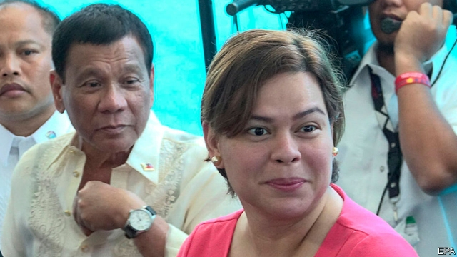
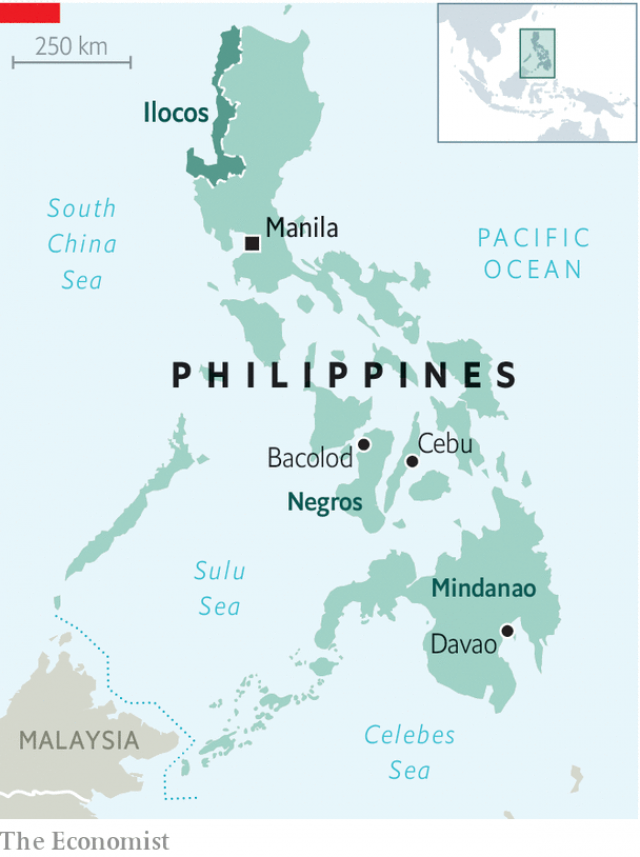

###### A first family affair

# The Philippine’s mid-term elections will tighten the president’s grip 

##### They may even pave the way for Rodrigo Duterte’s daughter to succeed him 

 

> May 9th 2019 

SANA VALLES serves up President Rodrigo Duterte’s favourite dish in a small eatery in the southern city of Davao. Tapa—crunchy, floss-like beef—arrives alongside tangy stew and fluffy rice. The place is a shrine to her favourite customer and his family. An early political poster showing the now-grizzled strongman with a fresh face adorns one wall, a picture of his daughter and successor as Davao’s mayor, Sara Duterte-Carpio, another. Photographs of the city’s toughest police units making Mr Duterte’s power-fist gesture appear too. Waitresses wear T-shirts supporting Bong Go, a longtime aide of Mr Duterte’s, who is running for a spot in the national Senate in mid-term elections on May 13th. “We are proud of our president,” explains Ms Valles. “He disciplined all the people here.” 

Mr Duterte served as Davao’s mayor from 1988 until he rose to the presidency in 2016, with only brief interludes as its representative in Congress and its deputy mayor (to get around term limits). It is where Mr Duterte tested the idea of a vigilante campaign against drug-dealers and -users. (Since he took the policy national, more than 20,000 people have died in extra-judicial killings, according to opposition politicians.) Davao’s streets are clean and its people largely enamoured with the first family. Ms Duterte-Carpio will cruise to re-election this week; her two siblings are also fighting for local posts. More broadly the mid-terms will reveal the potential of the family brand to endure beyond the presidency of the patriarch. 

Halfway through each president’s six-year term, elections are held for the entire House of Representatives and half of the 24-seat Senate, as well as some 18,000 local and provincial posts. The House of Representatives’ 300-odd members already cater to most of the president’s whims. That is not expected to change. But the results in the Senate, the only political buffer against the president’s excesses at the moment, will determine how much Mr Duterte can get done during the rest of his presidency. “Success or failure is based on how their Senate slate does,” says Manolo Quezon, a journalist. 

Mr Duterte’s popularity seems likely to boost candidates associated with him. Filipinos like his authoritarian approach to crime and the economy is generally well managed. Last year growth exceeded 6%. Infrastructure spending has increased and poverty rates have gone down. His outrageous talk (he has called Barack Obama a “son of a whore” and declared the Philippines a province of China), his absurd bluster (this week he threatened to declare war on Canada if it did not take back rubbish exported to the Philippines without the proper paperwork) and his attacks on the Catholic church (the Pope got the son-of-a-whore treatment, too) only seem to add to his popularity. The fact that critics such as Leila de Lima, a senator, have wound up in prison, or out of a job, such as a former chief justice of the Supreme Court, does not worry many people. Fully 79% of Filipinos approve of the job he is doing, according to Social Weather Stations, a pollster. 

 

Mr Duterte’s supporters are preparing for a time when he carries less clout, however. Last year they created a new political party called Hugpong ng Pagbabago or HNP, meaning “Faction for Change”. It boasts Ms Duterte-Carpio among its ringleaders and appears set on replicating the president’s tested formula for success: taking local tactics to the national level. Families with huge influence in their native fiefs have all teamed up. Thus Imee Marcos, daughter of the late dictator Ferdinand and a near-deity in the northern region of Ilocos, is one of HNP’s star candidates. 

Of the 14 candidates with a decent chance of winning a seat in the Senate according to a recent poll, ten fly the HNP banner. Mr Duterte himself is a vocal cheerleader for many of them, including Mr Go and Ronald Dela Rosa, a former head of the Philippine National Police and thus a bastion of the drug war. 

A smattering of opposition candidates are pushing back with a multiparty slate called the Otso Diretso (“Straight Eight”). Their allies are few and far between. When they all appeared at a recent rally in Cebu city, the country’s second-largest metropolis, local officials shunned them. Grace Poe, a senator who is not in the group, is among the most popular candidates seeking re-election. But having lost to Mr Duterte in the presidential election, she is careful not to be too critical. 

Mr Duterte’s acclaim is hard to campaign against, as is his ire. In Bacolod, on the island of Negros, farm workers protesting against low wages decorate their battered van with posters of Neri Colmenares, a local human-rights lawyer and critic of Mr Duterte. But he has little hope of winning a slot in the Senate. Some locals say the whole system is rigged. “Election fraud is really massive here,” complains an agrarian activist. “[Candidates] just need to ask for the blessing of the landlords.” 

The opposition’s weakness does indeed flow from the political system. Personalities matter far more than policies or parties. Politicians flit between parties according to the political mood. The expense of running for office is another factor. Candidates for senator run nationwide, just like presidential ones. A credible campaign costs roughly 100m pesos (nearly $2m), a political analyst estimates. No one wants to spend so much money simply to twiddle their thumbs in opposition. 

Victory for Mr Duterte’s forces in the mid-terms could reinvigorate his legislative agenda. He will probably dust off a shelved corporate-tax reform and may push for a constitutional amendment to institute federalism. The House of Representatives has approved a bill to that end, but the Senate has left the idea to moulder. Even with more allies in place, it will be a hard sell, since senators will be reluctant to vote to diminish their own clout. 

Whatever else happens, the election has already raised the profile of Ms Duterte-Carpio. A slick politician in her own right, she denies wanting to succeed her father as president, a prospect some supporters have mused about. But the temptation to run to defend Mr Duterte’s legacy (and protect him from prosecution) would be enormous. By revealing the length of his coattails, the mid-terms will give an indication of how likely the Philippines is to see a second President Duterte. 

