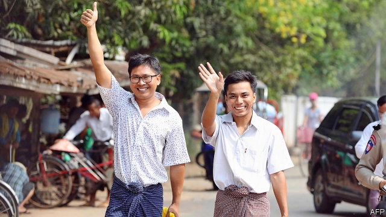

###### 511 days later

# Two unjustly jailed journalists go free in Myanmar 

##### But don’t read too much into it 

 

> May 9th 2019 

“I  CAN’T WAIT to go to my newsroom,” Wa Lone told a crowd of reporters as he walked free from Insein prison in Yangon, Myanmar’s biggest city. Mr Wa Lone and Kyaw Soe Oo, who work for Reuters news agency, were released on May 7th. The pair were convicted in 2018 of breaking the Official Secrets Act and received a seven-year sentence. They had served 511 days before being released as part of an amnesty for more than 6,000 prisoners to mark Buddhist New Year. 

The trial of the two journalists was a farce. They had been investigating the killing of ten men from the Rohingya Muslim minority in Rakhine state, where the army went on the rampage in 2017, forcing more than 700,000 Rohingyas to flee to Bangladesh. The journalists said they were entrapped by police, who invited them to dinner, handed them state documents and arrested them shortly afterwards. One officer admitted to burning his notes on the arrest. Another said he had been ordered to set up the journalists. A third was caught consulting prompts written on his hand when testifying against the pair. 

Nevertheless, Mr Wa Lone and Mr Kyaw Soe Oo were convicted, to the dismay of human-rights activists. They saw the pair’s jailing as yet another symptom of Myanmar’s failure to reform itself, even under the leadership of Aung San Suu Kyi, a democracy activist and winner of the Nobel Peace prize who ended many decades of military rule in 2016 when she came to power as head of the National League for Democracy (NLD) party. Every new legal appeal made front-page news. Diplomats pleaded with government officials for the journalists’ release. But Ms Suu Kyi refused to intervene, citing the independence of the judiciary. In fact, it was probably public hostility to anything that smacks of sympathy for the Rohingya that restrained her. Two weeks ago the courts rejected the journalists’ appeal for a third time. 

The amnesty provides a face-saving way out, but does not indicate that the government is turning over a new leaf. Under Ms Suu Kyi freedom of expression has been severely curtailed. A report released in January by Human Rights Watch, an NGO, found that a loosely worded telecoms law is being used to intimidate journalists and silence critics of the government. Since the NLD took power in 2016, about 140 cases have been brought under the law, many of which are baseless. Lots of reporters are languishing in prison. Many of those who remain free feel compelled to self-censor. The repression, sadly, is all too reminiscent of life under the generals. 

