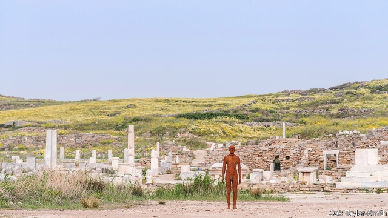

###### An artist of the floating world

# A groundbreaking show on Delos mixes classical and contemporary art 

##### Sir Antony Gormley’s sculptures are a rare exception to tight rules on the uses of Greek antiquity 

 

> May 9th 2019 

EUCLID, THE father of geometry, ordained that the centre of a circle must be a fixed point. The Greek island of Delos, a thirsty patch of rock and thin soil that lies, roughly, at the midpoint of a ring of islands known as the Cyclades, violated this rule. The ancients imagined it to be drifting perpetually. It was said to have gained a fixed location only after serving as the birthplace of Apollo, god of wisdom and light, and probably also of Artemis, the moon goddess. Its reward for this hospitality was to be bound to the seabed by diamond chains. Previously known as Adilos (invisible, unmanifested), it was given the new name of Delos, which suggests something shown or demonstrated. 

Stable co-ordinates were no guarantee of a stable life. In the realm of real history, this holy speck of land was contested by rival islands, city-states, empires and trading interests. At first there were benign competitions to build the finest temple; but in the Hellenistic and Roman eras Delos became an earthy duty-free market where slaves were the most visible commodity. More than 20,000 people lived on a dot 5km long by 1.5km wide; some had prosperous homes with superb mosaics. But there are also traces of a terrifying fire. 

Sir Antony Gormley, one of Britain’s foremost public artists, says he could sense all these legacies in the shape-shifting environment when he set about installing his own iron sculptures amid the rocks, the antiquities and the sea. On chilly days, the water and the island’s crust are a similar shade of grey; on sunny ones the granite reflects the sun and merges with the sky. Sir Antony says he understands why Delos was once seen as drifting: “There is a feeling of being extended into space at large.” This spring its beauty is outstanding: a wet winter has left a gorgeous carpet of flowers. 

Twenty-nine of Sir Antony’s anthropomorphic figures will stand on Delos until the end of October. Some are visibly cast from human bodies (including his own), others are an assembly of brick-based shapes which only approximate to Homo sapiens. Five of the works were made specially for the exhibition; the rest were produced during his 20-year study of the relationship between bodies and their environments. On Delos they also represent a startling experiment in juxtaposing classical and contemporary art—and a rare exception to Greece’s stringent attitude to the uses of its antiquities. 

Nobody but custodians may live on the holy isle, but each year about 165,000 people sail to Delos in packed boats, either from the swanky island of Mykonos or from cruise-ships. The lifelike statue that stands guard in the water at the north-western tip will catch visitors by the throat as they chug towards the quay. Other sculptures, like the highly abstracted prone figure planted in an ancient theatre, are more provocative. The heavy blocks of iron are placed stolidly in a spot that once hosted sophisticated classical tragedies. 

Having grown up Catholic but later immersed himself in Buddhism, Sir Antony abhors rigid religious systems. All the spiritual art of the past involves subservience to established ways of thinking and power structures, he contends. He tries to avoid that, calling his works a suggestion or a stimulus. They invite human beings to reinhabit their bodies and overcome their alienation from nature, which in his view all civilisation, even that of classical Hellas, has inflicted. His choice of iron has a double meaning: it is a core material of the planet, but also the basis for the Industrial Revolution with all its collateral damage. 

For reasons of both practicality and cultural politics, the installation has itself been a big, expensive feat. For a start, eight of the sculptures had to be delivered by chartered helicopter. Among the organisers of the show, named “Sight”, is Neon, a foundation established by Dimitris Daskalopoulos, a Greek businessman. In an unusually seamless case, for Greece, of public-private collaboration, Neon has worked with the department of the culture ministry that oversees the Cyclades. Together they approached the Central Archaeological Council, which jealously guards classical sites; it insisted that no sculptures be placed in the most sacred parts of the ancient temples. 

Even with the provisos, the permission to stage the exhibit was unusual. In the history of independent Greece, its antiquities have been put to unconventional use only a small number of times. In the 1850s British and French soldiers held a banquet in the Parthenon; for proud Greeks, this was provocative behaviour by countries which already held much looted Hellenic art. In the 1920s a Greek photographer called Nelly induced famous ballerinas to pose nearly or completely nude around the Parthenon. Isadora Duncan, a matriarch of modern dance, had been more decent as she twirled around the columns a few years earlier. 

Demand from film-makers for ancient Greek locations has posed fresh dilemmas. Permission to shoot on the Acropolis was granted to Francis Ford Coppola; the BBC’s bid to use the temple at Sounion, south of Athens, for “The Little Drummer Girl”, a mini-series, was accepted, too, though only after the broadcaster made revisions to its plans. But Gucci, the fashion house, was sent packing in 2017 when it asked to stage an event on the Athenian rock. And woe betide the tourist who attempts any spontaneous re-enactment. Don a classical dress and pose for friends in front of a pillar, and you risk a scolding from a guard. 

Films and other cultural events in the vicinity of the antiquities should be “an exception, not an addiction”, says Manolis Korres, doyen of conservation at the Acropolis. So in its boldness, its extravagance and its challenge to a revered location, the Delos show will very likely prove a one-off. “Nothing like this will ever happen again,” guesses Dimitris Athanasoulis, the culture-ministry mandarin who oversees the Cyclades. For now, Sir Antony hopes, his figures stand like acupuncture needles on the island’s craggy surface, primed to reactivate its mystical energies. 

