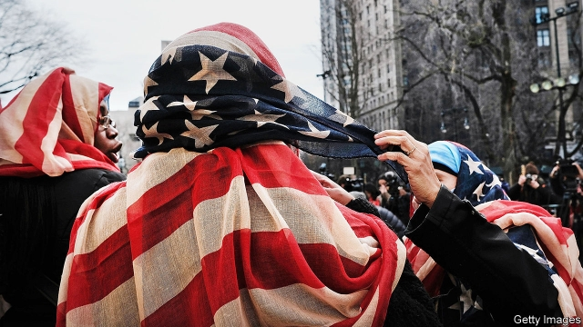

###### Beyond belief

# An encouraging history of religion in America 

##### It chronicles the spread of toleration—punctuated by outrages 

 

> May 9th 2019 

Sacred Liberty: America’s Long, Bloody and Ongoing Struggle for Religious Freedom. By Steven Waldman. HarperOne; 405 pages; $28.99.  

A BENIGN PARADOX lies at the heart of America’s approach to religion. It is far more devout than other wealthy Western countries. While 6% of British adults report praying every day, over half of Americans say they do. Yet, observant but diverse in their beliefs, Americans are remarkably accepting of other faiths. 

Steven Waldman, the author of a fine history of the religious views of the Founding Fathers, has now written a powerful account of American religion since the colonial period. As he recounts, Thomas Jefferson and James Madison ardently supported the separation of government and religion. The First Amendment duly provides that “Congress shall make no law respecting an establishment of religion, or prohibiting the free exercise thereof.” The pair were in the minority, however. Before the revolution, Quakers in Puritan Massachusetts were whipped and hanged. Baptists in Virginia were jailed. The constitution’s religious strictures were not fully enforced until the first world war. 

“Sacred Liberty” chronicles a general trend towards toleration—punctuated by outrages. In 1838 the governor of Missouri ordered the extermination of Mormons; a massacre ensued. In the 1920s and 1930s the anti-Catholic, anti-Jewish Ku Klux Klan gained power in several states. Twenty thousand people attended a Nazi rally at New York’s Madison Square Garden in 1939. 

The second world war shifted attitudes decisively. The draft mixed men of all faiths as comrades-in-arms. The entertainment industry chimed in. “Religion doesn’t make any real difference,” Frank Sinatra says in a short film of 1945, “except to a Nazi or a dope.” To be anti-Semitic was to be Hitler’s ally; the concept of a Judaeo-Christian heritage took hold. For his part, Franklin Roosevelt advocated the “freedom of every person to worship God in his own way—everywhere in the world”. Later, describing the struggle against atheistic communism, Harry Truman declared that there had never been a cause greater than defending “the right to worship God—each as he sees fit”. The Supreme Court began vigorously to protect religious freedom. 

In those days a Supreme Court without a Protestant majority was unthinkable. In 2010 the advent of a bench composed of six Catholic justices, three Jews and no Protestants was barely noticed. Jews are now the country’s best liked religious group—but the warm attitudes transcend philo-Semitism. By 2010 around half of all Americans had a spouse of a different religious tradition. Neighbourhoods, workplaces and friendships have become more religiously diverse. As Robert Putnam and David Campbell put it in “American Grace” (2010), a magisterial study that Mr Waldman cites: “It is difficult to demonise the religion, or lack of religion, of people you know and, especially, those you love.” Messrs Putnam and Campbell found that, within the big faiths, overwhelming majorities of Americans believe that good people of other creeds can go to heaven. 

Meanwhile, zealous as America may seem to outsiders, religion, particularly the organised kind, is becoming far less important. When pollsters queried religious preferences in the 1950s, some 95% of Americans gave a specific denomination or tradition. In recent surveys, the share who say they have no particular religion is roughly the same as those who identify as Protestant. The “nones” now comprise 40% or more of 18- to 44-year-olds. 

“Sacred Liberty” concludes with an analysis of the present. These days, Mr Waldman points out, the divisive religious cases before the Supreme Court sometimes involve what, by historical standards, are comparatively trivial issues, such as a baker’s reluctance to make a cake for a gay wedding. Even America’s most demonised religious group mostly feel secure. According to a survey by Pew in 2017—after the vitriol of Donald Trump’s campaign—over half of Muslims regarded other Americans as generally favourable to them. Only 14% saw their compatriots as unfavourable. 

This insightful study is grounds for guarded optimism. It shows that the advance of decency has been steady, heartening—and fragile. 

