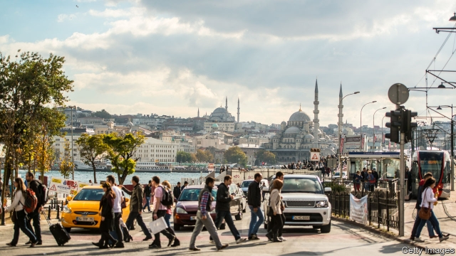

###### Tales of the cities

# From Istanbul to Paris in “Walking on the Ceiling” 

##### A Turkish woman befriends a British writer in Aysegul Savas’s debut novel 

 

> May 9th 2019 

Walking on the Ceiling. By Aysegul Savas.Riverhead Books; 224 pages; $26 and £18.99.  

IN ORHAN PAMUK’S novel “A Strangeness in My Mind”, a character admits to floundering in the author’s native Istanbul: “Being alone in this big city is unbearable.” The sentiment is shared by the protagonist of “Walking on the Ceiling”, a debut by another Turkish writer, Aysegul Savas. Despite its vitality and bustle, Nunu finds Istanbul infused with “a poetic sadness”, and a loneliness that “robs you of words”. 

Lonely as Nunu is, she narrates an original, mesmerising story about growing up in a fractured Istanbul family and spending time with a kindred spirit in Paris, where she moves after her mother’s death. In a bookshop she meets M., a fellow foreigner (British, in his case) and one of her favourite writers. An unlikely friendship develops. Soon they are corresponding, devising a private slang, and going on long exploratory walks around the French capital. He shows her new ways of seeing the city; in exchange, she provides material—hometown details, childhood recollections and “stories that weren’t quite mine”—for his work in progress set in Turkey. 

As Nunu traverses Paris, taking in sights and sounds, she also offers flashbacks of the life she left behind. She tells of her father’s death, the summers she spent at her grandparents’ house, Sunday walks along the Bosporus, and most of all her difficult relationship with her unhappy mother. And she meditates on the “new political climate” in Istanbul, in which “there was no knowing what would happen next.” 

All this makes for a fragmented narrative, composed of scattered, occasionally scrambled, remembrances. Ms Savas (who writes in English) flits between places and times. Each short, sharp chapter is either a discrete thought or deed, or the next stage of a city walk or relationship. Some sections are little more than vignettes that are over before they have properly begun. Others succinctly convey a fraught moment, intimate encounter or pivotal discovery. 

At the outset Nunu describes her account as an “incomplete inventory”. Not every reader will appreciate the disjointed storytelling: an intriguingly dangling thread for one will be a frustrating loose end for another. In the end, though, Ms Savas allows a coherent and rewarding whole to emerge. The result is a beguiling tale of two cities which expertly illuminates “the devious ways of memory”. 

