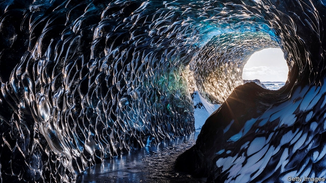

###### Another country

# Into the underland with Robert Macfarlane 

##### The nature writer’s new book explores the lure and horror of what lies beneath 

 

> May 9th 2019 

Underland: A Deep Time Journey. By Robert Macfarlane. W.W. Norton; 384 pages; $27.95. Hamish Hamilton; £20.  

WHEREVER THEY walk, people tend to look up, ignoring the world beneath their feet. For that world is dark. When it is cut open, for city drain-work or open-cast mining, the raw, muddy scar seems repellent. Few want to venture into it, let alone go deeper, where the light gradually diminishes and the bedrock closes in. 

Yet as Robert Macfarlane points out, in his best and most lyrical book of nature-writing since “The Wild Places”, humanity’s relationship with this underland is complex and contradictory. It is a place to hide both what is precious and what is revolting—including objects that excite both feelings, such as the bodies of the dead. The underland is rifled for treasure, oil, gold, rare earths; it is visited by heroes and shamans to retrieve memories, discover mysteries, consort with ghosts (Aeneas) or rescue love (Orpheus). At one point Mr Macfarlane combines these enterprises, rattling in a truck for miles through the tunnels of a giant potash mine under the North Sea. He debouches in a laboratory where, in the necessary pitch-dark and silence, a young scientist sits watching deep space to catch, if he can, the invisible tremor of dark matter on the last, least particles that humans can observe. 

Once again, then, as naturally as in ancient times, knowledge of the true nature of things is being sought in the depths. And once again, other depths are concealing what humans do not want to know. Few readers will be aware—so vastly accommodating and patient is the Earth—that at Olkiluoto in Finland, down a road through birch woods and saltmarsh, a “tomb” is being built to hold 6,500 tonnes of nuclear waste with a half-life of 4.46bn years. 

The name of this tomb, Onkalo, suggests both a hiding place and hell. The underland is often hellish, not so much for its obscurity (for it is often lit by torches or helmet lamps, and Mr Macfarlane has an owl mascot to help him see in the dark), as for its horrible constriction, and the weight of the world above. This is not a book for claustrophobes. In the Mendips in Somerset the author works his way sideways through a diagonal slit between two angled planes of rock, a “deep time space” that will only just admit him, squeezed by an immense overhang. Far beneath Paris, in the labyrinth of tunnels cut into the limestone to accommodate the overflowing dead of the city, he slithers along a crawl space, the back of his skull scraping on rock and his face pressed into gravel. 

These defiles sometimes open on surprises: dunes of black and gold sand, a roaring river writhing with strange white shapes, a long-lost Cabinet of Mineralogy belonging to a School of Mines. But such scenes are rare, and hard won. As a man of the mountains and open air, Mr Macfarlane often feels his fear “like bats, flocking and tangling”. His terror is not merely his; it is ancestral and primeval. 

In one of his most fascinating chapters, however, he stays on the surface. Safely seated among the coppiced beeches of Epping Forest, east of London, he learns from a mycologist about the near-invisible networks of fungi, “the wood wide web”, which connect trees in infinite succession below ground, another buried city. Through this web trees succour sick companions, co-operate and communicate, in ways still mysterious to those who walk above. Whenever he himself moves, sleeps and eats underground, he likes to think he is leading a similar unsuspected life. 

Swiftly, he becomes good friends with his guides and helpers through this hostile world. His most emotional response, however, is reserved for the humans who braved the underland millennia before: the mourners who laid corpses there, gently covered with a swan’s wing, or with coins pressed on their eyes to pay their fare across the Styx; or the artists who, at Chauvet in France, left their palettes and tapers below the bison they had painted. In one remote cave on the west coast of Norway, discovering a faint but spirited array of red stick-dancers, he simply collapses in tears. 

Man’s impact on the underland is no longer benign. The bedrock is hollowed to hold poison and trash, while the depths of the ice-cap are warming and shifting. In the Arctic, Mr Macfarlane watches a melting glacier calve: it seems to disgorge a whole city of ice. Cavers and miners of the future will spot the Anthropocene as a stratified layer of plastic, which he finds strewn on beaches in the farthest points of the Lofoten Islands. His book is suffused with sadness for this. He finds comfort where he can: in the innocence of children, the company of friends, the light-drenched vividness of surface life, which cries out to be cherished—and in the astronomer who, confined to the dark, patiently turns towards the stars. 

