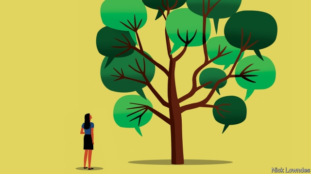

###### Johnson

# Words, like people, have tangled and extensive family trees 

##### Surprising connections emerge if you look back far enough 

 

> May 9th 2019 

IT IS NATURAL to try to find resemblances in family photos: grandma’s nose here, Uncle Jim’s hairline there. When considering the family of English words, it is tempting to look for the same sort of likenesses. Often they are real; for instance, regal and royal derive from the same source, which was imported into English twice, from both Grandpa Latin and Aunt French. 

But often they are not. In the human world, people sometimes find out to their shock that they are adopted, or take a DNA test and discover a surprising parentage. At this point, resemblances that they thought were genetic turn out to be illusory. Similarly, two words can look so alike that it seems they simply must be siblings—yet they aren’t. 

Take pawn the verb and pawn the noun. Both have to do with exchanging something for something else of value. In chess, a pawn is sacrificed for strategic advantage; at the pawn shop, a guitar is sacrificed for much-needed cash. Are they variants of the same word? No. While one word can develop many senses—to run a computer program is descended from the word to run with your legs—sometimes two words identical in spelling and pronunciation have entirely separate origins. 

As with pawn. The verb may be from a Germanic root meaning “surety”, which made its way into English via French; in modern German, Pfand is a “deposit”. The chess-piece, though, has a totally different story. It came from (Norman) French, as paun, but that in turn came from Latin pedon—a foot soldier (compare pedestrian). Since a foot soldier is lowly and dispensable, it came to mean a sacrificable chess-piece, and, in other languages, a menial labourer. English borrowed peon, another form of the same word, from Spanish. Pawn is related to peon, but not to pawn. 

This kind of thing is all over the language. Repair (to fix) and repair (as in “let’s repair to the smoking room”) look like they must be the same word with different meanings. In fact, they are pawn-style homonyms. The “fix” word comes from Latin reparare, to set something right again; the return/retire meaning comes from repatriare, to go back to your country. 

Isle and island seem to be obvious relatives. In fact their resemblance is happenstance combined with human error. “Isle” comes from Latin insula; its “s” became silent in its voyage through French. But island is Germanic (the –land is a hint, and the “i” is reminiscent of cousins like Icelandic eyja). Medieval writers mistakenly thought that the word, then written as iland, came from insula too. They inserted the “s” to reflect that (incorrect) etymology. It has never been pronounced. 

In fact, odd as it may seem, island is related to aquatic. The source of nearly every language in Europe and many in the Middle East and South Asia is Proto-Indo-European (PIE), spoken perhaps 5,000 years ago. That’s enough time for some truly scrambling sound changes: PIE’s akwa mutated into agwjo, aujo and ieg in the Germanic branch of the family before becoming the “i” in island. In the Romance branch, it stayed closer to its roots and became Latin aqua. Reconstructing PIE is one of the unsung achievements of modern science. Working backwards from today’s languages through written classical ones allowed philologists to discover systematic changes, which in turn let them peer further into the past to posit what the unwritten PIE would have sounded like. 

Browsing through an index of Indo-European roots (the American Heritage Dictionary website has an excellent one) enables verbal discoveries as startling as the fact that Dick Cheney is distantly related to Barack Obama. Dyeu (to shine) not only yielded day and diary but deity and divine, plus the gods’ names Jove, Jupiter, Zeus and Tiu. That last term, for a Norse god, appears in Tuesday—which therefore includes dyeu twice. 

Since PIE’s descendants are now spoken from Donegal to the Bay of Bengal, the “family” in question is not just the vocabulary of English but that of some 3bn people speaking over 400 modern languages. The stories of words that are surprisingly unrelated (pawn-pawn, repair-repair) are overwhelmed by the number of those that are just as startlingly connected (island-aquatic, divine-Tuesday). Those links are a good reminder of just how big the circle of family can be drawn, if you are open-minded enough in today’s nervously nationalist age. Time and distance can too easily obscure the fact that words—like people—have many more relatives than they might seem to. 

