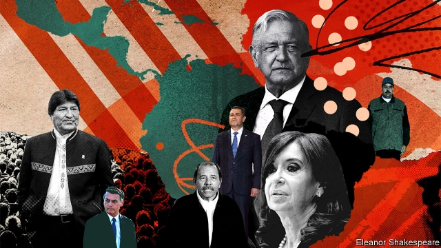
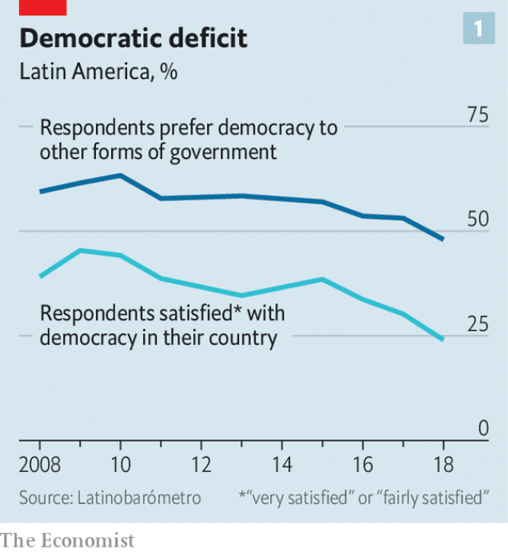
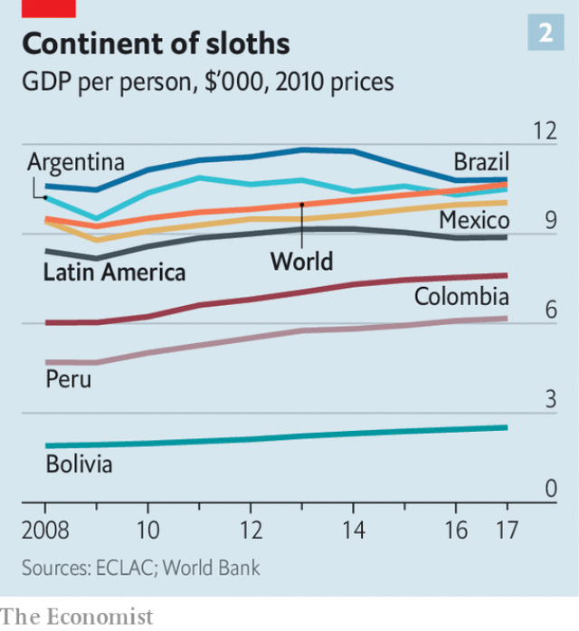
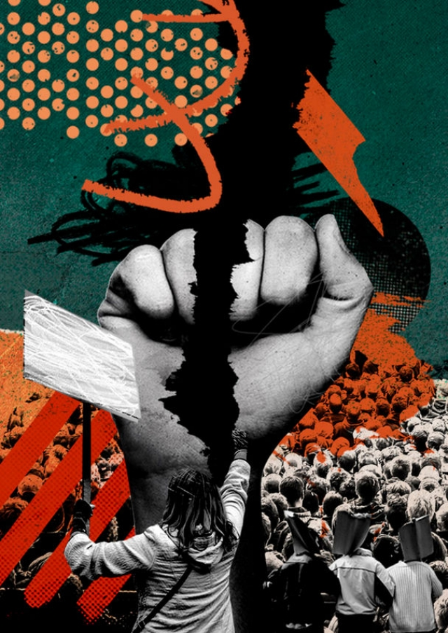

###### The 40-year itch

# Populism and polarisation threaten Latin America 

##### After dictatorships gave way to democracy trouble is brewing again 

 

> May 9th 2019 

IT WAS ONE of the greatest waves of democratisation ever. In 1977 all but three of the 20 countries in Latin America were dictatorships of one kind or another. By 1990 only Mexico’s civilian one-party state and communist Cuba survived. Several things lay behind the rise of democracy in the region. One was the waning of the cold war. Another was the economic failure of most of the dictators. And democracy was contagious. One country after another in Latin America put down democratic roots as power changed hands between right and left through free elections. 

The outlook is suddenly much darker. Nicolás Maduro in Venezuela, like Daniel Ortega in Nicaragua, is an originally elected autocrat ruling as a dictator. He clings to power with the support of Cuba at the cost of wrecking his country and destabilising its neighbours. At least 3.7m Venezuelans have fled economic collapse and repression; organised crime and Colombian guerrillas flourish there. The repressive family despotism into which Nicaragua has degenerated under Mr Ortega and his wife, Rosario Murillo, is almost as nasty. 

These autocratic extremes would be less worrying were not elections across the region showing that there are clear signs of disenchantment with democracy elsewhere. Election rules are sometimes flouted and independent institutions undermined. Many voters are turning to populists with little commitment to restraints on power. Parties of the moderate centre are weakening or collapsing. 

An election marked by fraud in Honduras saw Juan Orlando Hernández, the conservative president, win a constitutionally dubious second term in 2017. In Guatemala, which will hold elections in June, the president recently ordered out a UN investigative body into organised crime and corruption which had helped to jail two of his predecessors. Evo Morales, a leftist who has been Bolivia’s president since 2006, will seek a fourth term in October—also on dodgy constitutional grounds. In the same month, Cristina Fernández de Kirchner, a populist former president of Argentina who abused institutions in partisan fashion and faces corruption charges, stands a chance of being returned to office. 

And then there are Latin America’s two giants, Brazil and Mexico. Both have elected presidents who share a populist disregard for the norms, checks and balances, and toleration of critics that are necessary for lasting democracy. 

The threat is more obvious in Brazil. Jair Bolsonaro, an army captain turned far-right politician, took over on January 1st. A seven-term congressman, Mr Bolsonaro is a political insider in Brazil but one nostalgic for military rule. Eight generals sit in his 22-strong cabinet and scores more officers occupy second- and third-tier posts. “Democracy and freedom only exist when the armed forces want them to,” he said in a speech in March at a military ceremony. This will be news to Costa Rica. Its decision to abolish its army in 1948 is widely regarded as having helped it stay free. He even ordered the armed forces to commemorate a military coup in 1964, which he calls a revolution. Evidence is emerging that appears to show ties between Mr Bolsonaro’s family and paramilitary militias that operate in the favelas of Rio de Janeiro. 

Andrés Manuel López Obrador, a veteran populist of the left known as AMLO, has struck a more moderate tone in his first five months in office. Mexicans overwhelmingly approve of his promises to sweep away corruption and crime, as well as his modest way of life (he sits in economy on commercial flights around the country). But there are warning signs. 

AMLO is not a fan of independent centres of power. He has named his own “co-ordinators” to supervise elected state governors, cut the salaries of judges and civil servants, named ill-qualified allies to regulatory bodies, and stopped giving public funds to NGOs. He has also shown deference to the armed forces, placing them in charge of a new National Guard, a paramilitary police force, despite the objection of the Senate. A proposed bill to pack the Supreme Court would end its independence. In March the tax agency threatened the owner of Reforma, a critical newspaper, with a tax investigation over the seemingly trivial matter of owing 12,000 pesos (around $630) from 2015. 

These steps, though some are small-scale, all come from the populist handbook of disqualifying and intimidating opponents, building a political clientele and what Steven Levitsky and Daniel Ziblatt of Harvard University have called “capturing the referees” of democracy. The measures also hint at a return to what Enrique Krauze, a historian, calls Mexico’s “imperial presidency” of past one-party rule. 

Not all of the region is under threat. Chile and Uruguay, among others, still enjoy stable democracy, and most governments remain committed to that goal. The region’s people are not so sure. In 2018 Latinobarómetro, a multi-country poll, found that only 48% of respondents saw themselves as convinced democrats, down from 61% in 2010. Just 24% pronounced themselves satisfied with democracy in their country, down from 44% in 2010 (see chart 1). How did democracy fall into such disrepute? How great is the threat to it? And how can democrats fight back? 

 

The warning signs were clear. Take Eldorado, a sprawling suburb of São Paulo. In Brazil’s boom of 2005-13 it had hopes of becoming solidly middle class. A year ago, as the country’s election campaign got under way, people in Eldorado were fed up with rising crime, unemployment and a sense of official neglect. “When we go out we don’t know whether we will return alive,” lamented Cleber Souza, the president of Sítio Joaninha, a former favela. In what had been a stronghold of the left-wing Workers’ Party (PT), several people said they would consider voting for Mr Bolsonaro. “He’s a cry for justice from the society,” said Anderson Carignano, the owner of a large DIY shop. “People want a return to order.” 

Behind the discontent lies a toxic cocktail of crime, corruption, poor public services and economic stagnation. With only 8% of the world’s population, Latin America suffers a third of its murders. In many countries, the rule of law remains weak. 

In the 1980s, many of the new democratic governments inherited economies bankrupted by debt-financed statist protectionism. The adoption of market reforms known as the “Washington consensus” provided a modest boost to growth. The democratic governments gradually expanded social provision. After the turn of the century many economies benefited from a surge in exports of minerals, oil and foodstuffs thanks to the vast demand from China. Poverty fell dramatically, while income inequality declined steadily. 

The end of the commodity boom has brought a sharp correction. Taken as a whole, the region’s economies expanded at an average annual rate of 4.1% between 2003 and 2012; since 2013 that figure has shrunk to only 1%, taking income per head with it (see chart 2). Some countries, mainly on the Pacific seaboard, have done better. Others have done much worse. Brazil is barely recovering from a deep recession in 2015-16; Argentina is stuck in a long-term pattern of economic stop-go. Mexico has grown by only 2% annually for decades. 

 

The underlying causes include low productivity, rigid regulation, a lack of incentives for small companies to expand or become more efficient, and corrupt political structures benefiting from the status quo. For a time an expanding labour force saw the region grow despite the problems. That demographic bonus is now mostly spent. In many countries the working-age population will start shrinking in the 2020s. As economies have faltered poverty has edged up and the decline in income inequality has slowed. This has exacerbated an existing crisis of political representation. 

Against this bleak landscape, the worldwide ills of democracy have taken an acute form in Latin America. “There’s a kind of repudiation of the whole political class,” says Fernando Henrique Cardoso, a sociologist and former Brazilian president. Political structures “don’t correspond any more to the moment societies are living in,” he adds. That is partly a result of the digital-communications revolution in which social media have bypassed intermediaries. Political traditions also play a role. 

Latin America has a long history of caudillos and populists, sometimes embodied in the same person, such as Argentina’s Juan Perón. The strongman tradition stemmed from long and bloody wars of independence two centuries ago, and from the difficulties of governing large territories, often with challenging terrains and ethnically diverse populations. Many countries were rich in natural resources. Latin American societies, partly because of the legacies of colonialism and slavery, were long scarred by extreme income inequality. That combination of natural wealth and inequality bred resentments that populists exploited. 

But there is another political tradition in the region, one of middle-class democratic reformism, honed in the long struggle to turn the constitutionalism present at the birth of Latin American republics into a lasting reality. In various guises, this political current was in the ascendant in many countries for much of the past 40 years. Now the integrity and competence of the politicians that embodied it have been called into question. 

Voters abandoned such dominant parties as Brazil’s PT and Mexico’s Institutional Revolutionary Party because “they were hypocritical in talking of the public interest while being inward-looking, self-serving and corrupt,” says Laurence Whitehead of Oxford University. 

Corruption usually diminishes as countries get richer. Yet Latin American politics seem, for a mainly middle-income region, unusually grubby. The region’s states are marked by heavy-handed regulatory overkill mixed, in practice, with wide discretionary power for officials. The commodity boom meant more resources flowing into state coffers, and thus more money for politicians to steal. 

The investigation known as Lava Jato (car wash), originating in Brazil into bribery by Odebrecht and other construction companies across Latin America, has exposed the scale of the corruption to the public, leading to a widespread perception that the region’s entire political class is corrupt. In fact the investigations are a sign of overdue change. The traditional impunity of the powerful in Latin America has been challenged by independent judiciaries and investigative journalism, both a product of democracy. Brazil has seen scores of politicians convicted on charges of corruption. In Peru four former presidents have been under investigation. One of them, Alan García, committed suicide last month as police arrived at his house in Lima to jail him for alleged corruption. 

Ironically, populists have been relatively untouched by scandal, either because they control the judiciary and the media or because a halo of the saviour of the people surrounds them. It is often centrist parties that pay the political price. That is partly because they have struggled to practise good government. The reformist zeal of the early years of the democratic wave has fallen victim to two recent tendencies in politics: fragmentation and polarisation. 

Brazil’s new Congress contains 30 parties, up from five in 1982. The 130 seats in Peru’s single-chamber parliament are divided among 11 groupings. In Colombia’s parliament, once dominated by Liberals and Conservatives, there are now 16 parties. Even Chile’s stable system is starting to splinter. One reason is Latin America’s unique—and awkward—combination of directly elected presidencies and legislatures chosen by proportional representation. Party switching carries a low cost. 

In some countries politics has become a way of making money, or a brazen means to promote private business interests. In Peru, for example, such interests often buy their way into parties, undermining party solidity and the representative character of the country’s democracy, according to Alberto Vergara, a political scientist at Lima’s Pacifico University. 

Another factor is that the old left-right divide is no longer the only cleavage. Evangelical conservatives are pushing back against liberal secularism on issues such as abortion and gay rights. In Costa Rica, which had a two-party system until the turn of the century, an evangelical Christian gospel singer of little previous political experience made it to a run-off presidential election last year (though he lost). As a consequence of fragmentation, governments often lack the majorities required to push through unpopular but necessary reforms. 

Recent elections have seen a swing to the right in South America and to the left in Mexico and Central America. In both cases that has involved the alternation of power that is normal in democracies. But the switch has been accompanied by extreme political polarisation. That has been both cause and consequence of the collapse of the moderate reformist centre. And it risks making politics more unstable. 

Yet there are some grounds for optimism. Latin American democracy is more resilient than outward appearances might suggest. Opinion polls suggest that only around a fifth to a quarter of Latin Americans might welcome authoritarian government. In some countries checks and balances provide safeguards. In Brazil, for example, Mr Bolsonaro’s government is a ramshackle assortment of generals, economic liberals and social conservatives. “Bolsonaro isn’t a party, he isn’t anything, he’s a momentary mood,” thinks Mr Cardoso, who trusts in the countervailing strength of the legislature, a free media and social organisations. “You have to be forever vigilant but I don’t think the institutions here are going to embark on an authoritarian line.” 

In Mexico, where opposition to AMLO is weak and checks and balances on executive power are only incipient, there may be greater cause for concern. But the president’s popularity may decline as the economy weakens. And the centre is not dead everywhere. 

 

Amid the dust from the collapse of old party systems, there are glimpses of democratic renewal, led by a new generation of activists. There’s “an ecosystem of new politics in Brazil,” explains Eduardo Mufarej, an investment banker who has set up Renova, a privately funded foundation to train young democratic leaders in politics, ethics and policy. In the 2018 elections, 120 of Renova’s graduates ran (for 22 different parties). Ten were elected to the federal Congress and seven to state legislatures. They are trying to convince the public that not all politicians are self-serving. 

One was Tabata Amaral, a 25-year-old activist for better public education elected as a federal deputy for São Paulo. She mobilised 5,000 volunteers through social media; her campaign cost 1.25m reais ($320,000), raised through individual donations. To cut costs, she has teamed up with two other Renova graduates (in different parties) to share congressional staff. Her first brush with the old order was to find that the apartment assigned to her in Brasília by the Congress was illegally occupied by the son of a long-standing legislator, who refused to move. 

Julio Guzmán tried to run for president in Peru in 2016. He was thwarted when the electoral authority barred his candidacy on a technicality. He has spent the time since travelling round the country building a new centrist party. He insists that he is engaged in “a different way of doing politics” in which all members are scrutinised and donations will be made public. His Morado party is aimed at “the new Peruvian, who looks to the future, is entrepreneurial and from the emerging middle classes”. 

Polarisation in Colombia’s election last year led to a run-off between Iván Duque, the conservative victor, and Gustavo Petro, a leftist who until recently was a fan of Venezuela’s Hugo Chávez. But there, too, is a demand for a new politics, thinks Claudia López, the vice-presidential candidate of the centrist Green Party (which narrowly failed to make the run-off). The task, she says, is to restore the trust of citizens in politicians. That partly involves competing in the emotional terrain occupied by populists. But it also means a different approach. “Nobody is interested in being a member of a hierarchical political organisation anymore,” she says. “Those of us in parties have to adapt to citizen causes or we’re dead.” 

These are green shoots in a forest of dead wood. But they are a sign of the dynamism of Latin American societies—democracy’s greatest asset. Latin America remains the third most-democratic region in the world according to the Democracy Index compiled by the Economist Intelligence Unit. The past four decades have created a culture of citizen rights and political participation. But democracy’s defences in Latin America are relatively frail, as Venezuela shows. All the evidence is that citizens want a new political order, in which politicians are more concerned with public services, security and the rule of law rather than lining their pockets. And they want it now. 

