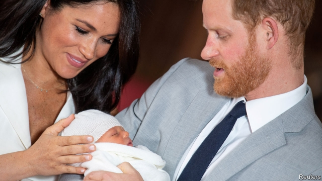

###### Monarchy and media

# Archie, the first royal Instagram baby 

##### Social media are reshaping the relationship between the royals, the press and the public 

 

> May 9th 2019 

THE PRESS had been camped outside the Lindo Wing of St Mary’s hospital in west London for weeks before the birth of Prince George, son of the Duke and Duchess of Cambridge (better known as William and Kate), in July 2013. The news, when it came, was delivered via a press release sent to the world’s media, before the immaculately turned-out family posed outside the hospital for banks of salivating photographers. 

Archie Harrison Mountbatten-Windsor made a quieter entrance on May 6th. There were no waiting journalists because his parents, the Duke and Duchess of Sussex (Harry and Meghan), had kept the location of his birth secret. Instead, the first word of his arrival came via @sussexroyal, the couple’s official Instagram account, which scooped the press with a message reading: “It’s a boy!” There followed a video on @theroyalfamily, the monarchy’s account. The next day William and Kate posted a video of themselves telling interviewers that they were “absolutely thrilled”. 

The relationship between Britain’s royal family and the media has long been strained. But two developments in recent years have made the palace and the press mutually less interested in each other. One is that British newspapers have toned down their royal muckraking. Tighter budgets mean that editors lack the staff to pursue princes and princesses as closely as they used to. Meanwhile the Leveson Inquiry, an official probe into the “culture, practices and ethics” of the press in 2011-12, set up a new system of self-regulation and shamed newspaper editors into dropping their most aggressive practices. “When I first started it was like the Wild West,” says Arthur Edwards, who has been the Sun’s royal photographer since 1977. At work or on holiday, royals were fair game. “But all that’s stopped now. Ever since Leveson.” 

At the same time, the internet has made British papers less important to the monarchy. Readers can get their royal gossip from foreign publications that are not bound by British privacy or libel laws. “You see websites with multiple royal stories a day, often stuff that would never make the cut in a newspaper,” says Victoria Murphy, who writes about the monarchy for international outlets. In 2012 Closer, a French magazine, published topless photos of Kate after British papers turned them down. On that occasion the royal family sued and won. Yet the speed with which information now spreads online makes it impossible to correct. “If they say one story is wrong, do people assume that others are correct?” asks Ms Murphy. 

This is especially true of social media. In 2013, the year Prince George was born, Facebook had 1.2bn users and Instagram just 150m. Those numbers have since risen to 2.4bn and over 1bn. The royal family has upped its social game, hiring a head of digital engagement in 2016. It now has several social-media accounts, each with millions of followers, who monitor the royals’ activities alongside those of Beyoncé or Kim Kardashian. 

Unlike those superstars, however, the royals benefit from a residual sense of deference on the part of their fans. Candid smartphone pictures of the royals are uncommon online. Mr Edwards says that when Kate takes her children to the park, she asks other mothers to refrain from taking and posting pictures, and they comply. What’s more, when new families come to the park for the first time, it is the other mothers who tell them the rules of engagement. It is not just the British press that self-regulates, but also the public. 

