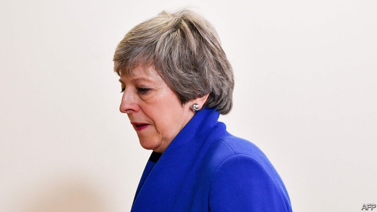

###### A little less conversation

# As cross-party talks stall, Theresa May faces calls to quit 

##### The Tories reel from local-election losses—and face more punishment from voters later this month 

 

> May 9th 2019 

AFTER MORE than a month of cross-party talks, pressure to reach a deal should be mounting. It was ratcheted up by the local elections on May 2nd, in which Theresa May’s Tories made a staggering net loss of 1,334 council seats and Jeremy Corbyn’s Labour unexpectedly lost 82, while the anti-Brexit Liberal Democrats and Greens each made substantial gains. Somewhat paradoxically, the two main parties chose to interpret these results as a call from the electorate for an early Brexit deal. The prime minister said that people wanted Westminster to “get on with it”. John McDonnell, the shadow chancellor, tweeted that the votes meant “Brexit—sort it. Message received.” 

Both parties duly promised to intensify negotiations on a Brexit deal that would pass Parliament. Real progress had been made, claimed Downing Street. An agreement on a temporary customs union that would last at least until 2022 was mooted. Yet no sooner had talks resumed on May 7th than they stalled again. Labour insisted it was ready to compromise but the government was unwilling to shift its red lines. 

Why is it proving so hard to reach a deal? One answer is that British politics does not easily lend itself to cross-party consensus on anything, let alone an issue as controversial as Brexit. Mrs May and Mr Corbyn are hardly natural partners known for their willingness to give ground to one another. And though both leaders would like Brexit to happen broadly as planned in the current withdrawal agreement, plenty of their own MPs do not. Were they to strike a deal based on a fudged customs union compromise, they would struggle to win support from their respective parties. 

The deeper reason is the political background. Labour has no interest in rescuing a Tory party on the edge of total meltdown. Mr McDonnell put it well when he likened the idea to entering into a contract with a company going into administration. The opposition fears that any agreement it might reach with Mrs May could be torn up by a hardline pro-Brexit successor such as Boris Johnson, a former foreign secretary. There is no simple way to “Boris-proof” any Brexit deal. 

Pressure on Mrs May is certainly rising. A poll for the Conservative Home website finds that 82% of party members want her to go. Every day there is talk of fresh deadlines for her departure. The rules of the 1922 committee of Tory backbenchers mean that, since she won a leadership contest last December, she is immune to a further challenge until next December. This week the committee chose yet again not to change this. Yet its chairman, Sir Graham Brady, made clear to Mrs May that large numbers of Tory MPs want her to set out a binding timetable for her resignation. 

What next? The cross-party talks seem likely to wind down next week. That could mean moving on to another round of Brexit votes by MPs, perhaps as before on a series of backbench motions. Yet Labour is unlikely to agree to be bound by any such votes. And as of now, none looks likely to yield a clear majority. Thus Brexit is unlikely to make measurable progress before May 23rd, when the European elections are due. 

This week the government belatedly admitted these elections would happen. As a new report on the European elections and Brexit from the UK in a Changing Europe think-tank notes, such “second-order” elections usually see strong protest votes. This time the Tories expect to be hammered by Nigel Farage’s new Brexit Party. The combined vote-share of Labour and the Tories may fall to its lowest since the second world war. No doubt the two parties will again say this means Brexit must be sorted. But it won’t make it any easier. 

