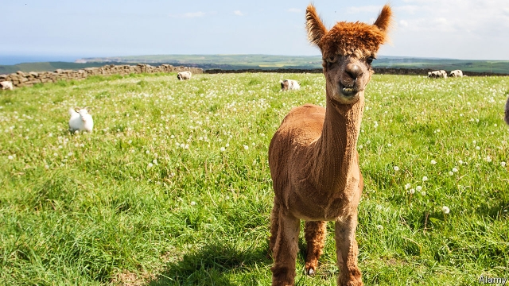

###### Herd behaviour

# British alpacas cheat the abattoir 

##### An 80,000-strong herd is made up increasingly of pets, not sausage-fodder 

 

> May 9th 2019 

EIGHT YEARS ago J. Broomhall Ltd, a family-run abattoir in Gloucestershire, became the first in the country to get a licence to slaughter alpacas. At the time, 40 or so animals a year would arrive to be dispatched. But in recent years business has fizzled out, says Stephen Broomhall, an owner of the firm. One reason is that the animals don’t taste great. More important still is what Mr Broomhall calls the “petification” of alpacas—in other words, people find them too cute to kill. 

Alpacas are increasingly popular as pets, rather than future sausages. There are 40,974 registered with the British Alpaca Society, up from 25,080 ten years ago. Duncan Pullar, head of the society, sticks his neck out and estimates there are 40,000 more unregistered ones. The first animals arrived a couple of decades ago from Peru, where they are mainly farmed for their soft fleece. In Britain owners tend not to be experienced farmers; most have simply “got some fields and don’t like horses”, says Mr Pullar. 

The 2000s saw alpaca prices rise steeply, as demand shot up but animals still had to be imported. Owners got sucked into a co-operative that claimed to offer a route to market for fleece but turned into something of a pyramid scheme. And unscrupulous types found that buying a few alpacas could help them win planning permission for a house, by claiming it was needed for someone to keep an eye on them. 

Today prices have stabilised and growth is slower. A cheap male might go for £300 ($390), less than the price of a pedigree dog. Growing numbers of farms offer alpaca walks, giving the chance to hang out without the hassle of ownership. At Spring Farm Alpacas, in Fletching, Sussex, visitors pay £30 to guide an alpaca around the farm and sneak selfies with the Instagram-friendly beasts. A small shop sells goods made from their wool. EU subsidies for land conservation provide a helpful boost to income. 

Although alpacas are no harder to keep than, say, sheep, they are a step up from more conventional pets. Those unused to humans are particularly standoffish. Spring Farm works hard to raise friendly alpacas. “Every day we’re contacted by people who have bought cute, friendly, cuddly animals [from other farms] but can’t get anywhere near them,” sighs Vicky Agar, who runs the business with her husband and offers training to alpacas and their owners. The Broomhall abattoir recently got a call from a charity wondering how to dispose of unwanted pet alpacas. Cuteness is not always enough to save their hide. 

