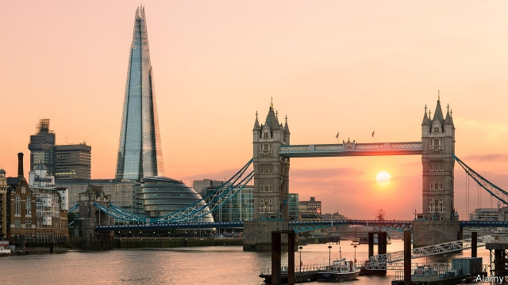

###### What’s up?

# How is Brexit affecting FDI into Britain? 

##### Foreign investment remains strong, but it would be stronger still were Britain not leaving the EU 

 

> May 9th 2019 

HAS THE Brexit vote put foreign investors off Britain? Remainers point to cancelled plans by Japanese carmakers, American banks and others. But Leavers say Britain is more alluring than ever. Last month the country topped a ranking by EY, an accountant, of attractiveness for investors. This week Facebook chose London as its base for expanding its WhatsApp messaging service. Who is right? 

Countries compete hard for foreign direct investment (FDI). When overseas firms enter a domestic market they tend to make it more competitive, which is good for consumers. And when they take over domestic businesses they often boost their productivity. That, in turn, raises wages. 

The Leavers’ case appears strong. In 1995-2015 Britain attracted a tenth of global cross-border mergers and acquisitions. Since the referendum of 2016 the proportion has barely budged. Warren Buffett, the world’s most famous capitalist, recently told the Financial Times he was “ready to buy something in the UK tomorrow”. Low corporation tax and a stable legal system continue to draw business to Britain. 

A common counter-argument is that much of the inward FDI since the referendum has been little more than asset-stripping. Foreigners have taken advantage of a weak pound to buy British companies on the cheap and make off with their intellectual property, the argument goes. Yet even FDI in more concrete things, such as offices and research facilities, has risen since 2016. 

So have investors brushed off Brexit? Not quite. Some industries have noticeably cooled on Britain. It was the top destination for cross-border mergers and acquisitions involving American tech firms in 2014-17. But in 2018 it tumbled to eighth place. In October the UK Trade Policy Observatory at Sussex University modelled a counterfactual Britain that had voted Remain, and found that the Leave vote had reduced inward FDI by a fifth. 

Brexit affects domestic firms, too. In January Barclays bank received legal approval to move €190bn ($213bn) of assets to Dublin, fearing no-deal. The London School of Economics recently found the Brexit vote had caused a 12% rise in investment by British firms in the rest of the EU. That capital might otherwise have been used at home. FDI remains strong, but it would be stronger minus Brexit. And Britain has not even left yet. 

