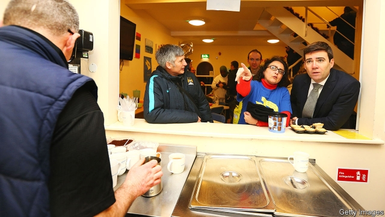

###### Manchester, united

# Manchester’s mayor uses new powers to tackle homelessness 

##### The number of rough sleepers is edging down. But eliminating the problem by next year will be a hard promise to keep 

 

> May 9th 2019 

IT IS THE wind that bothers Gary Cundle the most. The 47-year-old has been sleeping rough for eight months now, bedding down in the same spot outside Manchester’s crown court every night. Winter was the worst, of course, but last weekend he struggled to sleep as an unseasonably chilly breeze whipped across his face. Even three sleeping bags offered little respite. “It gets into your bones,” he says. 

Stories like these motivate Andy Burnham, a plain-speaking Labour politician who once hoped to lead his party. He was elected the first mayor of Greater Manchester in 2017, partly on a pledge to end rough sleeping by 2020. Homelessness is a “test case” for whether the powers that were devolved to the region can make a difference, he says. On May 8th, the second anniversary of his first day in office, he gave a progress update. 

He has set himself a difficult task. The number of people sleeping rough in England has jumped by 165% since 2010. One night last autumn, 4,677 people slept on the streets. Manchester has seen even more rapid change. In 2010, seven people slept rough on a typical autumn night; last year it was 123. Some do not last the night. In 2017, 21 homeless people died in the city. 

Mr Burnham’s approach is hardly radical. Rather than opening homeless shelters only when the temperature plummets, the city offers every homeless person emergency shelter every night and then helps them find stable accommodation. Permanent homes are funded by a government grant of £8m ($10.2m) and a “social-impact bond”, under which the government will pay out to private investors if the scheme keeps rough sleepers off the streets. “It’s not at all rocket science,” Mr Burnham admits. The degree of his commitment to the cause is more unusual. On his first day as mayor he walked the streets, talking to rough sleepers, and set up a fund to raise money for them, to which he donates 15% of his £110,000 salary. 

Early results suggest that things are improving, albeit slowly. Slightly more than 1,400 people have been given shelter since November under the “bed every night” scheme. About a third of them are now in permanent accommodation. Opening up more shelters means each homeless person can return to the same bed every night, giving volunteers more time to offer advice and tackle health issues. Although the problem continued to grow in the city centre, the region’s rough-sleeping count dropped by 10% last year, the first fall since 2010. Mr Burnham has extended the scheme for a year and wants to make it permanent. 

Devolution has helped. Mr Burnham reckons mayors have a “convening power” they can use to add momentum in one or two areas. “It’s the ability to say it’s everyone’s responsibility,” he says. The region’s ten councils have coughed up for the shelters. The mayor has harnessed the power of the city’s “driving forces”, music and football. Vincent Kompany, the Manchester City captain, is donating the proceeds of this year’s testimonial events marking his decade at the club. Later this month a concert will raise more cash. 

Policy wonks are sceptical that Mr Burnham will achieve his goal of eliminating the problem by next year. He acknowledges that it is an open question, calling it “an attempt to galvanise action” rather than a “typical politician’s pledge” (though this does sound a bit like a typical politician’s answer). He used his speech to implore MPs to declare a “homelessness emergency”, as they did with climate change this month. He also wants the government to speed up its plans to stop landlords evicting tenants at short notice—the biggest cause of homelessness in the region—and to grant local welfare officers more discretion to iron out wrinkles in the roll-out of universal credit, a catch-all benefit. 

Mr Cundle, at least, is impressed, even though he was turned away from a shelter this winter because of his mental-health needs. He hopes the expanded scheme will be able to accommodate him. A few years ago, he says, dozens of people would sleep every night in Piccadilly Gardens, in the city centre. Now there are just a handful. “I’ve seen the change. I just wish I could have a bed tomorrow.” 

