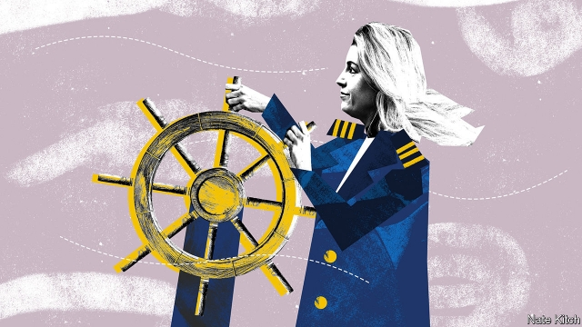

###### Bagehot

# Penny Mordaunt is on manoeuvres 

##### The new defence secretary is a serious contender to succeed Theresa May 

 

> May 9th 2019 

THE POLITICAL arts are often likened to magic because they depend on the suspension of disbelief. David Lloyd George was nicknamed the Welsh wizard. Harold Wilson was called an illusionist. Penny Mordaunt got an early start in training for her current profession when, as a teenager, she landed a job as a magician’s assistant. Now, thanks to Gavin Williamson’s sacking over leaks from the National Security Council, she has been given another lucky break in the form of her promotion to defence secretary, making her the first woman to hold the position. 

The Conservative Party is no longer run by a magic circle. But Ms Mordaunt’s new job puts her in a prime position to appeal to the collection of MPs and party activists who perform the same function today. She has carte blanche to appear frequently in the press against a background of warships and parades. And as a former junior defence minister, in 2015-16, and long-standing naval reservist, she has experience and the goodwill of the military brass to help her make a success of the job. 

Ms Mordaunt’s rise is far more significant than the reverse side of the coin, Mr Williamson’s fall, fascinating though that is. It is possible that Mr Williamson will succeed in clearing his name over the leaks and exacting revenge on Theresa May. But so what? Mrs May is on her last legs and Mr Williamson’s reputation was shot to pieces even before the scandal. Ms Mordaunt’s rise, on the other hand, is reordering the race to succeed the prime minister, providing Brexiteers with a potential new champion who is less dodgy than Boris Johnson and more likeable than Dominic Raab. 

The defence job will let her highlight her distinctive life story. Her father is an ex-paratrooper who named his daughter after a frigate, HMS Penelope. Both her parents were struck by cancer during her youth—her mother died and her father recovered—and she became her younger brother’s main carer. She worked her way through sixth-form college (hence the brief career in magic). Everything about her is a rebuke to Jeremy Corbyn, Labour’s leader, who was born in privilege and has taken every opportunity to criticise “militarism”, at least when it is practised by his own country. 

Her new job will also let her shake off one of her potential negative characteristics. No doubt for lamentable and atavistic reasons, voters continue to distinguish between what political strategists call “mummy issues”, like health and welfare, and “daddy issues”, like security and the economy. Female politicians can pay a high price if they are associated only with the former. But, as if by way of compensation, they can also reap a rich reward if they master the latter. Mrs May’s rise to power was much aided by the fact that she had held the law-and-order brief, as home secretary. 

This is Ms Mordaunt’s second piece of luck in the cabinet. Her previous job, running the Department for International Development (DfID), also brought big benefits. It allowed her to burnish her reputation as a compassionate conservative. The department’s guaranteed budget of 0.7% of GDP also provided Ms Mordaunt with a lot of money to spend at a time when other departments were suffering. Cabinet colleagues were grateful for DfID projects that helped them with their own agendas in, say, health or education. 

Ms Mordaunt is well positioned on the subject that most obsesses her party. The Conservatives’ ascendant Brexiteer faction trusts her to a degree that it doesn’t trust Vicars of Bray such as Sajid Javid and Jeremy Hunt, because, unlike them, she supported Leave in 2016 (when she notoriously made the false claim that Britain would be unable to veto Turkey joining the EU). Nevertheless, she is at the saner end of the Brexiteer spectrum, so she can also harvest votes from Tory Remainers who want to honour the referendum without wrecking the economy. 

She is equally well placed on the conservative-moderniser axis. She is a leader of the party’s Women2Win campaign to recruit more female MPs, and since last year has combined her main cabinet post with a position as minister for “women and equalities”. Yet at the same time, perhaps most important of all in this febrile era, she is a perfect Farage-fighting machine. She is a creature of the very world of simmering resentment and disappointed dreams that Nigel Farage hopes to conquer with his new Brexit Party. Brought up in Waterlooville, a down-at-heel corner of Hampshire, she now represents Portsmouth, a struggling seaside city. 

For all her strengths, Ms Mordaunt has a big weakness: she is rather too similar to the current prime minister for comfort. On the face of it she is as different from the publicity-shy and humourless Maybot as you could get. She appeared on a reality-TV diving contest, “Splash!”, and once gave a parliamentary speech on poultry in order to use the word “cock” and “lay” as many times as possible, after losing a bet with navy chums. But at a deeper level there are similarities. She shares Mrs May’s suspicion of the posh boys who have always vied with her own sort for control of the Conservative Party. And she has the same inability to think big thoughts or utter inspiring ideas. Rory Stewart, her successor at DfID, has made a more compelling case for overseas aid in his first few days in the job than she did in two years of leaden management-speak. 

It is easy to forget how much hope the Tories once placed in Mrs May. The populist wing of the party thought she could stick it to the snobs. Pragmatists saw her as a safe pair of hands. Visionaries imagined she could extend the Conservatives’ appeal to working-class voters who were terrified of Mr Corbyn. The party was so impressed by her credentials that it telescoped the leadership campaign and handed her the job just two weeks after she had declared her candidacy. Ms Mordaunt may prove to be a sturdier vessel for the party’s hopes than the current prime minister. But this time the Tories need to make sure they subject all candidates to the most gruelling examination possible. When it comes to choosing prime ministers, it is vital to let in daylight upon magic. 

