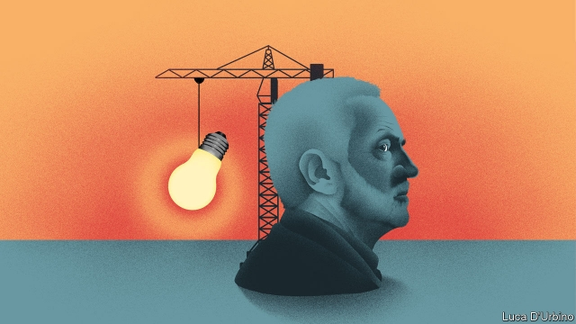

###### New left-wing thinking

# The brains behind Corbynomics 

##### A glut of new think-tanks show the left is at last coming up with new ideas—with help from an unlikely source 

 

> May 9th 2019 

THE EXPOSED brick walls, the east London venue and the bathtub full of free beer brewed specially for the evening did not point to a think-tank launch. Yet this was how Common Wealth, a new outfit aimed at radically overhauling the ownership of British business, announced itself on April 25th. “All of the energy is on the left in politics at the moment,” cheered Ed Miliband, a former Labour Party leader who sits on its board, to a merry audience. 

Common Wealth is only the latest think-tank to have sprung up to cater to the thirst for new ideas on the left. Autonomy, which examines the future of work, started life in mid-2017 and has churned out reports calling for a four-day week that have been hailed by John McDonnell, the shadow chancellor. Other research organisations examining foreign policy and the workings of government from a left-wing perspective are in the works. Democracy Collaborative, a progressive American think-tank, has muscled into the British market. Meanwhile, established outfits such as IPPR, which provided the ideological backbone of Blairism, have swerved leftward and called for a comprehensive reshaping of the British economy. 

It marks a sharp change from 2015, when the left’s ideological cupboard was pretty bare. Jeremy Corbyn’s victory in that year’s Labour leadership contest created a space for left-wing wonks to come up with more radical ideas, beyond simply opposing austerity. Following Labour’s strong showing in the general election in 2017, when the party took 40% of the vote, leftie thinkers turned their attention to working out how to convert those ideas into policies. Now, an ecosystem of left-wing pointy-heads is thriving. “It didn’t exist, so it had to be invented,” says Will Stronge, the 29-year-old director of Autonomy. 

The task is twofold. First, put meat on the bones of Labour’s economic programme. The focus of the new left is on ownership, the future of work and the environment. Mathew Lawrence, the founder of Common Wealth, helped shape the party’s plan to force big companies to hand over 10% of their equity to worker-owned funds. Autonomy, along with the New Economics Foundation, another left-wing think-tank, has banged the drum for a four-day week. Hints from Mr McDonnell that Labour would propose a trial of a universal basic income have provoked a flurry of papers looking at how it could work. Labour’s openness to a so-called Green New Deal has sparked a similar feeding frenzy among brainiacs to determine what such a policy might entail. 

The second job is to come up with ways these policies can be put into practice when Labour takes power. Lefties have discovered a belated admiration for Margaret Thatcher’s means, if not her ends. In a new book, “People Get Ready!”, Christine Berry and Joe Guinan of Democracy Collaborative call for a left-wing version of the Ridley Plan, a paper produced in 1977 by Nicholas Ridley, a Conservative MP, which outlined in stark and prescient detail how Thatcher could break the unions and sell off nationalised companies. But whereas Thatcher came to power after economists such as Frederick Hayek and Milton Friedman, along with think-tanks such as the Institute of Economic Affairs, had spent three decades spelling out an alternative, Labour is having to reverse-engineer an intellectual spine in just a few years. 

If the inspiration for the new blossoming of left-wing ideas is unlikely, so are some of the backers. Paying for the beers at Common Wealth’s launch was Democracy Collaborative, one of the think-tank’s main backers. The American outfit has been a socialist sugar-daddy for Britain’s new left. It is helping to oversee the so-called Preston Model, whereby councils buy locally where possible. James Meadway, a former adviser to Mr McDonnell, is writing a book on Corbynomics, funded by the think-tank. A Labour-branded report laying out potential reforms to the banking system was partly financed by the same organisation. 

For left-wing wonks, normally starved of cash, the money is vital even if its origins are somewhat ironic. A chunk of the money being used by Democracy Collaborative comes from the NoVo Foundation, which is funded by Warren Buffett and overseen by his son Peter. In short, the seed capital of modern British socialism is being indirectly provided by the godfather of American capitalism. 

The recent transatlantic interest in niche left-wing wonkery is based on the assumption that Britain has once again become a political laboratory, as it was in 1979, when Thatcher began to transform the state. This time it is those on the left who have most enthusiastically donned the white coats and safety specs. 

Sometimes the new professors get carried away. Ideas such as capital controls are openly discussed, despite Mr McDonnell repeatedly ruling them out. And the relative lack of original output at the right-wing end of think-tank land has led to a sense of cockiness among some on the left. But right-wing thinking could revive when Theresa May leaves Downing Street. Most ambitious thinkers on the right have already been through government, points out one former think-tanker; anyone outside government is not going to waste a good idea on a dying administration. 

If the left wants anything to show for its intellectual efforts, beyond grand plans and bespoke beers, it will have to get into power. But the unexpected advance of Mr Corbyn and Mr McDonnell has already provided room for the left’s radical ideas to flourish. The growing network of thinkers and institutions means that these ideas may survive long after Labour’s current leaders have gone. 

