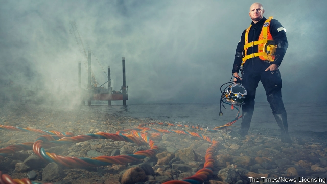

###### A life under pressure

# The ups and downs of the North Sea’s professional divers 

##### Divers’ lives mirror the stormy state of the oil-and-gas industry 

 

> May 9th 2019 

FOR A HIGHLY paid professional, Sean Cann has a decidedly small office. The isolated, pressurised steel chamber where he sometimes spends 28 days straight is about the size of a caravan. Crammed in with five other people, he receives meals through an airlock in between shifts. And although Mr Cann may be only a few hundred miles from his home in Fort William, in western Scotland, he cannot get back safely for up to a week, such is the time needed for his body to decompress. “You can get an astronaut back from the Moon quicker than a diver from the seabed,” divers like to say. 

In the frigid North Sea, Mr Cann dives up to 150 metres (500 feet) below the surface, walking the dark seabed to maintain rigs and pipelines. While working offshore, “saturation” divers like him must live at the pressure they will be diving at, to avoid decompression sickness, or “the bends”, an illness caused by leaving depth too quickly. It is risky work. A breach in the little steel caravan could lead to a quick death for those inside. Underwater, things can be more dangerous still. A recent film, “Last Breath”, depicts the miraculous escape in 2012 of Chris Lemons (pictured), whose umbilical cord providing helium and oxygen broke, leaving him on the bed of the North Sea for half an hour with just six minutes’ worth of air. 

The divers’ trade-off is that their hard and dangerous work can be spectacularly well paid. “They earn good money because their lives are limited,” says Jake Molloy, a regional organiser of the National Union of Rail, Maritime and Transport Workers. In a perfect year an offshore diver might work for six months and earn more than £200,000 ($260,000). Seth O’Rourke, who works in the industry in Fort William, has known of divers ordering brand-new Porsches to be waiting for them at the jetty after a month at sea. 

But by no means every year is perfect in the oil-and-gas business. The North Sea industry has recently been through one of its biggest-ever busts. After the oil-price crash in 2014-16, when a barrel of Brent crude fell from $115 to below $30, companies slashed their costs. Last year saw the least drilling in the North Sea since 1965. The number of jobs supported by Britain’s oil-and-gas industry fell by nearly 40% in three years, from 460,000 in 2014 to 280,000 in 2017. 

Divers are hit particularly hard in downturns because they tend to work as freelancers. “When it’s good, it’s really good. But even experienced guys don’t know when they’re next in work,” says Mr Cann. He has just got home from a job, but a year ago he had been out of work for eight months, sitting at home waiting anxiously for work to keep up with bills and mortgage payments. “It’s been an absolute nightmare,” he says. “A lot of pressure and a lot of stress.” That has an impact on family life. Mr Cann, a divorcee himself, notes the frequency with which divers’ marriages break up. 

Brent is now back to $70 a barrel and there are signs that investment is returning, says Gareth Wynn of Oil & Gas UK, an industry body. Some 13 new developments were approved on Britain’s continental shelf in 2018, more than in the previous three years combined. In January a gas discovery at Glengorm was billed as Britain’s largest in a decade. Mr Wynn says the industry cautiously expects an increase in headcount. 

That optimism isn’t shared by most divers, who saw only a “very intermittent” pickup in 2018 following “almost no work” in the previous three years, says Mr Molloy. “We hear a lot about green shoots. But the diving community say they haven’t seen any significant change.” One frogman says many colleagues are “up to their eyeballs in debt, relying on that next job coming in. If they don’t get it, they lose their house, their car.” Divers must pay partly out of their own pocket to maintain a variety of certificates needed to work. Many complain that they have not had a pay rise in years. Some are considering going on strike. 

Despite the shortage of work, trainees remain eager to sign up, tempted by the prospect of exciting work and Porsches on the jetty. One, a former soldier, spent more than £14,000 on a “premium package” at the Underwater Centre, a training facility in Fort William that has since gone into administration. Since qualifying in 2014 he has had only irregular work on fish farms or diving for razor clams, sometimes earning less than £100 a day. “I’ve just stopped looking for jobs,” he admits. Lucrative saturation-diving work is offered only to those who have years of experience. Even then, only a few make the big time. 

Although the North Sea basin is considered “ultra-mature”, the Oil and Gas Authority, which regulates the industry, believes Britain has enough oil to sustain production for 20 years or more. The decommissioning of oil rigs in the North Sea will provide another source of employment. And although robots do a growing share of the work, they cannot do the more complicated tasks. “You’ll never replace hands,” Mr Molloy says. If all else fails, divers can take their skills to places with more oil (and sunshine) than Scotland, from the Gulf of Mexico to Dubai. 

But as long as the industry continues its boom-and-bust cycle, divers’ lives will be equally turbulent. That means great highs; many love the thrill of working in the deep sea. But it comes at the cost of lower lows. “When you go into diving,” says Mr Cann, “you sign up for a rollercoaster life.” 

