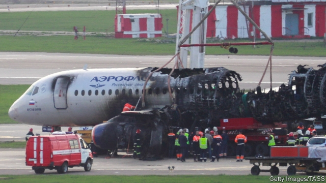

###### Down in flames

# A Sukhoi accident casts doubt on Russia’s civil-aviation plans 

##### The planemaker was already finding it hard to break into the regional-jet market, increasingly dominated by Boeing and Airbus 

 

> May 9th 2019 

JUST BEFORE the fall of the Berlin Wall in 1989, the Soviet Union built 150 airliners a year, around a fifth of the world’s total. By 2000 that number had fallen to almost nothing. In 2006 Russia’s president, Vladimir Putin, nationalised United Aircraft Corporation (UAC) and asked it to develop a commercial jet. When the slender, fuelefficient silhouette of the Sukhoi SuperJet was unveiled in 2007, Sergei Ivanov, Russia’s first deputy prime minister of the day, told foreign investors that it was “more than a plane”. It was meant to restore Russia’s glory in the civil-aircraft business. 

On May 5th these high hopes took a knock when one such aircraft caught fire and crash-landed at Sheremetyevo Airport in Moscow. At least 41 of the 78 people onboard died. Investigators have not yet reached any conclusions about what caused the tragedy. Sukhoi, the UAC’s civil-aircraft arm which makes the plane, extended “its profound condolences for the families and friends of the victims”. 

Before the accident UAC was aiming to increase its share of global revenues from civilian aircraft, from 17% in 2017 to 40% by 2025. The target now looks unreachable. Yet even beforehand Sukhoi had been making only slow progress towards it. The company has grabbed 20% of the global market for regional jets and secured a similar number of orders as rival aircraft from Bombardier of Canada and Embraer of Brazil, the two firms which have historically dominated the sector. But although the SuperJet is cheaper to buy, even Russian airlines were already falling out of love with it, says Tom Chruszcz of Fitch, a rating agency. The lack of a global maintenance network made servicing Sukhois more expensive, and the amount of time not in the air longer, than for the Canadian and Brazilian jets. Sanctions on Russia have crimped the availability of spare parts outside of Russia. Alexei Navalny, a former member of Aeroflot’s board turned vocal critic of Mr Putin, has previously derided SuperJets as “always standing idle” and generating losses for the flag carrier. 

Over the past year airlines have raced to pull SuperJets from service and to cancel future orders. CityJet of Ireland has dropped 15, Brussels Airlines of Belgium four, and Adria Airways of Slovenia 15, at a total cost to Sukhoi of up to $1.5bn at list prices. In the wake of the crash, Yamal Airlines of Russia cancelled its order for ten such aircraft, worth up to $500m. 

Sukhoi’s troubles will have ramifications beyond Russia. The planemaker was the last viable challenger in the near term to an industry increasingly dominated by two behemoths: Boeing of America and its European arch-rival, Airbus. Bombardier tried to break their duopoly in larger narrow-body aircraft with its C Series. Instead, Airbus took over the C Series programme in 2017. A year later Embraer announced a tie-up with Boeing to counter Airbus. 

Boeing itself is dealing with the consequences of two recent crashes. On the day of the SuperJet accident the American firm said it knew about software problems two years ago on its 737 MAX jet, which have been linked to accidents that killed 346 people. The Embraer deal may fall by the wayside as Boeing contends with regulators and lawsuits. Airbus is worried that Bombardier could sell the technology for the C Series’s lightweight wings, which the Canadian firm put on sale along with its factory in Belfast on May 2nd. Still, when the two giants put their current problems behind them, they may have no Russian rival to worry about. 

