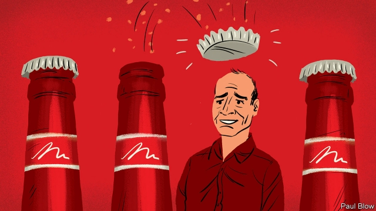
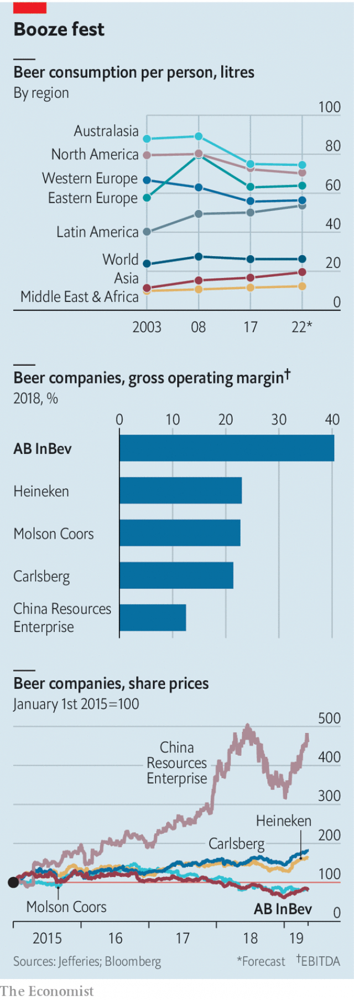

###### Trouble brewing

# Brewers at AB InBev need to rethink its strategy 

##### As drinkers cool on beer, the world’s mightiest beermaker can no longer rely on takeovers to boost growth 

 

> May 11th 2019 

SNOOTY ALE connoisseurs mock Budweiser’s usurped title of “King of Beers”. No one, however, quibbles that Bud’s purveyor, Anheuser-Busch InBev (ABI), reigns over global brewing. The all-conquering firm now sells almost three Olympic-sized swimming pools of beer an hour—more than its three nearest rivals combined. Yet even as profits have frothed, weariness has descended upon the head that wears the crown. ABI’s prospects, once as golden as its Corona lager, have assumed the cloudier quality of a Belgian witbier. 

ABI, which is nominally based in the Flemish city of Leuven but run out of New York, is not just much bigger than its rivals, selling one in four beers worldwide. It also generates around half the industry’s global profits. Its gross operating margins were 40% in 2018, more than double the average for other listed brewers—and stellar by the standards of firms that peddle any kind of consumer goods. It has devoted managers, nearly all recruited out of university. The looming presence of ABI’s boss, Carlos Brito, in the company’s corridors, can feel almost eerie. Employees’ fealty to “Brito”, as the methodical Brazilian is universally known, is reminiscent of General Electric under Jack Welch. 

Investors’ similar devotion to the company as a whole is increasingly being tested. The first set of worries is specific to ABI. 

Its agglutinated name points to a firm whose trajectory has been set by financiers, not brewers. At its core is a trio of Brazilian investors best-known for later starting 3G Capital, a private-equity fund which has snapped up other food firms such as Burger King and Kraft Heinz. They used Brahma, a Brazilian beer firm they acquired in 1989, as a platform to buy up rivals the world over: Interbrew, a Belgian brewer which makes Stella Artois, in 2004; Anheuser-Busch, the American owner of Budweiser, in 2008; and SABMiller, its biggest remaining rival, in 2016. Mr Brito is their main lieutenant. He has led ABI since 2005 atop a Brazilian-heavy management team with a lust for trimming fat from flabby conquests. 

The successful two-pronged strategy of serial acquisitions and cost-cutting appears to be nearing its limits, however. Having consolidated the fragmented beer industry—four of the ten biggest brewers in 1990 are part of its empire—no large rivals remain to be taken over without goading competition authorities. As for cost-cutting, by the end of the year ABI will have wrung out the last of the $3.2bn of annual savings it expected from SAB. 

At the same time, cost controls espoused by ABI and its 3G-run cousins—starting with every manager having to justify every dollar of spending anew each year—have come under scrutiny. Kraft Heinz’s shares tumbled in February after it wrote down the value of its assets by $15bn. Many took it to be a tacit admission that its cost-cutting had done the business harm. The announcement by Kraft Heinz on May 6th that it would have to restate nearly three years of results, after an internal probe unearthed “misconduct” in its procurement procedures, though not directly linked to “zero-based budgeting” or 3G’s other distinctive management techniques, nevertheless cast a shadow over them. 

Mr Brito is adamant that problems at Kraft Heinz are not ABI’s concern. His own cost-curbing philosophy—to redirect spending from wasteful things to wiser ones like marketing, he says, not strip expenses willy-nilly—does seem less draconian than Kraft Heinz’s. “We are not a 3G company,” he insists. Investors are not so sure. ABI’s own share price dipped briefly in February in the wake of Kraft Heinz’s impairment. ABI’s erstwhile top marketer has been parachuted in to fix the food giant. 

Either way, ABI needs a new growth strategy, having squeezed its historic one dry. Expanding its small non-beer offering—buying Coca-Cola, for example, or Diageo, which mainly sells spirits—once seemed like the obvious thing to do. But a daring takeover seems unlikely. The £79bn ($98bn) bid for SABMiller three years ago landed ABI with net debt of over $100bn, nearly five times last year’s earnings before interest, tax, depreciation and amortisation. Repayment has been slow, not least because ABI has borrowed largely in dollars and euros but earns most of its money in the fragile currencies of volatile emerging markets like Brazil and South Africa. 

Worries about debt caused its shares to tumble by 38% in 2018, a third straight year of decline. The share price has recovered half of last year’s losses, though it still looks cheap relative to expected earnings compared with its two closest rivals, Heineken and Carlsberg—ABI’s superior margins notwithstanding. It is also still down by a third since the SAB deal, even as the shares of smaller rivals have risen smartly. 

In a humbling turn, ABI’s board (which the Brazilian investors control alongside a group of Belgian heirs) halved its dividend in October to pay down debt. On May 7th it confirmed rumours that it is exploring listing a minority stake in its Asian operation, estimated to be worth perhaps a quarter of the group’s $172bn market value. 

No wonder Mr Brito says reducing debt is his priority. More specifically, analysts reckon, he wants to make it more manageable by boosting profits. Now that Kraft Heinz’s woes make some investors take a leery view of ABI’s fat margins, lest they too are down to indiscriminate cost-slashing, the focus has turned to increasing earnings by growing revenues from beer. 

Beermaking is not what it used to be, however. Brewers are seeing demand for their tipple dry up. In America, ABI’s biggest single market by revenue, beer is losing “share of throat”, in industry jargon, to wine and spirits, just as people are drinking less booze. The only rival of any size whose shares have underperformed ABI’s is predominantly American Molson Coors. Youngsters across the rich world are spending less time in the pub and more at the gym (or smoking cannabis, another alternative to beer). Nearly a quarter of young Brits are teetotal. 

Consumption is rising in poor countries, where 57% of ABI’s revenues now come from, in part thanks to SAB. But even there growth has slowed. Beer sales used to closely track the global economy, notes Ed Mundy at Jefferies, a brokerage. In future he expects them to grow a third as fast as GDP—or a paltry 1% a year. 

Such trends explain why ABI shipped barely 0.3% more pints in 2018 than the previous year. Exclude acquisitions and ABI has not increased beer volumes in over a decade. Sales growth, of 4.7% a year since 2008, is largely thanks to what Mr Brito calls “revenue management initiatives”—or, in plain English, selling ABI’s existing beers at higher prices. 

Mr Brito wants to emulate the spirits-and-wine trade, where consumers pay vastly higher prices for top brands than for mainstream ones. For example, ABI owns lots of labels which are nothing special at home but marketed as posh overseas: Budweiser, America’s bog-standard lager, sells for a premium in China; Stella, which Europeans quaff at football games, is served with three-course dinners across the pond. Around the world, dozens of craft breweries that ooze local charm and anti-capitalist mystique—think Camden Town Brewery or Goose Island—are, in fact, owned by ABI. But growth in craft-beer consumption, too, looks flat; people will only pay so much for ultra-hoppy ales. 

 

Analysts fret that ABI’s margins in emerging markets may come under attack next. Competition there used to be as weak as a Bud Light. Brewers did not unduly tread on rivals’ historic patches. No longer. “The competitive intensity has gone up a notch in recent years,” says Trevor Stirling of Sanford C. Bernstein, a research group. Countries that used to be beer monopolies, or at worst comfortable duopolies, are being besieged by outsiders. Heineken is making a big push into Brazil and Colombia, which would once have been considered an act of lèse-majesté against ABI. In November Heineken sealed a joint venture with China Resources, that country’s biggest brewer. The listing of ABI’s Asian business, if it happens, may help it retaliate by acquiring its way to a bigger market share in places where it is weak. 

Mr Brito insists growth is still there if you know where to look for it. Non-alcoholic beers have got tastier thanks to improved recipes and are also growing quickly; Mr Brito theatrically cracked one open at ABI’s annual shareholder meeting last month. Once considered the preserve of young men, beer is increasingly marketed to women and older folk. First-quarter results reported on May 7th suggest Mr Brito could be on to something. Revenue grew by a respectable 5.9% year on year. 

Sceptics question whether a corporate culture built around Excel wizards can be retooled into one where marketers eek out incremental market-share gains, quarter after quarter. Mr Brito may yet prove the doubters wrong. He betrays no hint of abdicating. But if he has learned anything, it is that reigning over the brewing world is more work than seizing the crown. 

