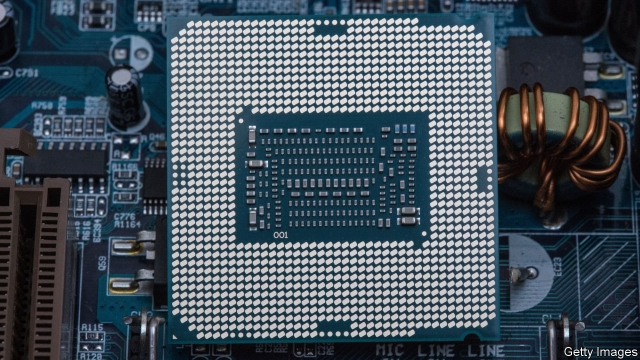
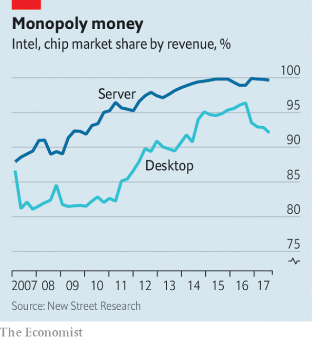

###### Computer chips

# Intel’s new boss wants to teach the chipmaker new tricks 

##### When fear of missing out meets financial ruthlessness 

 

> May 9th 2019 

“IT’S BEEN a couple of years since we’ve had you with us,” Bob Swan told Intel’s investors at its Californian headquarters on May 8th. “During that time, a lot has changed.” Not least for Mr Swan. Two years ago he was chief financial officer. Then, in June last year, Brian Krzanich, the firm’s previous boss, resigned after violating rules against romantic relationships between employees. Mr Swan, appointed regent while the firm hunted for a replacement, initially said he had no plans to make the arrangement permanent. By the end of January, though, he had decided that the view from the top was not so bad after all. He was duly appointed CEO. 

He has inherited a company in an awkward position. Intel’s business plan used to be simple. In 1971 it released the world’s first commercial microprocessor. It then dedicated its existence to implementing, over and over again, the famous observation by Gordon Moore, its co-founder, that the number of components on such processors (and, roughly, their capabilities) would double every two years. 

It worked, and very well. Intel dominates the market for chips that power desktop PCs. It is a virtual monopolist in the much more profitable market for the beefy server-class chips which power data centres around the world (see chart). The market for PCs is shrinking gently but demand for server chips is growing, propelled by the profusion of internet-connected gizmos, from smartphones to cars. 

 

More recently, however, Intel has made mistakes. It missed the arrival of the smartphone, which has elbowed aside the PC as most people’s computing device of choice. It failed to capitalise on the rise of GPUs, specialised chips designed for video-game graphics which have found other uses accelerating the calculations used in AI and scientific computing. 

And its manufacturing technology, which used to advance with such metronomic regularity that Intel called its business plan “tick-tock”, has stumbled. The firm’s latest generation of products, built on its “ten nanometre” manufacturing process, was due to arrive in 2016. They will not come until later this year. Such an unprecedented delay has allowed the world’s two other cutting-edge chipmakers—Samsung of South Korea and the Taiwan Semiconductor Manufacturing Company—to catch up. Worst of all, the magic of Moore’s Law seems to be fading. The performance gains from shrinking chips are not what they were, and the cost of doing so keeps rising. 

Along with the rise of cloud computing, this has transformed the hardware landscape. GPUs were the first of a new wave of highly specialised chips. No longer able to rely on big performance boosts in the sort of general-purpose hardware sold by Intel, firms from Microsoft to Facebook to Tesla have begun designing custom chips specialised for the sorts of number-crunching their businesses need. 

That is unlikely to harm Intel directly, since such accelerator chips are complements to its server chips, not replacements. Mr Swan could simply sit back and watch the profits roll in. But as he explained to the audience in California, he hopes to continue Mr Krzanich’s strategy of expanding the firm’s reach. He wants to use Intel’s almost unique position among chipmakers as both designer and manufacturer to mount an assault on both the accelerator market, and on data centres more generally. Intel’s old business, he said, eyed an annual market of perhaps $52bn. Add these new areas, he reckoned, and you get $300bn. 

With that in mind, the firm has been on a buying spree. In 2015 it bought Altera, which makes reconfigurable server chips, for $16.7bn. In 2017 it acquired Mobileye, which makes computer-vision chips for self-driving cars, for $15.3bn. Internally, it has poured cash into everything from photonics (which uses light, not electricity, to shuffle data between chips) to Optane, a new kind of memory designed to keep chips fed with numbers to crunch. It is even developing a GPU of its own. In February Murthy Renduchintala, Intel’s chief engineer, told The Economist that matching Nvidia, the market leader in GPUs, was “non-negotiable”. 

But Mr Swan hopes to pull off the tricky task of marrying ambition with discipline. “Intel’s acquisitions have a long history of destroying value,” says Joseph Moore, an analyst at Morgan Stanley (and no relation of Gordon’s). Fittingly for a former CFO, Mr Swan was at pains to emphasise that, in future, Intel would be hard-headed about when to double down on a bet, and when to fold. Pierre Ferragu, an analyst at New Street Research, calculates that Intel has spent $19bn since 2012 trying, and failing, to bully its way into the smartphone-radio market, which is dominated by Qualcomm, an American firm. One of Mr Swan’s early acts as boss was to pull the plug. 

When it comes to Moore’s Law, fixing things will be harder. Mr Renduchintala has said that, with the “ten nanometre” hiccup, Intel’s renowned engineers simply bit off more than even they could chew. The company insists it can carry on shrinking its chips for some time yet. But the physics will only get more finicky and expensive. As Moore’s Law slows, and engineers look elsewhere for performance improvements, the chip industry will become even more fragmented. Mr Swan’s fundamental diagnosis—that one of Silicon Valley’s original darlings must learn to diversify, and fast—is surely correct. 

Business and finance correspondent: The Economist is looking for a writer to work at its headquarters in London. Applicants should combine a knowledge of finance with the ability to write informatively, succinctly and wittily. They should send a CV and an unpublished article suitable for publication in the Business or Finance and Economics section to financejob@economist.com by May 31st. (Telling us what you would do if stranded on a desert island is optional.) 

