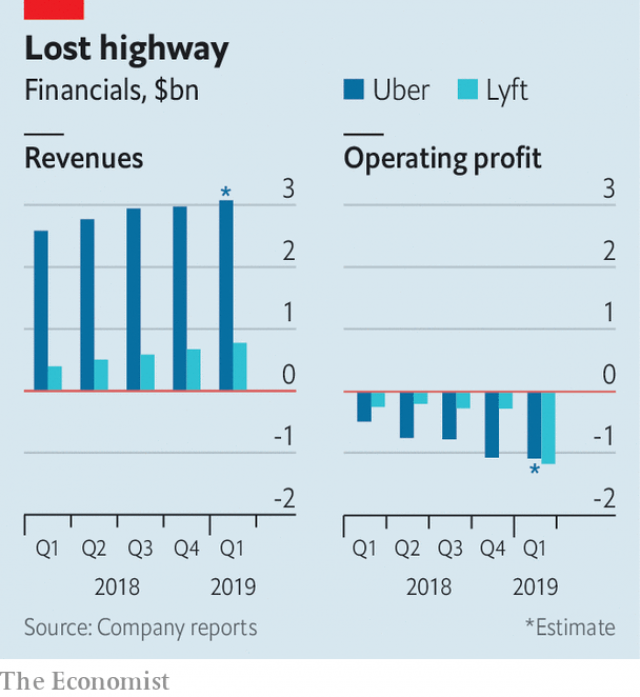

###### Public distress

# Lyft’s revenues double, losses quintuple—and prospects darken 

##### The same is likely to be true of Uber when it lists. Only more so 

 

> May 11th 2019 

ON MARCH 29th Lyft became the first ride-hailing company traded on a stockmarket. The company’s share price jumped by 9% on its debut, valuing it at $22.4bn. By May 7th, the day it reported results for the first quarter as a public company, it was worth $17bn. Some investors thought even that was too generous. Lyft’s share price fell by another 11% the next day. 

Although it posted quarterly revenues of $776m, nearly double the level a year ago, the company also recorded a loss of $1.14bn, more than it lost in all of 2018. Most of that was down to booking stock-based compensation plans for employees, who earned $894m from Lyft’s initial public offering. Lyft’s chief financial officer, Brian Roberts, conceded that 2019 would be its “peak loss year”. It will “move steadily towards profitability” thereafter, he promised. 

How that might happen is unclear. Lyft is still bleeding cash, even excluding employees’ compensation, as sales and marketing and insurance costs rise. The firm’s adjusted operating loss of $230m showed little improvement on the prior year despite fast top-line growth. And Lyft forecast that sales growth in the second quarter of 2019 would slow down sharply. 

Everything that is true of Lyft also holds for Uber—only more so. The ride-hailing goliath was due to list its shares on the New York Stock Exchange on May 10th with a market capitalisation several times Lyft’s. Its losses, too, are larger. According to Uber’s own unaudited first-quarter results, it lost another $1bn or so in the first three months of the year. That brings the total since it was founded in 2009 to $9bn. 

 

Both firms have enough cash to continue to burn money for years, but public investors expect a rapid path to profitability. Making it into the black will require either raising prices or reducing the cut of bookings passed on to drivers. The former will be hard; in many markets ride-hailing competes with other cheap modes of transport, such as buses, bicycles and riders’ own cars. 

The latter looks harder still. Drivers on both platforms complain of earnings that barely cover the cost of living. They staged a global strike to coincide with Uber’s IPO. That is why Lyft and Uber are keen to get rid of drivers altogether. During its earnings call Lyft announced that riders in Phoenix will soon be able to book one of ten robotaxis (all with human safety drivers to begin with). These will be provided by Waymo, the autonomous-car arm of Google’s parent company, Alphabet. In March Uber raised $1bn for its own self-driving venture from investors including Toyota, a Japanese car giant. Both firms’ initiatives have doubtless been designed to signal to Wall Street that there is a way to make red ink turn into gold. Perhaps. 

