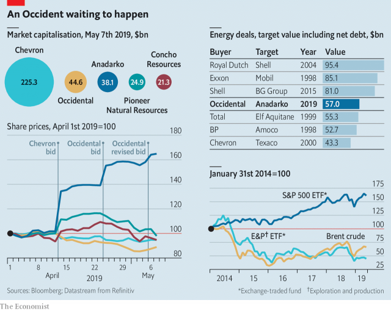

###### There will be blood

# Occidental Petroleum has bid $57bn for Anadarko 

##### The counteroffer to Chevron’s offer ups the ante in the energy industry’s biggest bidding war in years 

 

> May 9th 2019 

VICKI HOLLUB, chief executive of Occidental Petroleum, had been wooing Anadarko for nearly two years, according to people familiar with the events, when in early April her target went silent. On April 12th it became apparent why: Chevron, an oil major five times Occidental’s size, announced a $33bn deal to buy Anadarko instead (and assume its $15bn in net debt). Ms Hollub’s advances appeared spurned. Until, that is, Occidental made a counteroffer of $57bn (with debt) on April 24th, then on May 5th sweetened its terms. On May 6th Anadarko’s board backed it as “superior” to that of Chevron, which has until May 10th to up the ante. It is already the energy industry’s biggest bidding war in decades. 

Ms Hollub’s bold gambit now includes allies: Total, a French oil giant, and Warren Buffett. People close to the matter recount how she secretly flew to Paris on April 26th, then to Omaha two days later to speak with the revered investor, to win their support. Occidental, she agreed, would sell Anadarko’s African assets to Total for $8.8bn, reducing its debt. Mr Buffett would pay $10bn for 100,000 preferred Occidental shares, which would receive a generous 8% yearly dividend, and the right to buy 80m shares of common stock for $62.50 each. Brian Moynihan, the boss of Bank of America, which is advising Occidental and in which Mr Buffett’s holding company, Berkshire Hathaway, has a stake, had urged him to consider Occidental’s bid. Berkshire’s promise of a capital injection enabled Occidental to pad the offer with more cash and fewer of its shares. Occidental no longer needs its shareholders to approve the deal. 

In this battle, the risks and rewards are uneven. Winning would help Chevron produce more oil, more efficiently, thanks to Anadarko’s prize holdings in Texas’s Permian basin, whose abundant shale deposits make it the most productive oil field in America. However, reckon analysts at Morgan Stanley, losing would bring no long-lasting harm to its business. 

If Chevron’s courtship looks opportunistic, Occidental’s would, if successful, be transformational. Buying Anadarko would nearly double the smaller suitor’s production and help it battle ExxonMobil and Chevron as they expand through the Permian. But Moody’s, a ratings agency, reckons that the deal—accounting for Mr Buffett’s cash but not the sale to Total—would add $46bn in debt to the combined companies. Even after the sale to Total, debt would leave Occidental vulnerable to future falls in the oil price. If it loses Anadarko, Occidental could itself be subject to a takeover. 

Anadarko looks appealing in part because of its shale acreage, in part because its operations have room for improvement. Its share price also looked cheap. That it no longer does points to the bidding war’s biggest victors: its shareholders. Its share price gained 32% after Chevron’s bid was made public, and a further 17% following Occidental’s offers, at a time when investors have cooled on American shale. 

