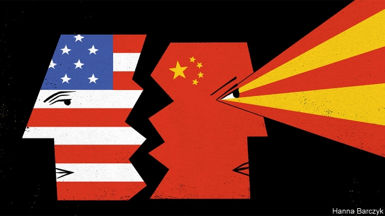

###### Chaguan

# Calls to harden the West’s defences against China suggest despair 

##### A China that feels less dependent on outsiders is not necessarily safer 

 

> May 9th 2019 

THE HISTORY of attempts to contain modern China is not a happy one. The Soviet Union tried it in 1960 when Mao Zedong’s insouciance about nuclear war—he had suggested that such a conflict would kill more imperialists than socialists, leaving the world ruined but Red—alarmed Nikita Khrushchev. Soviet technical advisers, including nuclear-weapons experts who shredded all documents they could not carry, were withdrawn from China. Chinese technicians reassembled the shreds, recovering clues which helped China test an atom bomb four years later. 

The lesson was clear. Withdrawing assistance from a threatening China may be rational, but a China that succeeds anyway, and then feels less dependent on outsiders, is not necessarily safer. 

It is not a lesson that has much resonance in America today. Whatever happens with the trade war started by President Donald Trump, America is hardening itself against China. Moves are afoot to wall off sensitive technologies behind export controls, tariff barriers and tougher investment-screening rules. With varying degrees of success, American officials are leaning on allies in Europe and elsewhere to shun such Chinese firms as Huawei, a telecommunications giant. Amid allegations of rampant, China-directed espionage on campuses, America is tightening visa rules for Chinese students of science and technology. 

In Congress and in the White House, leaders sound unmoved by the downsides of withholding assistance as China rises. If the result is a China that feels that it does not need the West, they are inclined to shrug. “I think that’s the way this ends anyway. In essence there is no way that China intends not to eventually wind up at that point,” Senator Marco Rubio of Florida recently told Chaguan. The Republican has co-sponsored bipartisan bills that would restrict China’s access to American technology and to markets such as telecommunications that touch on national security. 

President Xi Jinping sees a test of China’s mettle. Protectionism is making it harder to obtain vital technologies from abroad, he declared last September. China must take “the road of self-reliance”. 

The idea of “self-reliance” has been dear to the Communist Party for 70 years, notes a recent paper by Neil Thomas of the Paulson Institute, a think-tank in Washington. But it has usually referred to a desire for independence, not autarky. The phrase was common under Mao, even during the period when leaders in Moscow sent money, modern machinery and over 10,000 advisers. Deng Xiaoping used the same phrase when he opened China to capitalist forces and foreign investment 40 years ago, Mr Thomas notes. Talking of self-reliance amid so much foreign help sounds contradictory. But the phrase in Chinese is a woolly one, meaning “regeneration through one’s own efforts”. The barriers that America is now erecting may push China to seek a kind of self-reliance that leads to something dangerous: a China that feels it owes nothing to foreign powers with very different values and rules. 

In part, the West’s newfound desire to distance itself from China reflects an erosion of the old and complacent belief that free societies have such an edge when it comes to innovation and creativity that they will invariably stay ahead of autocracies. As China catches up, the West is turning defensive. 

In part, those advocating a warier approach to China are bowing to an unhappy political logic. Since foreigners first began seeking access to China, back in the days of the Qing emperors, engagement has been seen as a way to strengthen liberals and reformers within the Chinese system. In 19th-century Britain many commentators decried their government’s resort to armed force to prise open China’s markets, sometimes not so much from a moral standpoint as because they feared that getting tough with China would reinforce its contempt for foreign trade. In 2001, when the World Trade Organisation admitted China as a member, many in the West fondly hoped this gesture would boost the fortunes of reformers battling against state interference in the economy. 

Alas, many Americans and other Westerners who work on China policy have little confidence that Chinese reformers wield enough clout to be meaningfully succoured or harmed. Foreign business bosses and politicians believe that Mr Xi’s economic aide, Liu He, is a reformer who wants China’s markets to be more open. But they see few signs that Mr Liu, who is a deputy prime minister, has any mandate of his own to tackle vested interests opposed to reform. His power comes from representing Mr Xi. 

That helps explain why so many foreign governments and businesses quietly applaud an aggressive American approach that a short while ago would have appalled them. In the absence of internal pressure from reformers, they hope that Mr Trump and his team will secure substantive changes in the way China uses subsidies, local monopolies and the coercive transfer of foreign trade secrets to manage its economy. Many of Mr Trump’s tactics dismay them, and have at times humiliated Mr Liu, as China’s trade envoy. But seeking and empowering allies inside China has not worked. 

This conclusion alarms some of those in China most sympathetic to the West. In Beijing’s best-known universities and think-tanks, some scholars urge the world not to walk away. “Right now if you want to talk about reform, domestically, internally, it’s difficult,” says a think-tank boss, saying that outside pressure “keeps China open”. A more hawkish government adviser charges that, if Western governments are too aggressive and distrustful, they “will produce a very terrible nationalism in China.” 

Darker Chinese forces have much to gain from visible divides with the West. Chinese spies have cause to target foreign trade secrets that are never going to be shared voluntarily. Hardliners can growl that America was always bent on containment, and is now proving it. Both America and China will feel that their actions are rational and make them safer. Both may be proved wrong. 

