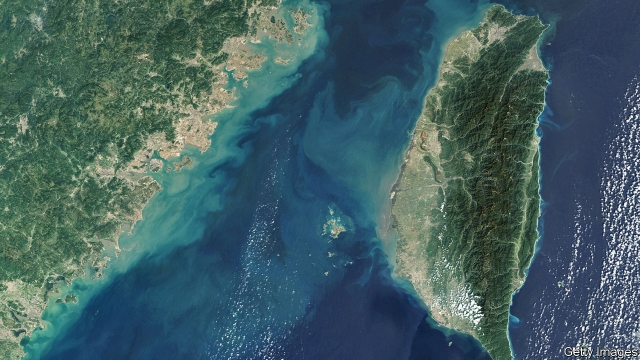
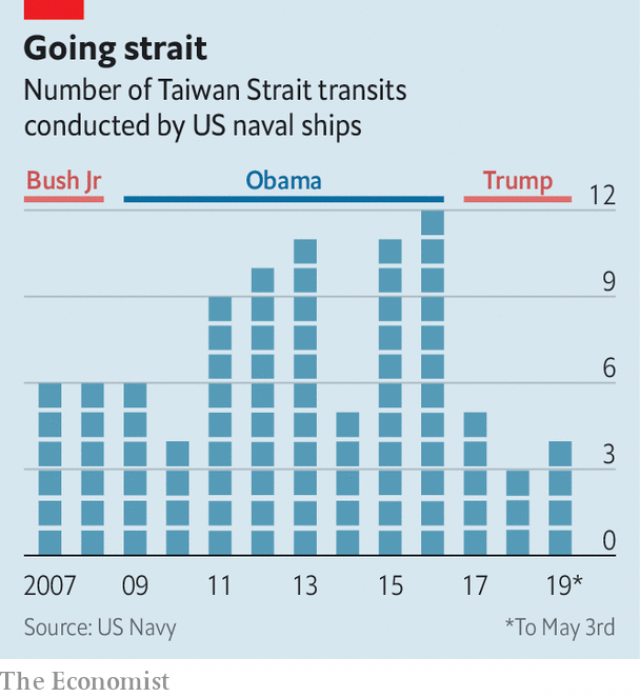

###### In deep water

# China bristles at Western naval transits through the Taiwan Strait 

##### Under Donald Trump, America’s navy has been staging fewer of them 

 

> May 9th 2019 

AS DAWN BROKE on May 5th, Chinese warships began live-fire drills in the north of the Taiwan Strait, the 180km-wide waterway between China and Taiwan. Fishermen, who were told to stay clear until May 10th, will be getting used to passing shells. In April 2018 the Chinese navy held its first live-fire exercise there for three years. The Taiwan Strait now seems thick with warships—and not only with China’s. 

Last month the passage of a French frigate through the strait angered China. It complained that the passage was “illegal” and barred France from a multi-country ceremony to mark the Chinese navy’s 70th anniversary. The suggestion of illegality—later removed from the website of China’s defence ministry—raised eyebrows. It seemed to imply that China was staking a claim to an entire international waterway. 

That did not discourage a pair of American destroyers from sailing through the strait a few weeks later, on April 28th. The US Navy said the transit showed America’s “commitment to a free and open Indo-Pacific”. It was the fourth such American passage in 2019, according to figures released by America’s Pacific Fleet in May and first reported by the South China Morning Post, a newspaper in Hong Kong. 

American naval transits rose from an average of under six per year between 2007 and 2010, to almost ten per year in the six years that followed (see chart). That was a relatively calm period in the Taiwan-China relationship, but a tough one for China-America ties—China was speeding up the reclamation of land and construction of military outposts on rocks and reefs in the South China Sea. 

 

America’s transits peaked at a dozen in 2016, Barack Obama’s last year as president. That year a less China-friendly government also came to power in Taiwan, raising cross-strait tensions. Yet since Donald Trump took office, transits have plummeted. There were just three last year—the lowest on record. On the face of it, that is curious. Many of Mr Trump’s officials have vocally supported Taiwan in the face of intensifying Chinese pressure. Mr Trump, as president-elect, was persuaded by advisers to make a taboo-busting phone call to Tsai Ing-wen, Taiwan’s president, in 2016, the first such conversation since 1979. He has since signed laws encouraging American ships and officials to visit Taiwan and approved arms deals totalling $2.25bn. 

But Mr Trump may have far less interest in Taiwan’s welfare than these moves suggest. At first he saw Taiwan as a useful card to play in his dealings with his Chinese counterpart, Xi Jinping. When Mr Xi pushed back, Mr Trump duly backed off. 

But the main reasons why America has been sending fewer of its warships through the strait could be unrelated to Mr Trump’s thinking about China or Taiwan. America’s Japan-based Seventh Fleet—the core of the Pacific Fleet—suffered several collisions in 2017, resulting in its commander’s dismissal and less time at sea for its ships. Seventh Fleet vessels also spent more time sailing north to the Korean peninsula as tensions caused by North Korea’s nuclear programme spiked in 2017 and 2018, rather than south through the strait. 

The drop in the number of transits has coincided with stepped-up muscle-flexing by China. Since 2016 it has started flying bombers around Taiwan. On March 31st China sent a pair of warplanes across the “median line” of the Taiwan Strait for 13 minutes. If deliberate, it was the first such intrusion in two decades. Taiwan is gearing up for a presidential contest in January. In recent years, China has reduced its military posturing ahead of Taiwanese elections, apparently to avoid boosting support for China-sceptic candidates. This year, however, it has been keeping up the pressure. 

