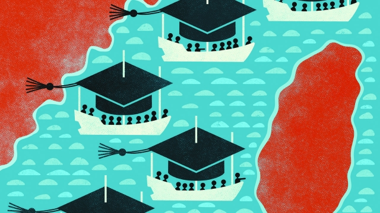

###### Formed in Formosa

# China worries about how study in Taiwan might affect its students 

##### But it still allows large numbers to go to universities there 

 

> May 9th 2019 

SIPPING ICED coffee at a trendy restaurant in Tainan, a city in southern Taiwan, Li Jiabao appears calm despite the attention the 20-year-old student’s outspoken views have recently attracted on the island’s campuses. Mr Li is a student of pharmacy from the eastern Chinese province of Shandong. In March he released a startling self-recorded video in which he denounced China’s decision, unveiled about a year ago, to scrap the ten-year term limit for the presidency. He compared China’s current leader, Xi Jinping, to an “emperor”. Most Chinese students in Taiwan keep quiet about politics at home. But Mr Li says living in Taiwan’s “model democracy” inspired him to speak out. Last month he applied for political asylum there. 

Liberal thinkers in China have long been fascinated by Taiwan’s politics because of the island’s close cultural and historical links with the mainland. At the end of the Chinese civil war in 1949, the defeated Kuomintang (KMT), or Nationalist Party, took refuge on the island and ruled it with the same contempt for democracy that the victorious Communist Party displayed in China. But Taiwan succeeded economically, producing a middle class that began pushing for reform. Eventually, in 1996, Taiwan held its first democratic presidential election. The KMT won but the next time, four years later, it was defeated. 

Despite the Communists’ efforts to portray Taiwanese democracy as a raucous farce, the island’s orderly political evolution has inspired some people in China. Even so, in recent years, as cross-strait economic links have boomed, China has allowed many thousands of students to experience the island’s freedoms for themselves, just as it had permitted students to head to universities in the West. In 2018 nearly 30,000 Chinese students were enrolled at Taiwanese universities, more than ten times as many as a decade earlier. 

The students’ presence is a sign that both sides have become less worried about exposing future members of their elites to the ideologies of their foes (technically, China and Taiwan are still at war). In China’s case it reflects confidence that its youth are unlikely to be won over by Taiwan’s view of itself as a sovereign country with every right to resist China’s claim to it. Recently China has reduced the flow. But the main purpose has been to show displeasure with Taiwan rather than limit exposure to its democracy. 

The Communist Party does remain determined to protect its population from heretical thinking. Less than three hours after Mr Li circulated his video on Twitter, censors in China responded by shutting down his accounts on Chinese social media, apparently fearing that he might use them to post similar material. Mr Li says his parents in Shandong were briefly detained by police. He believes a “terrible fate” awaits him should he return. 

But in its approach to student exchanges with Taiwan, other considerations have trumped China’s ideological reservations: a desire to satisfy burgeoning demand at home for education abroad, as well as to boost support for China on the island itself. China’s relations with Taiwan entered a deep freeze after the Democratic Progressive Party (DPP) took over in 2000—the Communists despise the party because of its rejection of reunification. But after the KMT returned to power in 2008 China began working hard to foster business, tourism and academic links. That was a boon for Taiwanese universities which were worrying about falling enrolment. In 2010 Taiwan changed its law to admit Chinese students not only for brief exchange programmes but also for degree courses. The following year the total number of Chinese students in Taiwan more than doubled, to nearly 12,200. 

Since the DPP’s return to power in 2016 China has cut the number of students it allows to study for undergraduate degrees on the island, from about 2,100 who began such courses that year to 800 in 2018. The number of exchange students has also fallen, from 33,000 in 2016 to 21,000. But the number of Chinese students in Taiwan remains far higher than it was during the DPP’s first period in power between 2000 and 2008. When the party was ousted, there were just 1,300 of them. 

China still has anxieties. Its Taiwan Affairs Office arranges pre-departure “coaching sessions” for Taiwan-bound students, involving lectures on Communist Party policy towards the island and instructions to stick to it. China tries to deter its students from registering at universities in Taiwan where student unions have a reputation for organising pro-independence activities. One such institution is National Cheng Kung University (NCKU) in Tainan. In 2017 newly admitted Chinese students to NCKU reportedly received calls from Chinese officials warning them not to attend. 

Around two years ago, Taiwan’s education ministry discovered that some Taiwanese universities had signed agreements, requested by their Chinese counterparts, promising that Chinese exchange students would not be exposed in class to “politically sensitive” ideas such as Taiwanese independence. An official at a private university in Taiwan reckons as many as half of the island’s universities did so, including his own. The education ministry’s official responsible for cross-strait education, Andy Bi, says his department reminded these universities of the importance of academic freedom. The deals have since been scrapped, he says. But China had made its point clear. 

For all China’s precautions, some Chinese students do come round to Taiwan’s political way of thinking. In 2010-11 Wang Chia-chou of I-Shou University in Kaohsiung, Taiwan’s second city, surveyed some 200 Chinese students in Taiwan, both when they arrived and again four months later. He found that the students’ average “regime identification” with Taiwan shifted considerably over this short period. At the time of arrival it was -0.72 compared with -0.04 four months later, where preference for China’s politics is given a value of -1 and for Taiwan’s a value of 1. In other words, the students on average moved from strong preference for China’s system to near neutrality. 

Mr Wang, who teaches politics, recalls one Chinese student insisting in class that “communism will prevail in Taiwan”. The student, however, later asked him in private how he could stay on the island (not, apparently, to await communism’s victory there). But many Chinese students claim to be unimpressed. To many of them Taiwan’s cities seem fusty in comparison with China’s boomtowns. “Just as I can learn from Taiwan, so too can my Taiwanese classmates learn from China,” says a Chinese student of public policy in Taipei. That kind of view gives China solace. 

