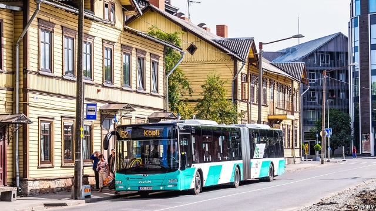

###### In the fast lane

# Free public transport in Estonia 

##### Expensive, but worth it 

 

> May 9th 2019 

THE BUSES are on time, the trams are shiny and new, and passengers usually get a seat. In many cities that would be remarkable enough. But in Tallinn locals are also not required to buy a ticket. In 2013 it became the world’s first capital city to offer residents free public transport. Estonia as a whole has been following suit, and last year set the ambition of becoming the first country with free public transport nationwide. Buses are now free of charge in 11 of its 15 counties. 

Tallinn’s city government came up with the idea of free transport after the 2008 financial crisis. Estonia was hit badly, and even though the city paid more than 70% of public-transport costs, ticket prices were still too high for poorer residents. Congestion had also become a problem. Since Estonia regained independence in 1991, car ownership rates have doubled. 

Opponents branded the idea populist and unaffordable. Estonia was pushing through tough austerity measures at the time, including a 10% pay cut for public-sector workers. Critics predicted the transport system would become overcrowded and underfunded. The row was only resolved by a referendum. 

Surprisingly, though, instead of collapsing, public transport has improved, despite a €12m hit to the system’s finances from lost ticket sales. Tallinn’s population has grown, leading to a boost in local tax intake. Additional revenue comes from tourists and non-Tallinn residents, who still have to buy tickets. The use of public transport in Tallinn has gone up by 10%, while the number of cars in the city centre has gone down by 10%, meaning less congestion. In the countryside, free buses aim to halt rural depopulation by boosting mobility and access to jobs. 

Now other countries are looking at Estonia’s experience. Tallinn officials say they have had interest from local authorities in France, Sweden, Poland, Italy and Germany. Luxembourg is set to introduce free public transport in 2020. Other places have already introduced free public transport for certain groups or at certain times. In England one-third of all bus trips are fare-free because of concessionary travel passes, especially for pensioners; Wales runs free travel at weekends to boost tourism. But so far full fare-free travel is rare. The city of Hasselt in Belgium ran free public transport for 16 years before reintroducing fares because of soaring costs. 

Free public transport on its own is not enough to stop people driving, though the evidence is that it helps. In Tallinn higher parking fees and reduced space for cars also played a part in cutting city-centre traffic: on-street parking now costs €6 an hour, and some parking spaces and car lanes have been replaced by bus lanes. Officials say providing a free alternative allowed them to avoid a backlash when driving in the capital was made more expensive and less convenient. 

