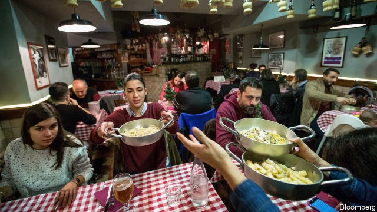
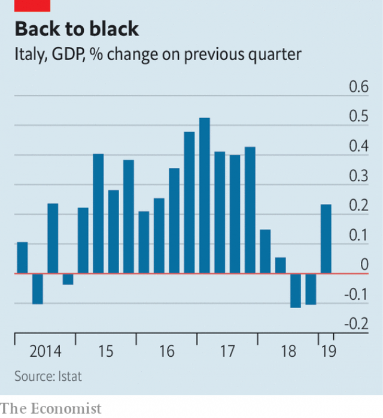

###### Out of the frying pan

# Italy is out of recession, but for how long? 

##### A scrap of good news on the economic front 

 

> May 11th 2019 

IN MOST OF the 19 euro-zone countries, provisional first-quarter economic growth data offered pleasant surprises. But in Italy they had a special importance. The economy grew by 0.2% compared with the previous quarter, ending a short, shallow recession in the second half of 2018. 

The end of the contraction came at a politically delicate moment as the two parties in Giuseppe Conte’s governing coalition battle for votes in the European elections later this month. The hard-right Northern League has barely half as many seats in parliament as the anti-establishment Five Star Movement (M5S). But, under its hyperactive, media-savvy leader, Matteo Salvini, it has overtaken M5S in the polls. 

If the League wins more of Italy’s 73 European Parliament seats than its rivals do on May 26th, it will become the dominant coalition partner (many would argue that this has already occurred, since Mr Salvini is so powerful a figure). But a good result could also tempt Mr Salvini to put an end to the League’s relentlessly fractious coalition with the more moderate M5S and force a snap election that would give him the votes needed for a more homogeneously right-wing coalition with the formerly neo-fascist Brothers of Italy and what is left of Silvio Berlusconi’s Forza Italia party. 

The economy has largely been the responsibility of the M5S, whose leader, Luigi Di Maio, heads an economic super-ministry. Unsurprisingly, Mr Di Maio pounced on the latest figures as evidence that “the direction taken is the right one”. Last year Italy’s populist coalition sparked a rise in government-bond yields when it tore up undertakings made by its predecessor and introduced a modestly expansionary budget with a target deficit of just over 2% of GDP, above what it is permitted under the EU’s fiscal rules. 

 

With an almost stagnant economy and mounting public debts of more than 130% of GDP, even a modest shortfall can soon create problems. On May 7th the European Commission warned that Italy’s deficit this year would be 2.5% of GDP, and that it risked soaring beyond the euro zone’s self-imposed ceiling of 3% in 2020, to 3.5%. 

The commission also cut its forecast for Italy’s growth this year from an already feeble 0.2% to just 0.1%. The economy remains acutely dependent on its exporters. Net of energy, Italy’s trade surplus has grown from 1.4% of GDP in 2010 to 4.6% of GDP last year. “I’m pretty sure there isn’t another country that can boast of having tripled its trade surplus in that time,” says Gregorio De Felice, chief economist of Intesa Sanpaolo, a bank. As the commission notes, though, the outlook for world trade is particularly cloudy. 

Internal demand, traditionally weak, had a negative impact on GDP growth in the first quarter. The coalition’s largesse, notably income support for the poor and unemployed, was intended to provide a boost. But even the government reckons the effect of its measures this year will be modest. And last year’s market reaction to the budget has done damage. Borrowing costs have risen and lending to companies has slowed, leading them to scale back investment plans. 

Hence Mr Salvini’s reaction to the end of the recession, which was to press for sharply lower income taxes as well. But that also explains why a government crisis after the European elections could lead Italy back into a vicious spiral of market fears over its ability to repay its debts leading to higher borrowing costs and an even bigger deficit. A populist right-wing government under Mr Salvini might be more homogeneous and harmonious. But it could be even more fiscally adventurous. 

