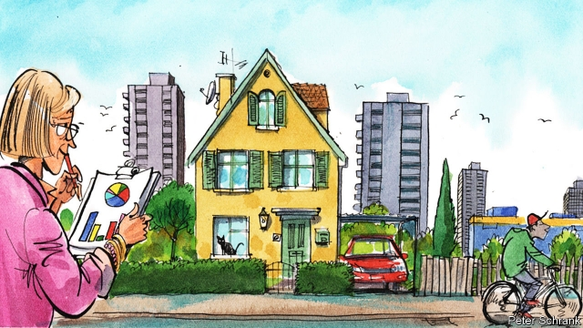

###### Between somewhere and anywhere

# The politics of suburbia in Europe 

##### And how it will affect the European Parliament elections 

 

> May 9th 2019 

FROM MAY 23rd to 26th, voters in the EU will elect a new European Parliament. But where is the bellwether? What sort of place, on a sprawling and diverse continent, reveals its overall state of mind? The crucial divide used to be left versus right. Areas with co-operative or working-class economic traditions (Emilia Romagna in Italy or the Ruhr in Germany) tended to the left. Strongholds of political centralism (Castile in Spain), prosperous borderlands (Skane in Sweden) or regions with a self-sufficient spirit (Bavaria in Germany) leant right. The bellwethers were the places that blended those tendencies: Lower Saxony in Germany, for example, or Aragon in Spain. 

These old left-right distinctions are fading as class identities break down. The big-tent party families, the social democrats and Christian democrats, will probably be the biggest losers in the upcoming election, and may lose their joint majority in the European Parliament to an array of parties with a firmer address on a new political scale. Invented by David Goodhart, a British political commentator, this goes from traditional, typically rural or small-town “somewheres” to cosmopolitan, big-city “anywheres”. Left-versus-right bellwethers like Lower Saxony, where the old duopoly remains unfashionably strong, now seem like political museums. Many of the crucial contests have played out in regions whose politics was once taken for granted—like congenitally left-wing Andalucia, where a right-wing coalition propped up by Vox, a far-right party, came to power in January. 

Culture wars have taken hold of European politics and eclipsed the old left-versus-right distinction. Two sub-genres have emerged in discussion of recent national elections. On the one hand, mournful reports from rural or post-industrial strongholds of locals resentful of big cities and fearful of migrants. On the other, scoffing reports of a pro-European backlash among bearded, bicycling types networking their way around city centres and drinking flat whites. It might make more sense to look at the suburbs, the places in between. 

These are often overlooked in Europe. The suburban dream infuses American and Australian cultures, which often either put them on a pedestal or subvert them. Continental Europeans, it is true, also built post-war suburbs and continue to do so—but they never embraced the ideals of personal space and car-borne independence to the same extent as Anglo-Saxons. Middle-class Europeans are more likely to live in flats, and wealthy Europeans have long preferred city centres, choosing museums and opera houses over swimming pools and golf courses. 

To the extent that they play a role in European culture, suburbs have a mixed image. There are the post-war high rises around cities like Marseille and Rotterdam, typically inner-city slums relocated by idealistic planners. In France in particular they feature as places of crime and exclusion in novels like “Kiffe Kiffe Demain” and films like “La Haine”. Another suburban mode that Europeans understand is that of a fake America. “Vorstadtweiber”, (“Suburb Wives”), delights German-speaking television audiences with its satire on life in Döbling, a wealthy outskirt of Vienna. Most often, European suburbs are anonymous blank canvasses. Elfriede Jelinek and Michel Houellebecq, the twin masters of the dark contemporary European novel, have both lived in suburbs and are fascinated by what they see as the soulless nothingness of these “peri-urban” realms. More so than their American or Australian counterparts, European suburbs are anonymous places. 

And yet it is in suburbia that Europe’s most important political shifts are occurring. They are melting pots where the pro-European internationalism of city centres meets rural scepticism, where fascination with the new meets love of the familiar. In a European election pitting nationalists against pro-Europeans and established parties against insurgents of all stripes, that makes them the continent’s most intriguing political zones. In Spain, for example, the two big trends of recent years are the conservative People’s Party’s vulnerability to Vox and Ciudadanos, a centre-right rival, and the Socialists’ struggle with parties virulently for and against the independence of Catalonia. At the national election on April 28th they were epitomised by results in Alcobendas, a Madrid suburb where the right-wing vote fragmented, and Hospitalet, a young town on the edge of Barcelona where the Socialists fought off hardline rivals on both sides. Suburbs were also crucial in the French presidential election of 2017. The battle between Emmanuel Macron and populists like Jean-Luc Mélenchon and Marine Le Pen was especially fierce in the outskirts of Paris. 

As so often, Europe’s populists have a sense of where the wind is blowing. They cultivate the edges of cities. Matteo Salvini, Italy’s hard-right deputy prime minister, vaunts his suburban Milanese lifestyle in his endless social-media posts, often featuring barbecues. Big right-wing populist events—Ms Le Pen’s pan-European rally with Austrian nationalists in 2016, the Czech populists’ victory party after the presidential election last year, the Finns Party’s rally on the eve of Finland’s election last month—took place in the Vienna, Prague and Helsinki suburbs of Vösendorf, Chodov and Myyrmaki respectively. Such places, sometimes examples of a halo effect in which culturally conservative city-dwellers put off by rapid change move outward, can offer populists rich pickings. “The suburbs are the place where energy is in the city—in the good, in the bad,” said Renzo Piano, Europe’s most famous living architect, in 2015. He could have been discussing politics. 

To understand the fault lines in today’s Europe, then, go to the suburbs. Go to where unloved tower-blocks loom over empty streets, where the roar of motorways echoes in patches of woodland, where the somewheres mingle with the anywheres. Go to where the Ikeas are. 

