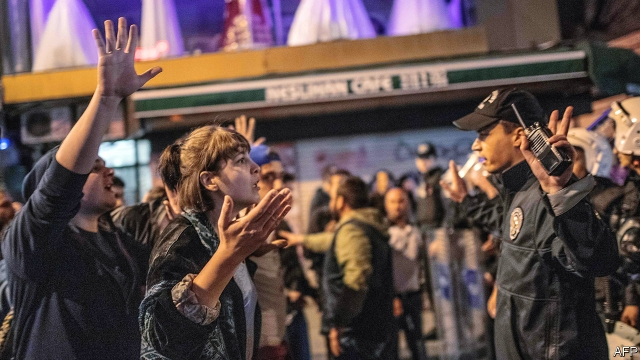

###### Democracy denied

# Turkey cancels the opposition’s victory in the Istanbul election 

##### President Recep Tayyip Erdogan seems ready to win back the city by hook or by crook 

 

> May 9th 2019 

LATE ON May 6th, many of them having just broken their daily Ramadan fast over dinner, men and women in several neighbourhoods of Turkey’s biggest city cracked open their windows, turned on their lights and started banging together their pots and pans in a time-honoured display of protest. Hours earlier, Turkey’s electoral board had cancelled the outcome of the city’s mayoral election held at the end of March, ordered a new one, and stripped Ekrem Imamoglu, the first opposition politician to preside over Istanbul in a quarter-century, of his mandate. The new vote will take place on June 23rd. 

To many ears, the kitchenware concert, the loudest in years, was a sign of defiance against the man believed to have orchestrated the move, President Recep Tayyip Erdogan. To others, it was the beat of Turkish democracy’s funeral march. 

The election board’s move had been in the making since March 31st, when voters in Istanbul handed Mr Imamoglu a very narrow yet shocking victory. The outcome came as a bitter blow to Mr Erdogan, his Justice and Development (AK) party and their candidate, a former prime minister. AK refused to concede, though it did so in other cities, including Ankara, where it lost by bigger margins. The morning after the vote, Istanbul woke up to banners and billboards heralding victory—for Mr Erdogan and his party. Newspapers run by the president’s cronies accused the opposition of conspiring with terrorists to steal the election. AK formally complained that tens of thousands of bureaucrats who had been sacked following a 2016 coup attempt should not have been permitted to vote. Mr Erdogan claimed to have unearthed evidence of “organised crimes” at the ballot box. Days before the board reached its verdict, prosecutors launched dozens of investigations related to AK’s claims, questioning some 100 people. 

In the end, the election board chose to annul the election, citing improprieties in the appointment of some polling-station officials. AK hardliners applauded. Mr Erdogan said the decision had “strengthened our democracy”. The opposition called it a power grab. Appearing before a crowd of supporters in his Istanbul neighbourhood, Mr Imamoglu came out swinging, condemning the board for caving in to pressure from Mr Erdogan and overturning an election whose conduct and outcome it had already endorsed. “You elected the president under the same rules last year, and you held a referendum and changed the constitution under the same rules,” he said. “In that case, the constitution is questionable, and so is the presidential election.” Powerful stuff. 

Analysts see Mr Erdogan’s fingerprints all over the move, and warn that Turkey and free elections might no longer belong in the same sentence. “For nearly 70 years there was a consensus in Turkey that political power changed through the ballot box, and that consensus came to an end today,” says Soner Cagaptay of the Washington Institute. “I thought there was one institution in Turkey that could act somewhat independently”, said Kemal Kirisci, a senior fellow at Brookings, referring to the electoral council, “and I was wrong.” The markets are bracing for more turmoil. The lira has already slumped by more than 3% since the verdict, reaching its lowest level for seven months. 

No expert reached for comment by The Economist saw any reason to endorse the board’s argument. When voters in Istanbul went to the polls, they voted for city mayor, the local assembly and district mayors, points out Osman Can, a former member of the Venice Commission, but the board cancelled only the outcome of the mayoral vote. (AK prevailed in the others.) “This is crazy”, he says, “because if the composition of the ballot board was corrupted, all of the votes should have been cancelled.” Others were less generous. “When the independence of the judiciary no longer exists, anything’s possible,” says Ergun Ozbudun, a veteran academic. “There is no legal merit whatsoever to this decision.” 

This is not the only case of Mr Erdogan subverting elections. Since March’s municipal vote, the election board has deposed at least six newly elected local officials in the Kurdish south-east, awarding their seats to the runners-up. Fraud allegations surrounded the constitutional referendum which gave Mr Erdogan sweeping new powers in 2017 and an earlier mayoral contest in Ankara. 

This time around, even veteran AK members have been unable to stomach Mr Erdogan’s antics. Abdullah Gul, a former president, and Ahmet Davutoglu, a former prime minister, who are both rumoured to be considering a political comeback, have distanced themselves from the Istanbul move. The decision, Mr Davutoglu said, “contradicted the universal rule of law and established practices”. 

The opposition, however, appears unlikely to boycott the repeat election or to stage mass protests. (Mr Imamoglu’s Republican People’s Party suggested as much on May 7th.) Fear is clearly a big factor working in the president’s favour. Young people who took part in the last wave of large protests, six years ago, risked being tear-gassed. Today they risk being thrown behind bars, indicted as coup plotters and possibly attacked by pro-government goons. Of the millions who took to the streets in 2013, hundreds have been hauled through the courts. One, a respected philanthropist, has spent the past two years in prison on outlandish coup charges. He and 15 others now face life sentences. Mr Erdogan regularly brands the opposition as terrorists and provocateurs. Demonstrations, especially if they were to turn violent, could play directly into his hands. 

Mr Imamoglu, hitherto a barely known businessman-turned-politician, who won in March despite seemingly insurmountable odds, has gained sympathy. Some observers reckon that Mr Erdogan has miscalculated and that his actions might hand his opponent an even bigger victory next month. Others, though, warn the Turkish strongman may go to extremes to wrest back control of the city that elected him mayor three decades ago, a position he used as a springboard to national power. “Erdogan did not call a new election to roll the dice and see what happens,” says Howard Eissenstat, an expert at the Project on Middle East Democracy, a research and advocacy group in Washington, DC. “The cost of losing [again] would be an unacceptable demonstration of weakness.” 

