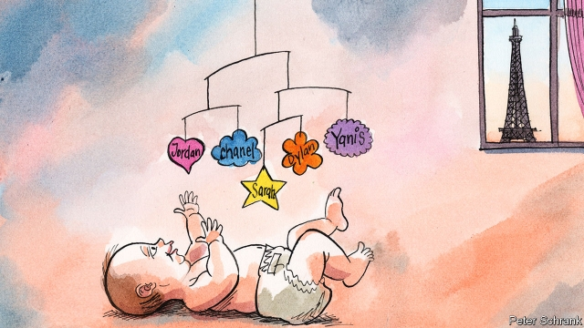

###### When Marie met Yanis

# What French baby names say about the country 

##### Not what Marine Le Pen would like them to 

 

> May 9th 2019 

A  FEW YEARS ago a French couple tried to name their baby girl Nutella. It had a ring to it, and the French state had in 1993 relaxed strict rules about registering names. But the chocolate spread was a step too far, and the parents were overruled. In recent times, though, the parents of little Chanel, Dior, Britney and Beyoncé have all had their way. 

Two new studies suggest that such trends reflect deeper social change. One element is the waning influence of the Catholic church. Its grip on names was entrenched by Napoleon in 1803, who decreed that all babies should be named after a saint (or a figure from ancient history). A century ago one in eight girls born in France was named Marie; today the figure is less than 1%. Jérôme Fourquet, author of one of the studies, says this reflects the “terminal stage of the dechristianisation” of France. 

As Catholicism’s hold has eased, American pop culture has stepped in, filling classrooms with Kevins, Jordans and Dylans. Such names, says the study, have become a class marker. They are also popular in regions which support Marine Le Pen, the populist defender of French cultural tradition. Her campaign for the upcoming European elections is headed by a 23-year-old called Jordan. 

In a country that bans ethnic or religious census data, names can also serve as a proxy. The number of baby boys named Mohamed has grown sixfold since 1960. The persistence of such names, say some on the nationalist fringe, reflects an integration problem. Ms Le Pen has argued that naturalised French citizens should adopt a name more adapted to national culture. Hapsatou Sy, a French presenter, understandably quit a TV show after a commentator told her that her name was “an insult to France”, and that her mother should have named her Corinne. 

On the contrary, suggests a second study by two demographers, Baptiste Coulmont and Patrick Simon, integration is indeed reflected in baby names, but in a different way. The French-born children of North African immigrants are often still given names from the Maghreb, most commonly Mohamed or Karim. Yet babies born in the third generation follow a broader French trend. The top choice, they say, is Yanis for boys and Sarah for girls. Part of being French these days, it seems, is naming your baby not Marie, but Lina or Mila—“international names”, the authors note, “that everyone can identify with.” 

