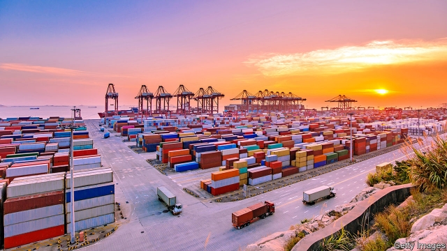
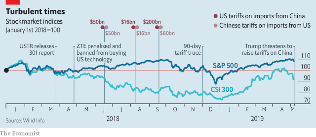

###### Speaking softly

# America ratchets up the pressure in its trade war with China 

##### China’s measured strategy could soon be put to the test 

 

> May 9th 2019 

CHINA’S PROPAGANDA machine grinds slowly. But its output is nothing if not consistent. It took more than 24 hours for state media to report President Donald Trump’s threats, tweeted on May 5th, to ratchet up tariffs on China. By that time Chinese stocks had already plunged, a foretaste of global market ructions. When the response finally came in official editorials, it was a familiar refrain from China’s canon of trade-war statements: “We do not want to fight, but we are not afraid to fight and, given no choice, we will fight.” 

That sounds bellicose. Yet one lesson from the past year’s dispute with America is that China places more weight on the sentence’s first part, its desire to avoid a full-on fight. At multiple points when the Chinese government could have retaliated against America by targeting its businesses, it has instead tried to win them over. 

Dodging a fight, though, does not mean giving in. As The Economist went to press, officials from both countries were preparing for talks in Washington to see if they could revive a deal which, until Mr Trump’s tweets, had seemed nearly done. The previous evening, America announced its intention to raise tariffs on $200bn of Chinese goods from 10% to 25% from midnight on May 9th. According to Reuters, citing American government sources, China had backtracked on pledges to rewrite laws on everything from competition policy to intellectual property. Chinese advisers counter that it is American negotiators who have become inflexible. 

This creates two huge uncertainties for the global economy. One dominates discussion. Will there be a deal or will America raise tariffs? The other receives less attention. Is there a point at which China might lash out against America, even at a cost to itself? 

It is easy to imagine how China could punch back. Given its $380bn trade surplus with America, China is more vulnerable to tariffs. But American businesses, from Apple to General Motors, have big footprints in China. American firms made roughly $200bn more in sales in China in 2015 than Chinese firms did in America, according to Deutsche Bank. The Chinese government could whip up consumer boycotts. It could hold up supplies at customs. It could smother factories with safety inspections. 

 

In its retaliation, China has already used tariffs to hit sensitive targets. It has pushed soyabean farmers in Iowa and Wisconsin, states that will influence whether Mr Trump can win a second term, to the brink of bankruptcy. But it has largely refrained from deploying the dirtier weapons in its arsenal. After briefly delaying American whiskey shipments at the border last year, Jack Daniel’s is flowing again. 

Even more striking are China’s attempts to be emollient. Having long hesitated, it opened the door last year for a range of foreign firms, from carmakers to insurers, to take majority stakes in their Chinese operations. In March it passed a foreign-investment law that, in theory, addresses some big American grievances. It has even undone some tariffs: in December it lifted extra duties that it had imposed on American cars and car parts. 

China’s decision to opt for a relatively conciliatory strategy can be explained in three ways. Most obvious is its desire to minimise the trade war. If America were to slap 25% tariffs on all imports from China, that could knock two percentage points off Chinese growth over the next 12 months, according to UBS, a Swiss bank. 

A second factor is China’s play to win back some support in America. Foreign businesses have grown frustrated with China. A more level playing field could change that, especially if China offers evidence of benefits. News on May 8th that JPMorgan Chase, an American bank, might become the first foreign company to own a majority stake in its Chinese mutual-fund business is just the kind of thing. 

The final point is China’s management of domestic opinion. Xi Jinping, the president, is powerful, but he does not want to arm his critics. One government adviser says that left-wing scholars are planning to greet the announcement of any trade deal as a “day of national humiliation”, a reference to the 19th century when foreign powers dominated China. Front-loading reforms offers some insulation: the government can portray the deal as a ratification of what it was already doing. 

But domestic politicking also sheds light on why the trade talks have hit a rocky patch. China has more incentive to take a harder line at this moment—just when a deal seems to be within reach. Sending Mr Trump into a frenzy on Twitter may worry investors. But to Chinese officials it looks like Mr Xi is driving a tougher bargain. 

Complicating matters, negotiations have been conducted in English, with the draft agreement (reportedly seven chapters and 150 pages) also in English. As it is translated into Chinese and circulated among more officials, changes are inevitable. “You can’t really renege on something that is a non-binding work in progress,” says James Zimmerman, a partner in the Beijing office of Perkins Coie, a law firm. 

China still wants to avoid a full-fledged trade war. Should America raise tariffs, China’s initial preference will be to continue with limited retaliation, says Wang Yong, director of the Centre for International Political Economy at Peking University. The American economy would, he thinks, suffer enough damage for Mr Trump to change course. If not, China’s fight-back could get much nastier. 

