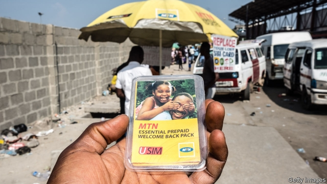
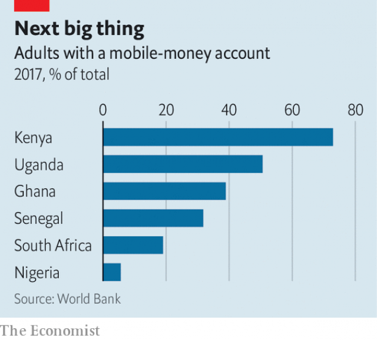

###### Revolutionary cells

# Mobile money comes to Nigeria 

##### Africa’s largest country has lagged behind the continent’s pioneers 

 

> May 9th 2019 

THE SHARED cars that shuttle between Abuja and Kaduna, two Nigerian cities, carry more than passengers. For a fee they will also carry cash, says Odedele Olusanmi, a driver. On a typical journey he takes five packages, each holding around 20,000 naira ($55). Only two-fifths of Nigerians have bank accounts, which is why some send money this way. Yet an alternative could already be in their pockets. 

In the past decade a mobile-money revolution has swept through much of Africa, enabling the unbanked to make transfers, pay bills and save. Half of the world’s 866m mobile-money accounts are in Africa, not counting services which need users to belong to a bank. But not many are in Nigeria, its largest economy and most populous country, with 200m people, where mobile money was used for transactions worth just 1.4% of GDP last year (compared with 44% in Kenya). Four-fifths of Nigerians have never heard of it. 

Until recently, the Nigerian central bank did not allow telecoms firms to offer financial services, except as the junior partners of conventional banks. Elsewhere mobile operators had been in the vanguard. A mobile-money system needs agents to take in and give out cash—boots on the ground, not just bytes in the pocket. In the early stages telecoms firms, which sell phone credit in the remotest villages, can run these operations at costs 40% below those of banks, according to consultants at McKinsey. 

So late last year the Nigerian central bank brought in new rules that will allow telecoms firms, supermarkets, courier companies and others to become “payment-service banks”, with a licence to take deposits, make payments and issue debit cards. A quarter of their service points must be in rural areas. Among the applicants is MTN Nigeria, the local unit of Africa’s largest telecoms firm. Designing and marketing its own service is “completely different” from working with a bank, says Usoro Usoro, its head of mobile financial services. He argues that MTN can draw on its experience with mobile money elsewhere and has the “know-how to build and manage a distribution network”. Globacom, a rival, plans to launch its own mobile-money service. Airtel, an Indian firm, is interested. 

 

But success is not guaranteed, warns Yinka David-West of Lagos Business School. In east Africa, mobile money was initially touted as a way for urban workers to send money to relatives in villages. That may have less appeal in Nigeria, where more people live in cities and new arrivals often come with their families. And the rules restrict the products firms can offer: for example, they cannot lend. 

Competition comes from specialist mobile-money operators, which are neither banks nor telecoms firms. They were permitted under the old rules, but faced obstacles to growth: until 2015, for example, unbanked mobile-money users could send no more than 3,000 naira at a time. Paga, a PayPal-like startup, has recruited 20,000 agents and reached 12m users (still a small fraction of a vast market). Tayo Oviosu, its founder, argues that the advantages of telecoms firms have been exaggerated. Many airtime sellers are not set up to handle large transactions, he says, so the likes of MTN have to build a new network of agents. 

The advent of mobile money was a shock for east Africa’s fusty financiers. In Nigeria it is less of a threat. Bankers will not mind if telecoms firms scoop up the poor, rural clients whom they have long ignored. And their existing customers can already use their bank accounts to carry out transactions through apps or by typing short codes into a phone. Nigeria will have insurgents. But the incumbents will survive. 

