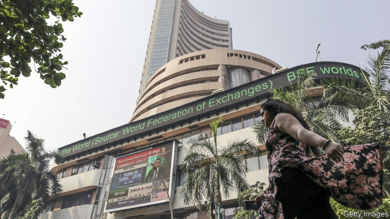
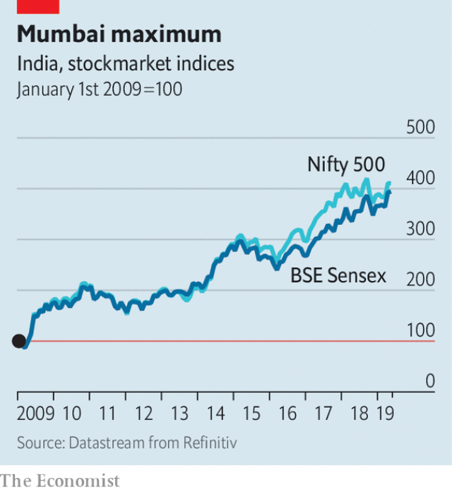

###### 28 weeks later

# Months after IL&FS collapsed, India’s markets are on a strong run 

##### Foreign investors seem convinced that the new bankruptcy code is starting to have an effect 

 

> May 9th 2019 

IN OCTOBER, SENTIMENT on India’s financial markets was bleak. The previous month Infrastructure Leasing and Financial Services (IL&FS), a Mumbai-based lender with scores of subsidiaries, had defaulted on a series of loans. Stockmarket indices fell sharply (see chart). Investors worried not only that the firm’s losses would directly harm other institutions, but also that similar problems might be lurking in other lenders. 

Then the government stepped in. The management was replaced, and state-controlled entities ensured that other non-bank lenders had enough liquidity to enable credit markets to function. From a low point on October 26th, financial markets resumed a rise that, notwithstanding several reversals and a lull in recent days, has seen dramatic gains in the past decade. Late last month the major indices, including the Bombay Stock Exchange’s Sensex, which includes 30 companies, and a broader index of 500 companies, flirted with the heights they reached before the IL&FS scare—even though American sanctions on Iran pushed up the price of oil, India’s biggest import. 

Crucial to the rally have been foreign buyers, whose activities are tracked and reported by local exchanges. Their importance is a consequence of the odd ownership structure of Indian companies. More than half the shares of private companies are held by “promoters”, managers with controlling stakes, who rarely trade. Similarly, the government sits on its shares in the numerous semi-public companies in which it holds large stakes, in sectors such as banking, coal and oil. 

 

Of the “free float” (the shares not locked up and thus available to trade), foreign institutions own about half, reckons Gaurav Narain, head of equities for India at Ocean Dial Advisers, an asset-management company. They thus play a crucial role in setting prices. And in recent months they have been pumping billions of dollars into Indian shares. That is no doubt partly a result of broader enthusiasm for emerging markets that has led to rallies elsewhere. But there are also India-specific reasons. 

The first is the election. As a bitter campaign reaches its final stages, fears that the result will be a destabilising muddle have receded. Narendra Modi, the current prime minister, looks likely to remain in office, albeit with a reduced majority. He has not lived up to all the business-friendly promises he made before entering office, but investors would still prefer stability over unpredictable parliamentary horse-trading. 

More significant, some sectors of India’s economy that have been through serious problems are now doing well. The best-performing, up more than 70% since the October dip, is airlines, which have been in the news since the collapse in April of Jet Airways, once India’s largest private airline. Though Jet’s shareholders were largely wiped out, shares of other airlines rose on the prospect of less competition and higher fares. 

Shares in some private banks have also appreciated, though less dramatically, buoyed by the demise of IL&FS. So have those in the cement sector, plagued by overcapacity in recent years: a flurry of mergers and acquisitions is letting prices stabilise. Even in telecoms, where competition from Jio, of Reliance Industries, one of India’s biggest conglomerates, has been relentless, rising share prices suggest business conditions are improving. Some of Jio’s competitors have merged and there are hints it may be tiring of a costly price war. 

India’s rising stockmarket has not benefited every industry. Vehicle and apparel stocks, for example, have declined as sales have slowed. The specifics suggest something less indiscriminate than a bull market, and more heartening: that tighter bankruptcy laws passed in 2016 are finally biting, and rotten financial structures are being exposed. With fewer “zombie” companies able to stagger on endlessly, healthy competitors will be less likely to get dragged down. 

