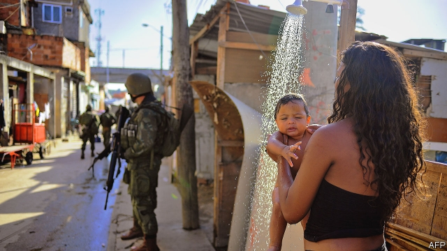

###### Spillover effects

# New research traces the intricate links between policy and politics 

##### Benefit recipients in Brazil who are penalised punish politicians at the polls 

 

> May 9th 2019 

INCENTIVES ARE central to welfare systems. In developing countries some “conditional cash-transfer” programmes offer families on low incomes benefits only if the children are sent to school and vaccinated. Payments may be suspended if they do not meet the conditions, but relatively little is known about how recipients respond. A trio of papers written by Fernanda Brollo of the University of Warwick, Katja Kaufmann of Mannheim University and Eliana La Ferrara of Bocconi University, and presented at the annual conference of the Royal Economic Society last month, examine the far-reaching spillovers of enforcing conditionality. 

The authors analyse the behaviour of recipients of the world’s largest conditional cash-transfer scheme, Bolsa Família (Family Grant), which covers 14m poor households in Brazil, or roughly a third of the country’s population. Its budget amounts to 30bn reais ($7.5bn)—0.4% of GDP. In order for a family to receive the benefit, the children must attend school for at least 85% of days in a month. Parents whose children play truant first receive a warning; further absences eventually lead to payments being suspended. 

The papers find that such penalties have wide-ranging effects. They encourage compliance not only by the family that is directly affected, but also by their neighbours, and by the families of classmates and siblings’ classmates. 

But the ripple effects do not end there. Families punished by having their benefit withdrawn or receiving a warning have an opportunity to punish in turn—at the ballot box. The authors examine the results of mayoral elections in 2008, and find that municipalities with a high share of penalised recipients were less likely to vote for the Workers’ Party (PT), the party that introduced the benefit in 2003 and was leading the federal government at the time. Parents who were sanctioned in the week before the election were more likely to turn against the PT than were others in the same municipality who were penalised immediately after. 

Furthermore, it seems that officials affiliated with the PT, fearing a drubbing at the polls, became strategically lenient around election time. Although the benefit is administered at the federal level, the data suggest some municipalities may have massaged school-attendance records to make it appear that fewer families were breaking the rules. 

Under Brazilian electoral law, mayors can be in office for only two terms consecutively. The authors compared the behaviour of mayors with the most to lose—those with an extra term to run, in narrowly contested municipalities—with those who had reached the term limit. First-term mayors were more likely to be lenient. The effect was especially strong in areas where school principals were political appointees rather than chosen through exams or elections, and so perhaps more susceptible to pressure to fiddle with attendance records. 

The authors stress that the effects of Bolsa Família are still very positive overall. But their research shows the importance of taking account of a policy’s knock-on effects when considering its impact. Schemes with sophisticated incentives provoke sophisticated responses. 

