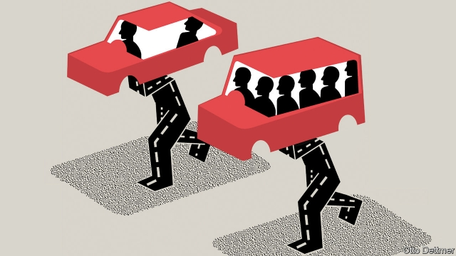

###### Free exchange

# Riding alone in a car is a luxury—an increasingly unaffordable one 

##### Whether you drive yourself or hail a ride, solitary splendour will become more expensive 

 

> May 9th 2019 

UBER’S INITIAL public offering, due after The Economist went to press, will be one of the largest in tech history. The hoopla cannot drown out uncertainty about the firm’s future. Ride-hailing platforms have grown hugely in recent years, changing the face of urban transport. They have also been virtuosic losers of money (see article). Lyft made an operating loss of nearly $1bn in 2018; Uber, about $3bn. The flow of red ink mainly represents subsidies from investors to riders: cash that allows average Joes to feel as though they have a personal car at their beck and call. It will not last. But Uber passengers are not the only road-farers facing straitened circumstances. Car-related subsidies of all sorts are becoming harder to sustain. Their loss could reveal mass travel in single-occupancy cars to be a no-longer-affordable luxury. 

The mania for tech platforms that match cars with riders rests on the idea that they can turn car-hire into critical urban-transport infrastructure. Perhaps ride-hailing could spare millions of people the cost of owning cars that mostly sit idle, and allow vehicles and roads to be used more efficiently. But increased scale has yet to turn losses to profits. To remain viable, Uber and its peers must make more money per trip. They could increase fares. But cheap rides have been crucial to building their user bases. However dominant one or another becomes, competing transport options remain, from personal cars to public transport to travellers’ own two feet. Higher fares will make those alternatives more attractive. 

Perhaps instead the firms could cut their per-ride costs. Payments to drivers are the juiciest target, and indeed Uber is keen to develop a fleet of driverless taxis (as are other firms, including Waymo and Tesla). Yet even these may struggle to turn a profit. A recent analysis by Ashley Nunes of the Massachusetts Institute of Technology and Kristen Hernandez, now at Securing America’s Future Energy, an advocacy group, concludes that driving your own vehicle costs about $0.72 per mile (inclusive of ownership costs and expenses such as fuel and parking charges), whereas the lowest break-even fare an operator of driverless taxis could expect to charge is $1.31 per mile. While on duty, taxis rack up costs for items such as petrol, whether or not a fare-paying passenger is in the car. Furthermore, driverless cars would need some minding by human safety monitors, whose salaries must be covered by fares. 

Until they turn profits, ride-hailing firms will be vulnerable to a loss of investors’ patience. But drivers of private vehicles also receive plenty of implicit support. Drivers impose environmental hazards on others at no financial cost to themselves, from the health effects of local air pollution to the climate change resulting from carbon emissions. And then there is congestion. The right to use scarce road space is valuable. When it is given away, drivers overuse available roads, and clog them. The waste is colossal. An estimate by INRIX, a consulting firm, suggests that the value of time lost to traffic in 2018 in America alone reached $87bn. 

Removing the subsidy to drivers means pricing road space by levying tolls that increase with traffic. That would deter driving, and reduce congestion and other social costs of automobile use. Such charges are rarely popular with drivers. But governments’ enthusiasm for new, untolled roads has dimmed. And they do not help much with traffic. Gilles Duranton of the University of Pennsylvania and Matthew Turner of Brown University posit a “fundamental law of road congestion”: unless road space is priced appropriately, new capacity reduces the cost of driving, thereby inducing more of it, leading, eventually, to renewed congestion. 

Uber passengers also benefit from subsidies to driving, and contribute to the social costs. According to new research published in the journal Science Advances, from 2010 to 2016 time lost to congestion in San Francisco rose by 62% more than it would have in the absence of ride-hailing vehicles on the city’s streets. Were dirty fuels to face stiffer taxes or road tolls to be increased, those additional costs would probably increase fares. But there is reason to think that eliminating subsidies, while reducing driving, would nonetheless boost the ride-hailing business. Congestion delays the response to a request for a ride, which inconveniences passengers. And it raises the cost of operating taxis by increasing the time spent between dropping off one rider and picking up the next. The more efficiently firms can serve customers, the better their cost proposition relative to driving alone. So total trips would fall, but a greater share would involve an app-hailed vehicle. Tellingly, both Uber and Lyft spent money advocating for a recent budget measure in New York City that will introduce congestion-charging in parts of Manhattan. Similar efforts in other traffic-choked cities are likely to follow. 

Should congestion pricing spread, ride-hailing firms might gain room to raise fares and survive, even without fresh injections of capital. Urban transport would nonetheless be transformed. Ride-hailing services have gained passengers, in part, by luring them away from public options. Higher fares would induce some to switch back. Ride-hailing firms might retain users by improving their car-pooling options. Congestion pricing would reduce the delay associated with multiple stops. Indeed, in a subsidy-free world car-pooling of all sorts would increase. On a once congestion-clogged highway in Northern Virginia, for example, the number of cars with multiple occupants has risen by 15% since the introduction in 2017 of tolls that vary with the level of congestion. 

For decades, the striving working class has dreamed of the freedom to commute in the splendid isolation of a private car. “A man who, beyond the age of 26, finds himself on a bus can count himself as a failure,” Margaret Thatcher is supposed to have said. The real failure may be a widespread, persistent reluctance to grapple with the cost of travel in vehicular solitude—whether with or without the aid of an app. 

