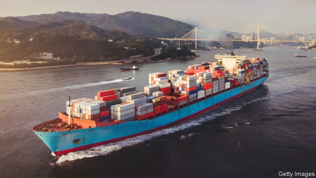
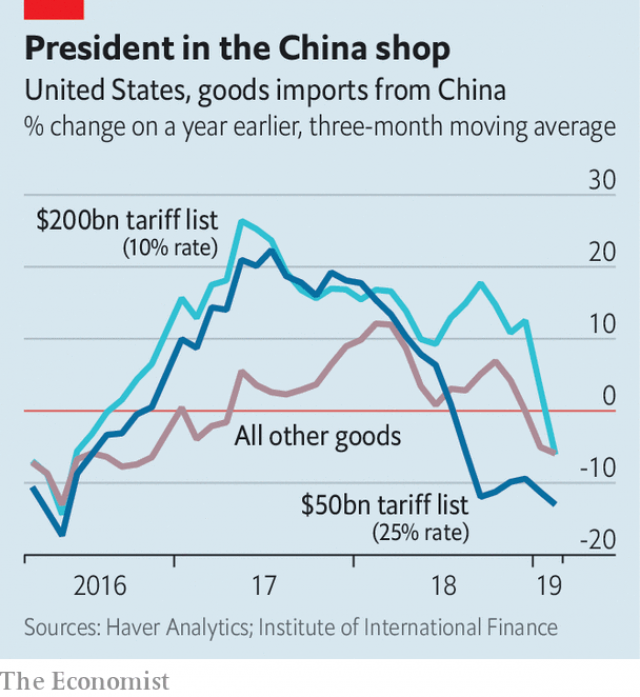

###### Shock therapy

# So far, Donald Trump’s trade war has not derailed the global economy 

##### An escalation would inflict much greater damage 

 

> May 9th 2019 

A  YEAR AFTER the start of trade skirmishes between America and China, America’s economy—and the world’s—seem to be holding up. Are trade wars, as President Donald Trump believes, not so costly after all? 

The immediate impact was always going to be hard to spot. Though special tariffs now cover more than half of China’s exports to America, those exports account for less than 2% of American personal consumption and only around 5% of American business investment. Surveys suggest that tariffs are suppressing investment in America, but how much is unclear. 

As with all taxes, much of the effect is to shuffle costs and resources around. Taxing imports hurts companies and consumers by making their foreign purchases more expensive, and as domestic producers respond to weaker foreign competition by raising prices. Exporters may lose out from retaliatory tariffs. But there are also winners, including domestic companies shielded from foreign competition and thus able to enjoy fatter profits—and the US Treasury, which gains new revenues. 

A recent study by Pablo Fajgelbaum of the University of California, Los Angeles, Pinelopi Goldberg of the World Bank, Patrick Kennedy of the University of California, Berkeley and Amit Khandelwal of Columbia University totted up all such effects for the tariffs imposed by the Trump administration in 2018. The bulk of these fell on imports from China. They found that the welfare losses to producers and consumers from higher prices came to 0.4% of GDP, but when the gains to others were included, the economy-wide net cost was just 0.04% of GDP. 

However, the tariffs have clearly caused disruption and higher prices for American importers, while Chinese exporters and their suppliers have lost business. The value of affected imports crashed just after they came into effect (see chart). According to numbers crunched by economists at the Institute of International Finance, an industry group, China lost market share for those products hit by tariffs of 25% last July. 

 

Lower underlying prices (that is, excluding tariffs) might have helped. But where trade has continued, American firms seem to have gone on paying full whack, in addition to the new levies. Their Chinese suppliers’ margins have been spared. Importers may not have had time to renegotiate contracts, or they may have expected the tariffs to be temporary. (They may also have stockpiled imports before an increase in the tariff rate, from 10% to 25%, that was once planned for January.) In time contracts could adjust, or American firms could find alternative suppliers, further mitigating the economic fallout. 

So far, then, tariffs on China seem to have disrupted business and geopolitics more than they have harmed the economy at large. But further escalation would bring rising costs. Mr Trump’s threats are for a tariff of 10% on $200bn of Chinese imports to rise to 25% on May 10th, and for a 25% tariff on a further $325bn-worth “shortly” thereafter. American businesses would find the former tough to handle, and consumers would struggle to escape the latter. So far, consumer goods have been only about a fifth of the imports from China covered by tariffs. Escalation would add items such as toys and clothes. Economists at the New York Federal Reserve reckon that the effect of tariffs on core inflation (excluding food and energy) would rise from 0.1 percentage points to 0.4 percentage points. 

The Chinese would surely retaliate, raising the costs. According to the IMF, tariffs of 25% on all trade between America and China would knock 0.3-0.6% off America’s GDP, and 0.5-1.5% off China’s. Financial markets would reel. Economists at Morgan Stanley, an investment bank, put the downside risk for the value of equities in Asia and emerging markets at 8-12%. 

Faced with such harms, policymakers would feel pressure to act. If faltering American growth threatened to increase unemployment or push already-low inflation down further, the Federal Reserve could ease monetary policy. The Trump administration has already given billions of dollars in aid to farmers affected by China’s retaliatory tariffs; it could hand out more. And China’s government, which has already raised spending and cut taxes, could increase its stimulus. All this would help conceal the costs of tariffs. But it would not make those costs go away. 

