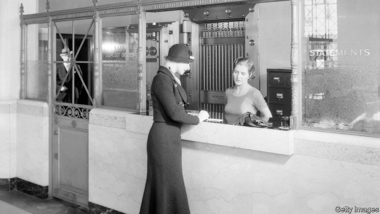
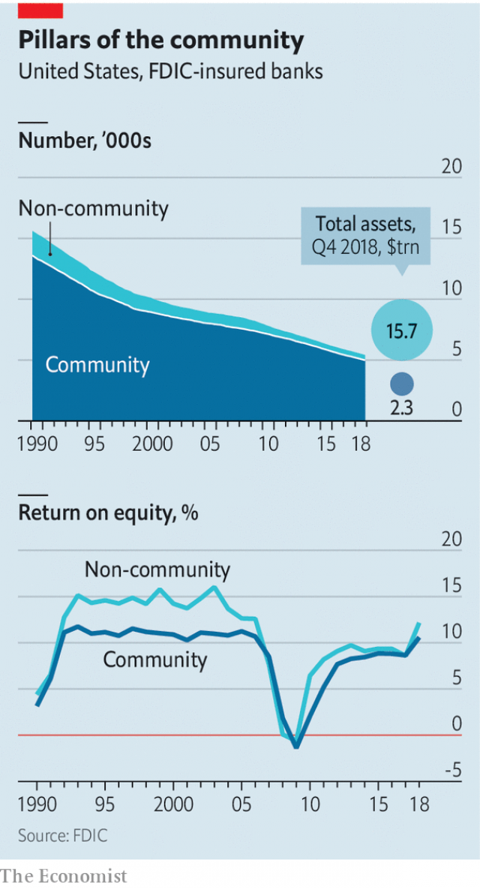

###### They know their customers

# The state of America’s community banks 

##### Don’t write off the admirable bantamweights of the industry 

 

> May 9th 2019 

THE CLASS of the guests reflects the clout of the hosts. In a posh Washington hotel, two powerful visitors—first Maxine Waters, the Democrat who chairs the House of Representatives’ financial-services committee, and then Mike Crapo, the Republican head of the Senate banking committee—address a roomful of well-breakfasted bankers. After the speeches and a few polite but pointed questions, the bankers head to lobby Capitol Hill. 

They are not from Wall Street, but are community bankers, from towns large and small all over America. Some belong to the third or fourth generation running the family business. They each oversee only up to about $10bn in assets, and most of them much less. But the Independent Community Bankers of America (ICBA) are both deeply rooted in their home soil and well organised. Almost every congressional district is home to at least one such bank. 

Though their numbers have been falling for years (see chart), America’s small banks are, by and large, in fair shape. According to the Federal Deposit Insurance Corporation (FDIC), a regulator, the 4,979 community banks reported an average return on equity of 10.6% last year—less than bigger banks, but nearly two percentage points more than in 2017 and the most since the financial crisis. Only 3.4% lost money, the lowest share on record. 

 

Community bankers are at last finding their regulatory burden easier to shoulder. They groaned even more than big banks under the Dodd-Frank act, which bulked up the rule book after the crisis. In 2017 President Donald Trump promised them, during that year’s outing to the capital, that he would lighten their load. Tim Zimmerman, who runs Standard Bank, a Pittsburgh lender with assets of $1bn, detects “a difference in the tone at the top” of supervisory agencies, which all have new leaders. He and his peers also credit last year’s Economic Growth, Regulatory Reform and Consumer Protection Act, which was partly the product of the ICBA’s tireless lobbying. 

The new act expanded the range of mortgages presumed to satisfy the detailed underwriting requirements, under Dodd-Frank rules, to assess borrowers’ ability to repay. The loosening applies only to small lenders, which must keep the loans on their balance-sheets. Bankers had feared lawsuits from defaulting borrowers and say the risk made them wary of lending. 

Capital rules are being simplified. If they satisfy a simple minimum leverage ratio, banks with less than $10bn in assets will be exempt from the more complicated ratios laid down in Basel 3, an international post-crisis agreement. Quarterly “call reports” of banks’ health, which had become ever thicker over the years, have been slimmed from 80 pages to 50-odd. 

Community banks still have battles to fight. Regulators want to fix the leverage ratio at 9%. The ICBA wants 8%. Jelena McWilliams, chairman of the FDIC, says 80% of community banks satisfy the 9% limit; a lower figure would require additional forms of scrutiny. Bankers say that the shorter call reports omit pages that were anyway irrelevant and are filed only for the first and third quarters. Kathy Underwood of Ledyard National Bank, in New Hampshire, which has assets of $500m, says one of her staff spends two weeks a quarter compiling call reports, even though “nothing really changes” from one to the next. The banks are keen on the SAFE Banking Act, which would legalise financial services for the marijuana trade. Mr Crapo is not. The drug is illegal in his state, Idaho, as well as at federal level. 

Despite their successes, in recent years community banks’ ranks have been thinning by around five a week, mainly through mergers. Lighter regulation may help to slow the decline, because fixed compliance costs weigh heaviest on small businesses. A trickle of new banks is being founded; (after the crisis, the flow had dried up altogether). But reversal is unlikely. The smallest banks, with assets below $100m, are most vulnerable. One in 12 tiddlers is unprofitable. They lend, on average, only 71% of their deposits, compared with 82% at banks with $100m-1bn. When business is slow, it makes sense to sell up. 

You may wonder whether community banks can thrive in the digital age against the sheer scale of America’s giants. Their combined assets, $2.3trn, roughly match those of Bank of America, the country’s second-largest bank. Yet it seems they can. Incredible Bank, the digital operation of River Valley Bank, of Wausau, Wisconsin, collects deposits from more than 2,500 customers in all 50 states and makes online loans—notably for fancy mobile homes. Todd Nagel, River Valley’s chief executive, says that in September the branch and digital sides will merge and Incredible will be the $1.4bn bank’s sole brand. The ICBA has an accelerator for fintech firms developing products for community banks. 

Most important, local knowledge of the needs of small firms and family farms still counts. Community banks make more than 40% of small loans to businesses. Big banks have quit some rural spots or, says Alice Frazier of Bank of Charles Town in West Virginia, moved their commercial bankers to bigger towns. Community bankers aren’t going anywhere. Except, of course, to Washington again next year. 

