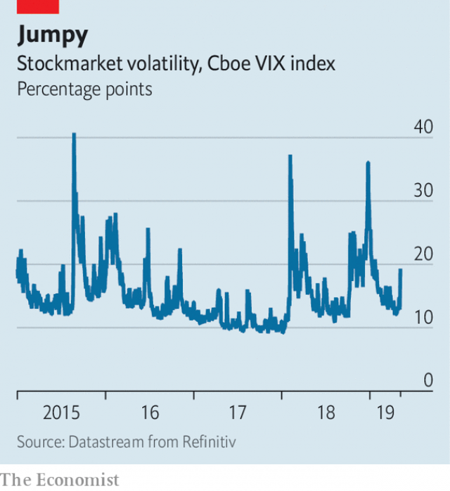

###### Buttonwood

# When you have options, volatility is your friend 

##### The jumpier prices are, the more valuable is a right to buy or sell 

 

> May 11th 2019 

IMAGINE THAT, by some twist of fate, you become the ruler of an oil-rich state. A crash in the oil price has left a hole in its budget. You are forced to consider selling the kingdom’s assets. Among them is a mothballed oilfield in a remote part of the country—so remote that it costs $90 to retrieve each barrel of oil. That is above the prevailing price of $70 a barrel. Even so, you are advised to try to sell a licence to operate the field. 

Who would buy such a licence? It is valuable only if a barrel of oil sells for at least $90. Yet there is always value in a right—if it carries no obligation. The greater the chance that prices will rise above $90, the more the licence can be sold for. The price will be higher if the licence is for a long period. Crucially, the price also depends on how changeable the oil price is. The more volatile, the likelier it is that it will hit a level where it is profitable to restart production. 

Volatility is normally something to fear. People prefer a stable income to an erratic one, for instance, and they feel the same way about their wealth. In this regard, the jumpiness of stock prices is a source of discomfort. But where you have rights without obligations—options, in other words—things are different. Here, volatility is welcome. 

Look closely, and the hypothetical oil licence has the features of a “call” option, a particular kind of financial contract. A call option is the right to buy an asset—a barrel of oil or a basket of stocks, say—at a specified price (the strike price) on or before a specified maturity date. The owner of a call option profits if the price of the underlying asset goes above the strike price. The owner is not obliged to buy at the strike price; she will do so only if it is in her interests. Anyone who buys the oilfield licence is essentially buying a call option on the oil price. If it goes above $90 the buyer makes a profit; if it stays below $90 for as long the licence is valid, the option expires worthless. 

Putting a value on options is a fiddly business. The key ingredients in the Black-Scholes model, the industry formula, are time, volatility and the gap between the asset’s strike price and its current price. A small gap is more likely to be closed than a large one, so options with strike prices close to prevailing prices cost more. Call options with a strike price above the prevailing price are said to be “out of the money” and are cheaper. The more violently prices fluctuate, the more chance there is that an out-of-the-money option, like the hypothetical oil licence, becomes a winning lottery ticket at some point before it matures. 

Estimates of volatility are a central input to options prices. They can also be calculated from those prices. The VIX (a contraction of volatility index) is one such gauge. It is the level of expected volatility derived from the market in equity-index options. Many of these traded options are put options, which confer on a buyer the right to sell an asset (in this case the S&P 500 index of leading stocks) at a specified price. By contrast with call options, the owner of a put option benefits when the price of the asset falls. Out-of-the-money puts are insurance policies. They pay off when a market crashes. 

 

As in any other corner of financial markets, there are traders looking for mispricing. The Black-Scholes pricing model has flaws that they might exploit. A few years before he died, Fischer Black (who with Myron Scholes gave his name to the formula) listed them in a paper called “The holes in Black Scholes”. A big one is the assumption that an asset’s volatility is known and fixed. You can make a decent estimate of it based on history. But how prices will fluctuate in the future is unknowable. And volatility itself is volatile. So are forecasts of it—the VIX is prone to spikes in anxious moments (see chart). Black offered some advice in dealing with such flaws. If you think volatility will rise, you should buy options; if you think it will fall, you should sell them. And as he showed in his paper, the value of an out-of-the-money option rises very rapidly as volatility inches up. 

This quality has not gone unnoticed. Nassim Nicholas Taleb, a trader-turned-author, has built a view of the world based on the properties of out-of-the-money options. There are fragile things, like Ming vases or priced-for-perfection stocks, which are hurt by an increase in disorder and randomness. And there are others that come to life because of such an increase, among them our oil licence, a put on the S&P index or even personal character. These things are “Antifragile”, the title of one of Mr Taleb’s books. They have a value that is latent. All you need is a dose of volatility to bring it out. 

