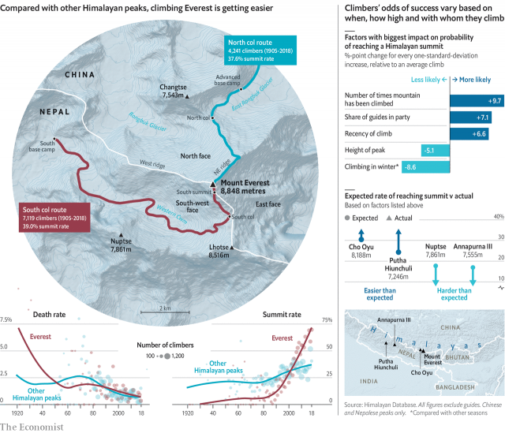

###### Not so rare air

# How Mount Everest went mainstream 

##### Climbers’ success rate on the world’s tallest mountain is higher than any other Himalayan peak 

 

> May 11th 2019 

BEFORE EDMUND HILLARY and Tenzing Norgay set foot on the summit of Mount Everest in 1953, at least 145 other climbers had tried and failed to reach Earth’s highest point. In 1924 a British team got within 250 metres of the top, but turned back after two members (who may or may not have reached the peak) vanished. 

Scaling Everest was scarcely easier afterwards. Excluding guides, just 9% of people making an attempt reached the summit from 1954-83, while 2% died. As climate change thaws the snow, the remains of many of these victims have emerged—including one of the lost climbers from 1924. 

But since the 1990s, the pinnacle of mountaineering has become accessible. In 1994-2003, 24% of Everest climbers got to the top, double the rate in the previous decade. The share doubled again, to 51%, in 2004-13. In the past three complete climbing seasons, 66% have made it. The first summit attempts of 2019 are due this week. 

Technology accounts for some of these gains. Oxygen tanks deliver twice as much gas as before, and suffer fewer leaks. Suits and gloves made from high-quality down and double-insulated boots keep climbers warmer. And better weather forecasting has minimised unpleasant surprises. 

However, these advances help just as much on other peaks. And summit rates elsewhere have risen much less. Among the 13 Himalayan mountains with available records that were climbed by at least 40 people since 2016, Everest’s summit rate was the fourth-lowest before 1994. In the past three years it has been the highest. 

Two factors probably account for this trend. First, Sherpas set up ladders and ropes along the entirety of the two most popular Everest routes, which are used by 98% of climbers. This work is perilous—an avalanche killed 16 Sherpas in 2014—but makes the ascent easier for foreigners. 

In addition, the bulk of Everest climbers today hire private firms to bring them up and down alive. In contrast, grizzled daredevils seek harder challenges on other mountains. A few peaks stand out for their difficulty, after adjusting for factors like their height; the season, year and number of guides for each expedition; and how many people have tried to ascend them. Climbers on popular routes benefit from greater infrastructure and know-how. 

Take Nuptse, whose snow is especially loose and dangerous. Just 8% of its climbers have succeeded, less than half the 19% predicted by a model we built using the factors above. Its victims include Ueli Steck, a renowned alpinist who fell 1km to his death in 2017. Another siren is the Annapurna massif. For every ten people to reach its three highest summits, three have died trying. The latest perished just last week. 

