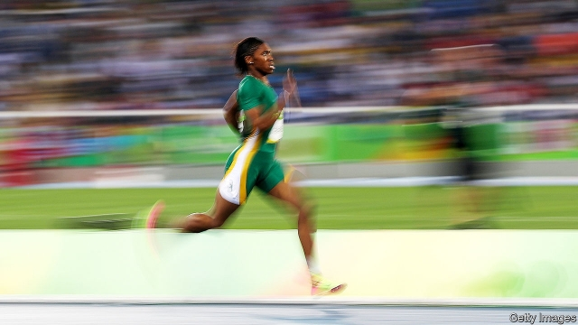
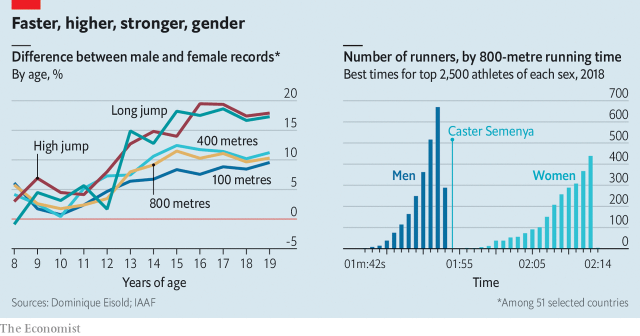

###### A defining moment

# What Caster Semenya’s case means for women’s sport 

##### A very specific ruling for a very special runner has implications far beyond athletics 

 

> May 9th 2019 

FEW ATHLETES have been as blessed and cursed as Caster Semenya. All that the 28-year-old South African has ever done is run as fast as her legs could carry her—fast enough to win back-to-back Olympic gold medals over 800 metres. But her remarkable body has also drawn ridicule, speculation and a decade of investigation. 

In 2009, when she breezed to a World Championship title, the International Association of Athletics Federations (IAAF), the sport’s governing body, began examining whether she might be intersex—an umbrella term for people with developmental conditions affecting the genitalia and gonads. To protect her privacy, the findings are unpublished. The IAAF has since been in a regulatory tussle about whether Ms Semenya must adjust her testosterone levels to compete as a woman. On May 1st the Court of Arbitration for Sport (CAS), an international court for sports, ruled against her. Its decision covers only athletes with one of a group of syndromes known as 46,XY, which means that a person with a male Y chromosome and high testosterone does not develop male genitalia. The ruling has implications far beyond Ms Semenya’s sport—and indeed, beyond sport itself. 

CAS allowed the IAAF to impose a limit of 5 nanomoles of testosterone per litre of blood (nmol/L) on runners with 46,XY conditions. This threshold is far below the normal male range of 8-30nmol/L, but well above the normal female range of 0.1-1.8nmol/L. The ruling covers women’s races between 400 metres and a mile. To continue racing over 800 metres, Ms Semenya would have to undergo hormone therapy, which may have nasty side-effects, such as an increased risk of blood clots. 

Ms Semenya has endured hormone therapy before, when the IAAF in 2011 introduced a testosterone limit of 10nmol/L for women in all track-and-field events. CAS suspended that rule in 2015, when Dutee Chand, an Indian sprinter with abnormally high testosterone levels, disputed that there was any proof that women like her received an unfair advantage in all athletic events. 

After a decade of gathering data on the question, the results the IAAF presented showed that women with high levels of testosterone did disproportionately well in middle-distance races—but no evidence of any effect in most other events. Ms Semenya is one of a handful of runners affected by the ruling. Rather than again submitting to hormone therapy, which added about 4% to her 800-metre time, she could switch to the 5,000-metre race, which is not covered by the new rules. 

The precedent CAS has set could affect every sport. What makes it even more contentious is that testosterone limits also apply to transgender women, who were born male but identify as women. The International Olympic Committee (IOC) already introduced a testosterone cap of 10nmol/L for trans women in all sports in 2016, replacing its previous requirement for athletes to have undergone genital-reconstruction surgery—a procedure few trans people undertake. CAS’s ruling makes the IOC’s policy likely to stand up in court, although it is now considering cutting its limit to 5 nmol/L. Not a single openly trans athlete has yet competed in the Olympics. 

The requirement for trans women to undergo hormone therapy to compete in women’s events could face legal challenges. Several Western countries are weighing laws that allow people to categorise their own gender. In America the Equality Act, a bill proposed by Democrats, would mean that sports officials could no longer discriminate between athletes using biological sex, explains Doriane Lambelet Coleman, a legal scholar at Duke University who is a former international 800metre runner. It could force Team USA to select trans women who have had no hormone treatment—even though the IOC would bar them from international events. 

At some levels of sport, self-identified gender is in many places already becoming the norm. Since September Canadian university athletes have been able to compete in the category of their choice, without hormone treatment. American high-school students in 18 states and Washington, DC, could already make that decision. In Connecticut trans girls finished first and second in the 100 metres at last year’s junior state championships. 

The underlying problem is a basic one: sports bodies still have no satisfactory way to distinguish between men and women. The most obvious route—to pick a binary characteristic, such as having testes or a Y chromosome—fails in a few cases. Between 1968 and 1996 officials at the Olympics verified athletes’ sex through chromosome testing. But some women’s performances are not enhanced by having Y chromosomes and testes. Maria José Martínez-Patiño, a Spanish hurdler with a 46,XY condition, was kicked off the national team after a test in 1985. Geneticists later proved that her body was insensitive to testosterone, so her condition conferred no athletic advantage. The IAAF subsequently stopped chromosome testing. 

Just one in 20,000 people is affected by 46,XY conditions. But an unusually high number of intersex women take part in elite sport. By one estimate, 8.5% of championship medals in women’s middle-distance races in the past 25 years have been won by 46,XY people—1,700 times their share of the general population. Over time, governing bodies have decided not to exclude such people if their conditions neither raise doubts about their biological sex nor confer a sporting advantage. 

This has led them to a second option: picking a characteristic that exists on a spectrum. Scientists generally agree that testosterone is the best candidate. From puberty, the hormone drives the development of male traits, such as bigger muscles, sturdier bones and less fat. The gap between boys’ and girls’ running times widens during adolescence (see chart). The fastest men run about 10% faster than women. The discrepancy is even wider for jumping events. As a result, artificial testosterone is a banned substance. 

 

However, using testosterone as a marker also has its flaws. People’s bodies respond to the hormone differently. It had no measurable effect on Ms Patiño. And once officials pick a testosterone threshold for intersex athletes, it is likely also to apply to trans women, who can use hormone therapy to fall below it. 

The success of intersex athletes in middle-distance running and the 4% decline in Ms Semenya’s performance after hormone therapy show that testosterone matters. But a couple of studies among small samples of elite women have found no statistical relationship between testosterone levels and performance in certain sports. The analysis that the IAAF presented in Ms Semenya’s case is of this type: in most events it looked at, it found no correlation at all. 

However, Ross Tucker, a sports scientist, points out, such studies are limited to people who perform at a similar level. A study of professional basketball players is unlikely to find a link between height and proficiency—the short, bad ones have already been filtered out. Among female athletes overall, the range of testosterone levels is quite large, but the average elite sportswoman has a higher one than an average woman (just as the typical basketball star bumps ceilings). The IAAF’s data had other flaws. Three independent researchers found them riddled with errors, such as athletes who had been double-counted. 

The IAAF’s decision to cap intersex middle-distance athletes at 5nmol/L is based on estimating the maximum level that a non-intersex woman could naturally reach. Critics argue that this is no different from, say, penalising basketball players for their height. But others counter it is a price worth paying, for protecting women’s sport. (Nobody is agitating for a short-person’s basketball league.) 

The guesswork around testosterone becomes even sketchier for contact sports, because measuring the ability of a wrestler or rugby player is harder than timing a runner, and their bone structure matters more. Anyone who develops a stronger skeleton at puberty has a permanent advantage. 

Such advantages affect many trans athletes as well as intersex ones, sparking controversy. Fallon Fox, an American mixed-martial-arts fighter, was pilloried when she revealed in 2013 that she was a male who had undergone gender-reassignment surgery. Hannah Mouncey, a trans woman who had represented the Australian men’s handball team before undergoing hormone therapy and switching to the women’s team, was barred from the women’s Australian Football League in 2017. 

Good data for trans women are as scarce as for intersex ones. Joanna Harper, a scientist and trans runner, has conducted one of the few studies, of eight non-elite female endurance runners who had earlier competed as men. Their slower times after hormone therapy put them in much the same relative positions in women’s races as they had achieved in men’s. But the data are too scant to say that this holds for all athletes. Whereas chromosome tests discriminated against a small number of women with unusual conditions, the new rules could disadvantage a large number of women by allowing some stronger and faster intersex and trans women to compete against them. 

Ms Harper points out that there has been no deluge of trans women gaming the system. The trans athlete who has come closest to dominating an individual sport is Laurel Hubbard, a New Zealander who held junior national weightlifting records as a man, became an international contender as a woman and in 2017 finished second in the World Championships. 

International sporting bodies are unlikely ever to accept self-identified gender as the basis for admitting trans women to women’s competitions. Even so, many women still worry that the testosterone threshold could allow some fairly good male competitors to become all-conquering female ones. Some trans women call such fears scaremongering. The court’s ruling on Ms Semenya is not going to settle that argument. 

