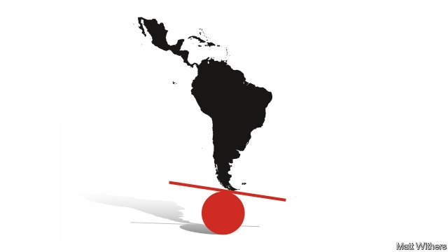

###### Latin America

# John Bolton and the Monroe Doctrine 

##### Democracy is at risk in Latin America. The danger goes well beyond Cuba, Nicaragua and Venezuela 

 

> May 9th 2019 

DONALD TRUMP’S administration is not famed for its adherence to highfalutin’ political principle, so John Bolton, the United States national security adviser, struck an unusual note when he claimed in a speech in Miami last month that the “Monroe doctrine is alive and well”. The reference to the 19th-century principle under which the United States arrogated to itself the right to police Latin America was taken as a warning to Russia and China not to meddle in what used to be called “America’s backyard”. Mr Bolton gave new life to the doctrine by announcing fresh economic sanctions against Cuba, Nicaragua and Venezuela, which he likes to call the “troika of tyranny”. 

But the tone of his speech was optimistic as well as threatening. Once the troika was brought down, Mr Bolton explained, there was a prospect of “the first free hemisphere in human history” extending from “the snowcapped Canadian Rockies to the glistening Strait of Magellan”. 

The problem with Mr Bolton’s soaring rhetoric is not just that the Strait of Magellan roils more than it glistens. It is also that both his analysis and his prescription are wrong. The weaknesses in Latin American democracy stretch far wider than the trio Mr Bolton fingered, and the United States will not help strengthen it by bullying its southern neighbours. 

In the 1980s Latin America turned from a land of dictators and juntas into the world’s third great region of democracy, along with Europe and North America. Since then democracy has put down roots. Most Latin Americans today enjoy more rights and freedoms than ever before. 

Yet many Latin Americans have become discontented with their democracies (see article). The region’s economy is stagnant. Poverty is more widespread than it need be because of extreme inequality. Governments are not providing their citizens with security in the face of rising violent crime. Corruption is widespread. Voters’ discontent, voiced on social media, has helped promote leaders with an unhealthy tendency to undermine democratic institutions. 

Latin America’s fall from grace is most obvious in Venezuela and Nicaragua, which are sliding into dictatorship; in communist Cuba, which stands behind those two regimes, hopes of reform have been dashed. But across the continent, the threats to democracy are growing. 

Many Latin American voters have abandoned moderates in favour of populists. Brazil’s Jair Bolsonaro and Mexico’s Andrés Manuel López Obrador (known as AMLO) share an ambivalence to the dispersal of power and the toleration of opponents that are the essence of democracy. Mr Bolsonaro, who has spoken of his nostalgia for military rule, has eight generals in his cabinet of 22; AMLO is weakening competing centres of power, such as elected state governors. The “northern triangle” of Central America, meanwhile, is dominated by weak and corrupt governments. In Honduras a conservative president and American ally, Juan Orlando Hernández, governs thanks to an election marred by fraud. Guatemala’s president ordered out a UN body investigating corruption that had helped jail two of his predecessors. 

Voters elect populists such as Mr Bolsonaro and AMLO—and may elect Cristina Kirchner, who is on track to make a comeback in Argentina’s election in October—not to replace democracy with dictatorship, but because they want their politicians to do a better job. Yet in the 21st century, it is not tanks on the streets that crush democracy. Rather, elected autocrats boil the frog, capturing courts, cowing the media and weakening the parts of civil society that hold them to account. By the time citizens squeal, it is too late. That is what happened in Venezuela under Hugo Chávez, and what is happening now in Turkey (see article). 

The main task of averting the danger falls to Latin Americans. They need to rid politics of corruption and cronyism. Politicians need to keep their distance from the armed forces and their hands off the institutions that scrutinise the government. Above all, politicians need to reconnect with ordinary citizens. There are a few hopeful signs. New parties and NGOs are training young activists in how to be effective reformers. 

The United States needs to help rather than hinder the task of strengthening democracy. Talk of the Monroe doctrine may make some Latin Americans see their northern neighbour more as a bully than as an ally. Instead of threatening to supplement sanctions on Venezuela with military action, it should work harder at combining sanctions with negotiations, especially with the armed forces. And Donald Trump should restore the $500m aid programme for the northern triangle that he abruptly cancelled this year, for there were signs that it was helping to cut both violent crime and immigration. 

Although Latin America usually gets little attention in American foreign policy, few other parts of the world have a bigger bearing—through immigration, drugs, trade and culture—on daily life in the United States. A democratic and prosperous Latin America matters on both sides of the Rio Grande. Mr Trump needs to think harder about how to help that happen. 

