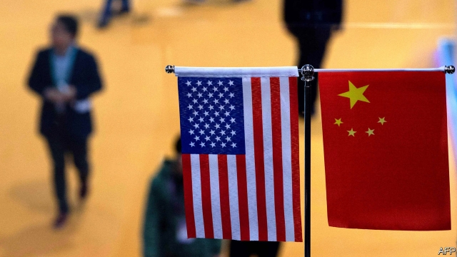
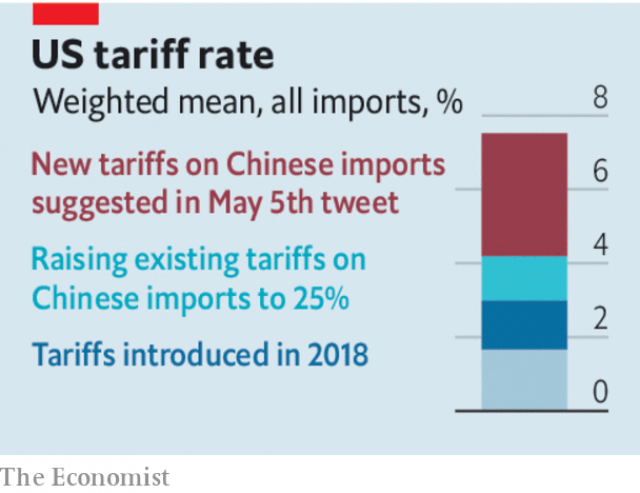

###### Triumph and disaster

# The US-China trading relationship will be fraught for years to come 

##### That matters more than trade deals today 

 

> May 9th 2019 

OVER THE past two years investors and executives watching the trade tensions between America and China have veered between panic and nonchalance. Hopes for a cathartic deal that would settle the countries’ differences have helped global stockmarkets rise by a bumper 13% this year. But on May 5th that confidence was detonated by a renewed threat by President Donald Trump to impose more tariffs on Chinese imports. As The Economist went to press negotiations rumbled on, but no one should be under any illusions. Even if a provisional agreement is eventually struck, the deep differences in the two countries’ economic models mean their trading relations will be unstable for years to come. 

Some trade spats are settled by landmark agreements. In the 1980s tensions between Japan and America were resolved by the Plaza Accord. In September Mr Trump agreed to replace NAFTA, which governs America’s trade with Canada and Mexico, with a renamed but otherwise rather similar accord (although the new treaty has yet to be ratified by Congress). Even by those standards the China talks have been an epic undertaking involving armies of negotiators shuttling between Beijing and Washington, DC, for months on end. Yet they have never looked capable of producing the decisive change in China’s economic model that many in Washington crave. 

There is some common ground (see Finance section). China is happy to buy more American goods, including soyabeans and shale gas, in an effort to cut the bilateral trade deficit, a goal which is economically pointless but close to Mr Trump’s heart. It is willing to relax rules that prevent American firms from controlling their operations in China and to crack down on Chinese firms’ rampant theft of intellectual property. Any deal will also include promises to limit the government’s role in the economy. 

 

The trouble is that it is unlikely—whatever the Oval Office claims—that a signed piece of paper will do much to shift China’s model away from state capitalism. Its vast subsidies for producers will survive. Promises that state-owned companies will be curbed should be taken with a pinch of salt. In any case the government will continue to allocate capital through a state-run banking system with $38trn of assets. Attempts to bind China by requiring it to enact market-friendly legislation are unlikely to work given that the Communist Party is above the law. Almost all companies, including the privately owned tech stars, will continue to have party cells that wield back-room influence. And as China Inc becomes even more technologically sophisticated and expands abroad, tensions over its motives will intensify. 

This fundamental clash of economic systems has been made more combustible by politics. In an atmosphere of mistrust, both sides have sidelined the World Trade Organisation, the global framework for handling trade disputes, opting instead for a transactional approach to the talks replete with gimmicks and threats. Meanwhile the mood at home has changed. Strikingly, many Democrats now accuse Mr Trump of being too soft on China. Earning less than 5% of their combined profits in China, and enjoying a boom in their home market, America’s big firms support a tough line, too. In Beijing, meanwhile, the call for economic self-reliance is gaining steam (see Chaguan). 

At some point this year Mr Trump and Xi Jinping, his Chinese counterpart, could well proclaim a new era in superpower relations from the White House lawn. If so, don’t believe what you hear. The lesson of the past decade is that stable trade relations between countries require them to have much in common—including a shared sense of how commerce should work and a commitment to enforcing rules. The world now features two superpowers with opposing economic visions, growing geopolitical rivalry and deep mutual suspicion. Regardless of whether today’s trade war is settled, that is not about to change. 

