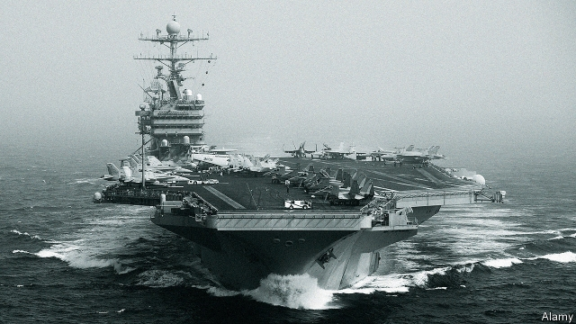

###### Collision course

# The brewing conflict between America and Iran 

##### Both sides need to step back 

 

> May 11th 2019 

THE DRUMS of war are beating once again. An American aircraft-carrier strike group is steaming towards the Persian Gulf, joined by B-52 bombers, after unspecified threats from Iran. John Bolton, the national security adviser, says any attack on America or its allies “will be met with unrelenting force”. In Tehran, meanwhile, President Hassan Rouhani says Iran will no longer abide by the terms of the deal signed with America and other world powers, whereby it agreed to strict limits on its nuclear programme in return for economic relief. Iran now looks poised to resume its slow but steady march towards the bomb—giving American hawks like Mr Bolton further grievances. 

Just four years ago America and Iran were on a different path. After Barack Obama offered to extend a hand if Iran’s leaders “unclenched their fist”, the two sides came together, leading to the nuclear deal. That promised to set back the Iranian nuclear programme by more than a decade, a prize in itself, and just possibly to break the cycle of threat and counter-threat that have dogged relations since the Iranian revolution 40 years ago. 

Today hardliners are ascendant on both sides (see article). Bellicose rhetoric has returned. Mr Bolton and Mike Pompeo, the secretary of state, believe in using economic pressure to topple the Iranian regime and bombs to stop its nuclear programme. In Tehran the mullahs and their Revolutionary Guards do not trust America. They are tightening their grip at home and lashing out abroad. In both countries policy is being dictated by intransigents, who risk stumbling into war. 

It is probably too late to save the nuclear deal, known as the Joint Comprehensive Plan of Action (JCPOA). Iran has been complying, but critics in America complain that its temporary restrictions will ultimately legitimise the nuclear programme and that the deal will not stop Iran from producing missiles or sowing murder and mayhem abroad. President Donald Trump pulled America out of the agreement last year, calling it a “disaster”. It is not, but that damage is done. Renewed sanctions on Iran and the threat to punish anyone who trades with it have wrecked what is left of the agreement. Last week America cancelled waivers that let some countries continue to buy Iranian oil. It is extending sanctions to Iran’s metals exports. Instead of reaping the benefits of co-operation, Iran has been cut off from the global economy. The rial has plummeted, inflation is rising and wages are falling. The economy is in crisis. 

Predictably, rather than bringing Iran’s leaders to their knees, America’s belligerence has caused them to stiffen their spines. Even Mr Rouhani, who championed the nuclear deal, has begun to sound like a hawk. Having long hoped that Europe, at least, would honour the promise of the deal, he is exasperated. On the anniversary of America’s exit from the agreement, on May 8th, he said that Iran would begin stockpiling low-enriched uranium and heavy water, which would in sufficient quantities breach its terms. Without economic progress in 60 days, he said, Iran “will not consider any limit” on enrichment. All this suggests that Iran will start moving closer to being able to build a nuclear bomb. 

As he walks his country towards the brink, Mr Rouhani has three audiences in mind. The first is his own hardliners, who detest the nuclear deal and have been pressing him to act. He appears to have appeased them, for now. On May 7th the front page of an ultraconservative newspaper declared: “Iran lighting match to set fire to the JCPOA.” He is also trying to get European companies to break with America. He will not succeed. Despite European Union attempts to design mechanisms that allow European businesses to skirt American sanctions, most of them have decided that the American market is too valuable. 

Iran’s most important audience is America, with which it seems to be playing an old game. Iranian leaders have long seen the nuclear programme as their best bargaining chip with the West. Though they have claimed that it is peaceful, UN inspectors have found enough evidence to suggest otherwise. The technology is the same whether power or a weapon is the ultimate goal. Iran’s centrifuges can produce a bomb faster than sanctions can topple the regime, goes the logic of hardliners. But they are wielding a double-edged sword. The threat of obtaining a nuclear weapon is useless if it does not seem credible. And if it is credible, it risks provoking military action by America or Israel. 

The potential for miscalculation is large and growing. American troops are within miles of Iranian-backed forces in Iraq and Syria. Its warships are nose to nose with Iranian patrols in the Gulf. America recently declared the Guards a terrorist group; then Iran did the same to American forces in the Middle East. Officials on both sides say their intent is peaceful, but who can believe them? America’s accusations that Iran has been planning to attack American forces or its allies in the Middle East are suspiciously unspecific. Violence by Iran’s proxies may be just the sort of provocation that leads America to launch a military strike. Mr Pompeo once suggested that he preferred American sorties to nuclear talks with Iran. Mr Bolton penned an article in 2015 in the New York Times entitled “To Stop Iran’s Bomb, Bomb Iran”. Now even Mr Rouhani appears to agree that the way forward lies with provocation and escalation. 

A nuclear Iran would spur proliferation across the Middle East. Bombing would not destroy Iranian nuclear know-how, but it would drive the programme underground, making it impossible to monitor and thus all the more dangerous. The only permanent solution is renewed negotiation. Mr Trump, a harsh critic of America’s foreign wars, therefore needs to keep the likes of Mr Bolton in check. He will face pressure from hardline politicians at home and opposition in the region, not least from Israel. 

Doing deals, though, is a Trump trademark. The president has shown an ability to change direction abruptly, as with North Korea. A new war is not in his interest, even if being hard on Iran is part of his brand. The Europeans can help him by urging Iran to keep within the deal—and condemning it if it leaves. Mr Rouhani, who spurned Mr Trump in the past, now says he is willing to talk with the deal’s other signatories if today’s agreement is the basis. That has so far been a non-starter for the Trump administration. It should not be. As the threat of a conflict grows, all sides need to head back to the negotiating table. 

