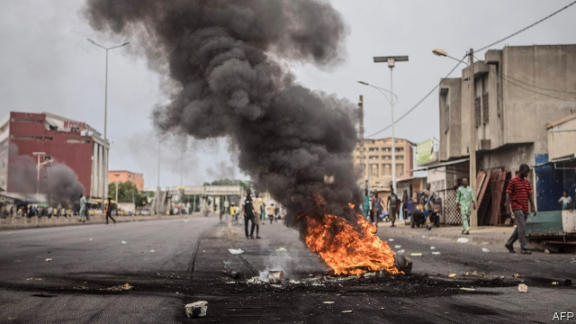

###### The wrong kind of rupture

# After a lousy election, Benin’s democracy is under threat 

##### Three-quarters of eligible voters boycotted the poll 

 

> May 9th 2019 

WITH ONLY two parties on the ballot, both of them supporters of President Patrice Talon, Benin’s general election on April 28th was an unhappy throwback to the country’s post-independence Marxist era, when voters had no real choice at all. This was all the more dispiriting because Benin was in the vanguard of Africa’s democratic revival in the early 1990s, when its long-serving leader, Mathieu Kérékou, became the first incumbent president on the continent to let his people peacefully vote him out of office. Since then, the Beninois have managed freely to elect three more presidents, and prevented Mr Talon’s predecessor from flouting the constitution’s two-term limit. This time, however, new electoral laws made it cumbersome and expensive to field candidates. All opposition parties were barred for not following them to the letter. So Beninois voted with their backsides: only 27% of them bothered to go to the polls. 

Many Beninois are proud of their country’s democratic record. Though Benin is poor and corrupt, it seemed to have avoided the fate of neighbours like Togo, which has been harshly governed, and Nigeria, where elections have invariably been violent. Mr Talon, one of Benin’s richest men, was elected in 2016 promising a “rupture” with his country’s history of underdevelopment. But more recently he has been keener to undermine its democracy. 

Opposition parties, seething at their exclusion from the poll, took to the streets. Mr Talon sent in the army to squash them. The opposition says at least seven protesters were killed. An uneasy calm now prevails, with soldiers stationed outside the house of Thomas Boni Yayi, Mr Talon’s bitter foe and predecessor as president. 

Many Beninois worry that the new parliament, due to be sworn in on May 15th, will be Mr Talon’s rubber stamp. Since 1991, the year Mr Kérékou left office, a multitude of parties has competed for power; 11 are represented in the outgoing parliament. The body has been an effective check on presidential power, for instance by forcing Mr Yayi to drop his attempt to stick around for a third term. 

Now that Mr Talon has neutered parliament, his opponents fear he will further enrich himself and his cronies. Nicknamed the “King of Cotton”, he won bids for state-owned assets and government contracts while Mr Yayi, then his ally, was in power. The opposition points to the changes in the electoral laws and his readiness to call up the army to suppress protests as further evidence of his intention to destroy democracy. Last year Sébastien Ajavon, a poultry magnate known as “the Chicken King” who had run against Mr Talon for the presidency, was sentenced to prison under what many observers considered false pretences. The president’s friends say that such complaints come from entrenched elites who oppose his plans to liberalise the economy. 

Mr Talon admitted before the poll that the exclusion of opposition parties “brings discredit on our democracy and on me”. By staying at home in record numbers, voters in Benin rebuked him for holding the election anyway. They will hope that sooner or later the president cottons on. 

