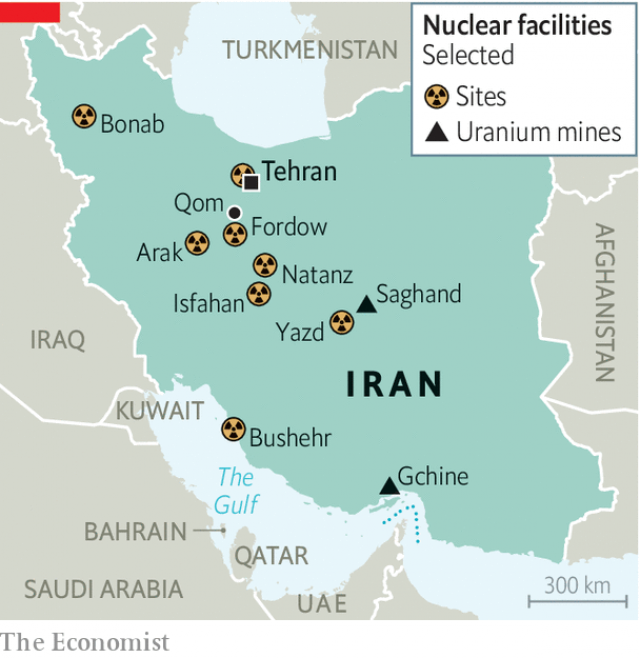

###### Moving in a dangerous direction

# As America and Iran act tough, the risk of conflict is growing 

##### Meanwhile, the nuclear deal is in tatters 

 

> May 11th 2019 

“THE WORST deal ever negotiated,” was President Donald Trump’s view of Barack Obama’s signature diplomatic achievement: a deal that placed strict limits on Iran’s nuclear programme in return for sanctions relief. The agreement, signed in 2015 by Iran and six world powers, clumsily named the Joint Comprehensive Plan of Action (JCPOA), made it much harder for Iran to build an atom bomb, at least for a while. But it has been on life support ever since Mr Trump declared a year ago that he was withdrawing from it. 

On May 8th Hassan Rouhani, Iran’s president, pushed it closer to death. Mr Rouhani said that Iran would stop complying with parts of the deal and warned that more breaches might follow. His announcement had an ominous backdrop. On May 5th America sent an aircraft-carrier strike group and bombers to the Middle East in response to “troubling and escalatory indications and warnings” of Iranian aggression. Two days later Mike Pompeo, the secretary of state, unexpectedly turned up in Iraq, where America has long accused Iran of sponsoring attacks on American forces. The combination of a dissolving nuclear agreement and more sabre-rattling increases the risk that America and Iran will stumble into a war—whether by accident or design. 

For now the nuclear deal is hanging on. Iran, said Mr Rouhani, would stop exporting enriched uranium once its stockpile reached 300kg and heavy water over 130 tonnes, thus breaching caps set by the agreement. That is worrying. Enriched uranium, if spun in centrifuges to higher levels of purity, can be used to power nuclear bombs. Heavy water is used in nuclear reactors that can produce plutonium, an alternative bomb fuel. 

Mr Rouhani also gave the deal’s other signatories—Britain, China, France, Germany, Russia and the European Union—60 days to work out how to relieve the pressure brought on by American sanctions, imposed by Mr Trump, which have crippled the Iranian economy (see article). If they do not, Mr Rouhani is threatening to increase not just the volume of its enriched uranium, but also the purity, which is capped at 3.67%, far below the level of around 90% required to make a bomb. Were Iran to enrich some or all of its stockpile to 20%, that would halve the time needed to make the final leap to weapons-grade levels. He also said Iran might resume work on the heavy-water reactor at Arak that had been halted under the nuclear agreement. 

Mr Rouhani’s calculation, and hope, is that these steps are strong enough to placate hardliners at home and to signal Iran’s resolve to America, but calibrated enough to avoid provoking Europe into reimposing sanctions. The EU signatories warned Iran in a joint statement on May 9th that they “reject any ultimatums”. But Mark Fitzpatrick, a former State Department official (currently at the International Institute for Strategic Studies in London), thinks Iran's tactic might work. The heavy-water limit is vaguely written and is “too minor an issue” to blow up the deal. It will also take some time for Iran to breach the 300kg-limit on enriched uranium. “When it is exceeded, the amount will probably be judged as not so great as to spark a crisis,” says Mr Fitzpatrick. 

Yet it is unlikely that the other signatories will be able to meet Iran’s demands. On January 31st Britain, France and Germany announced the creation of Instex, a barter-based channel to isolate Europe-Iran trade from American sanctions. But it has proved a disappointment, covering only food and medicine. Aniseh Bassiri Tabrizi of the Royal United Services Institute, a think-tank, says Iranian officials were especially incensed by America’s decision on April 22nd to end exemptions from its sanctions that had allowed some countries to buy Iranian oil. Europe’s best efforts are unlikely to compensate for that blow. 

“Eventually, we’ll reach another point where Iranians feel they have to go another step further,” says Ilan Goldenberg, a former State Department official. How much further is the question. If Iran were to shrug off the nuclear deal entirely, it could take thousands of old centrifuges out of storage, install them underground and build up a huge stock of uranium enriched to higher levels. All that might bring its breakout timeline—the time it would take to produce enough material for a single nuclear weapon—to two to three months, where it stood in 2015, or even less. 

 

But such dramatic moves would result in the evaporation of European support, diplomatic isolation and possibly even military action. More likely is that Iran continues to slice away at the JCPOA over time. “What we will have is not an immediate crisis, but a slow-motion crisis that will play out over years—just the way it did before,” says Mr Goldenberg. 

A race between American sanctions on the one hand, and a gradual Iranian nuclear build-up on the other, would take the world back to the febrile years before the nuclear deal, when American or Israeli air strikes sometimes appeared imminent. But the situation may be more dangerous today. Iranian-backed forces have grown stronger in Lebanon, Syria, Iraq and Yemen. 

More importantly, American hostility to Iran has grown. Last year Mr Pompeo issued a dozen sweeping “demands” of Iran that resembled terms of surrender. These include halting uranium enrichment (permitted under the deal) and pulling out of Syria. John Bolton, America’s national security adviser, has long advocated regime change. It was he who announced the deployment of warships on May 5th. “I don’t believe that President Trump wants to go to war,” says Wendy Sherman, a former American diplomat who negotiated the nuclear deal. “But I don’t think he fully understands the escalatory cycle Bolton has put him on, and the risks of war, which are growing every single day.” 

