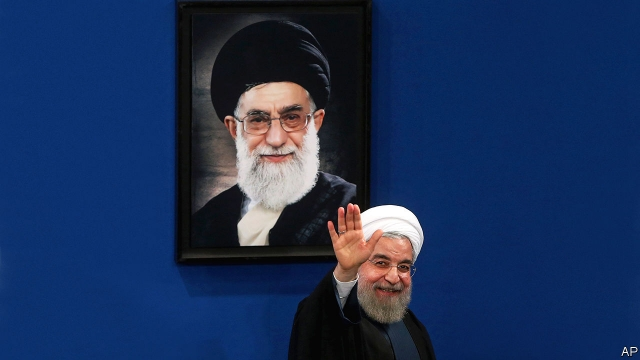

###### Hassan Rouhani’s remorse

# Iran’s president does not want to walk away from the nuclear deal 

##### But hardliners leave him with little choice 

 

> May 11th 2019 

TWO YEARS ago the chairman of Iran’s national airline was eager to travel the world and spend a few billion dollars. In December 2016 Farhad Parvaresh shook hands with a Boeing executive to buy 80 passenger jets. A month later he was in Toulouse, France, to take delivery of a new jet, one of 100 ordered from Airbus. Both contracts were vivid symbols of how the world’s economy was opening up to Iran after the conclusion of a deal in 2015 that eased sanctions in exchange for limits on its nuclear programme. 

Times have changed since America’s president, Donald Trump, withdrew from the nuclear agreement a year ago. The reimposition of American sanctions halted both aeroplane contracts and scared away other potential trading partners. The Iranian economy is now isolated. President Hassan Rouhani, in turn, says Iran will stop abiding by parts of the pact. 

This was not what Mr Rouhani wanted. When America withdrew he said that Iran would still fulfil its commitments under the nuclear deal. The International Atomic Energy Agency confirms that it has. But domestic politics has made his position untenable. As Mr Trump has increased pressure on Iran, he has unwittingly emboldened its hardliners to squeeze Mr Rouhani, one of the architects of the deal. 

Mr Rouhani had hoped that the European Union would blunt the pain of American sanctions by compelling companies and banks to keep doing business with Iran. But European efforts to work around the sanctions and facilitate trade have not been effective. European countries have not taken action against big firms such as Total and Airbus that have backed out of their Iranian contracts. “They don’t want a full-fledged trade war with the US over Iran because the benefits are too marginal,” says Suzanne Maloney of the Brookings Institution, a think-tank in Washington. 

Cut off from the global economy, Iran’s economy is plunging. Before Mr Trump was elected one dollar bought 35,000 rial. Today’s black-market rates are upwards of 150,000. Oil sales are hard to track because Iran hides shipments through middlemen and “ghost tankers” with transponders switched off. But analysts think they have fallen to about 1m barrels a day, less than half of their level before sanctions. They will drop more in coming months with the expiry of temporary waivers from sanctions that America granted to the biggest buyers of Iranian oil. New sanctions announced on May 8th target iron, steel, aluminium and copper production, which America says is Iran’s “largest non-petroleum-related source of export revenue”. 

Suffering Iranians have understandably soured on the nuclear deal and the president who promoted it. A poll in December found that support for the agreement had fallen to 52% from 76% in 2015. Mr Rouhani’s conservative rivals, long suspicious of his attempts to repair relations with America, feel vindicated. Mr Trump’s recent decision to brand the Revolutionary Guard Corps a terrorist organisation gave them another boost; even reformists rallied around them. The ayatollahs who wield power in Tehran have fallen out with those who study in Qom. But Iran is still a clerical regime and the mullahs are in ever-tighter lockstep with the Guards, who also control a big chunk of the economy. 

Iran’s parliament has spent months debating legislation meant to remove Iran from a blacklist maintained by the Financial Action Task Force, a global body that sets anti-money-laundering standards. Mr Rouhani risked much political capital to advance these bills, one of which was even opposed by the supreme leader. That effort now looks dead. Hossein Shariatmadari, the curmudgeonly editor of Kayhan, a state-run daily, calls the bills a sign of “weakness” in the face of American sanctions on the Guards. 

Mr Rouhani has tried to buy himself time—and to press Europe into offering economic relief—by setting a deadline of 60 days before breaching the nuclear deal further. Hardliners are praising his “first decisive step”. But his ultimatum does not change the underlying political and economic realities. America wants to batter Iran. Europe cannot stop it. Nor does his move change the calendar: even if a future American president were willing to lift sanctions, Mr Trump still has 20 months left in his first term. That is a long time for a weakened Mr Rouhani to endure. In order to fend off hardline critics he is, by undermining the deal, adopting their policies. Even a tactical win for the president is ultimately a victory for his rivals. 

