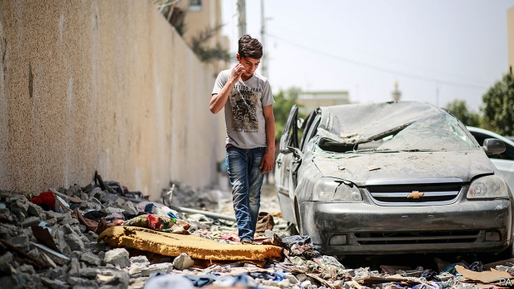

###### Rockets over Gaza

# Israel and Hamas come close to war 

##### The ceasefire will not last unless conditions in Gaza improve 

 

> May 9th 2019 

IT SHOULD HAVE been a celebratory weekend. Israelis were getting ready to mark their 71st independence day. In Gaza 2m Palestinians were making final preparations for the month-long Ramadan holiday, which began on May 6th. And then the rockets and bombs started falling. Residents on both sides spent the weekend cowering under rocket fire and air strikes. Four Israelis were killed, the first civilians to die in fighting with Gaza since a brief but brutal war in 2014. On the Palestinian side 27 people, a mix of militants and civilians, died. As in previous bouts of conflict, the fighting ended with a truce brokered by Egypt, Qatar and the UN. And, as before, no one expects it to last. 

Such has been the pattern since March 2018, when residents of Gaza began holding regular protests at the barrier separating their enclave from Israel. The protests are meant to call attention to the dire economic situation in the territory, which is blockaded by Israel and Egypt, with only essential supplies allowed in. These restrictions have been in place since 2007 when Hamas, a militant Islamist group, took power. Tensions have risen over the past year, with exchanges of fire between Israel and Hamas every few months. 

This time the spark was an attack on an Israeli army jeep patrolling the boundary by Islamic Jihad, another militant group, that wounded two soldiers. Yet the specific cause matters little, since each round of fighting is a continuation of the last. What was different this time was the intensity. In the whole of 2018 militants in Gaza fired about 1,000 rockets, Israel says. During the latest flare-up they launched nearly 700 over a single weekend. Israel conducted more than 300 air strikes. Instead of bombing mostly empty buildings, as it has in the past, Israel has resumed the targeted killings of mid-level militants. It also bombed a compound used in an alleged cyber-attack, perhaps the first-ever case of a state using force against digital assailants. 

Hamas and Israel are stuck in a bind. The militants know that Binyamin Netanyahu, Israel’s prime minister, does not want to invade to remove them from power, for that would involve a bloody fight, followed by uncertainty about what would replace Hamas. The Palestinian Authority (PA), which controls the West Bank, is in no shape to control Gaza. Mr Netanyahu’s rivals love to criticise his strategy, yet none has a coherent alternative. Hamas is also a useful foil for a prime minister who has no interest in peace talks with the PA. Division among the Palestinians makes moot any talk of a two-state solution. 

Hamas believes that the best tool it has to extract concessions is force. The protests and occasional rounds of rocket fire have already won promises to alleviate Gaza’s misery. Israel agreed to expand its fishing zone from six miles (10km) to 15. It also let Qatari envoys bring cash-stuffed suitcases into the territory; that allowed Hamas to pay salaries. After this month’s fighting Qatar pledged another $480m in aid. 

But the bulk of the money, $300m, will go to the PA, which is suffering a financial crisis of its own. Gaza will get an unknown share of the remainder, a small dose of aid for a territory where 52% of adults are unemployed (up from 38% in 2010). Those lucky enough to have work earn, on average, 45 shekels ($13) per day. Many residents receive just eight hours of electricity a day. Water supplies are undrinkable and once-unspoilt Mediterranean beaches are contaminated by untreated sewage. 

Hamas officials say Israel has promised to take further steps, including easing import restrictions, within a week. That deadline will coincide with the start of the Eurovision song contest, to be hosted in Tel Aviv from May 14th. Mr Netanyahu will not want violence to mar an event that will be watched on television by millions of people. But some Palestinians may not be satisfied with whatever modest concessions Israel makes in the coming days. Ziad al-Nakhaleh, the head of Islamic Jihad, calls the latest fighting a “live-fire drill” for an upcoming war. If the formula is money for quiet, Israel and Arab states will need to deliver much more cash. If they do not, this ceasefire will be short-lived. 

