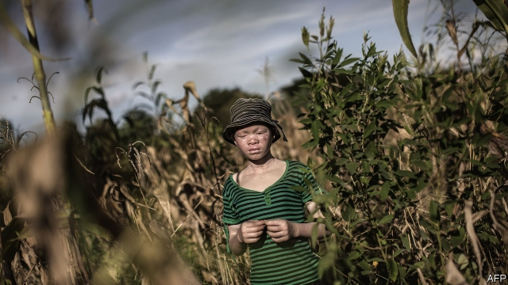

###### White magic

# The killing of albinos is overshadowing Malawi’s election 

##### Politicians believe their body parts boost their chances of winning 

 

> May 11th 2019 

HIS FISTS clenched on the tabletop, Bon Kalindo, an opposition MP, leans forward conspiratorially to list the magical properties of albino body parts. Place the fibula of one under a bottle of Coke and it will fizz manically, until the top pops off. Pass it in front of a torch and the light will go out. Most handily of all, a bone correctly inserted into a machine made by a reputable witch doctor will cause large amounts of cash to fly out; it’s the magnetic liquid albinos have in their bones, you understand. Sensing scepticism, Mr Kalindo brushes it aside. You are not from here, he says. 

For some in Malawi, a belief in the numinous runs deep. Medicine men post flyers boasting of potions and charms to neuter rivals, punish the unfaithful or rekindle lost ardour. Such superstition is not uncommon in much of the world. But in Malawi, it can carry dark undertones. The most potent spells require ritual human sacrifice, according to a local journalist who has approached witch doctors under cover. Murders are not uncommon. Women and children are killed for their breasts and genitals. Albinos, who number no more than 10,000 in Malawi, are said to carry the most powerful magic and are thus most at risk. 

Albino body parts can cost tens of thousands of dollars. The Association for Persons with Albinism in Malawi (APAM) says it began documenting attacks in 2014 after a surge before an election that year. Since then it has recorded 25 murders, 15 disappearances and 122 other crimes, including attempted abductions and exhumations. 

In recent months, as Malawians prepare to vote in a general election on May 21st, there has been another rise in attacks. An albino man was killed and dismembered in front of his nine-year-old son. Three weeks later an 18-month-old girl was kidnapped. In February, a machete-wielding gang carried away Goodson Makanjira, aged 14. Another 11 attempted attacks were thwarted by neighbours, APAM says. 

Activists suspect politicians are involved. Though evidence remains circumstantial, suspicions have been fuelled by the mysterious deaths (one in police custody) of two suspects who may have held clues about who is behind recent attacks. The government of Peter Mutharika, the president, denies that anyone in power is involved in the murders or that the suspects were killed to silence them. 

The scandal has only deepened since, with the parties of Mr Mutharika and his two chief rivals blaming each other for the killings. Mr Kalindo says that, while in custody earlier this year for insulting the president in song, he met suspects held for the murder of an albino in 2014. Lurid recordings of the men purportedly implicating one of the president’s senior advisers have been circulated widely on social media. 

These may be, as the government protests, yet more smears in a campaign that has been full of them. But in a close election that could be won by any of the three main candidates, the temptations to resort to witchcraft are high. After all, a credible electoral commission watched by international observers will make it difficult to rig the vote. And history shows that incumbency offers no guarantee of victory. In elections in 2014 the sitting president, Joyce Banda, came third. 

Malawi’s albinos would rather their politicians stopped trading accusations and worked together to protect them. The government says it is trying. Last week a judge handed down a death sentence to the murderer of an albino teenager. Hetherwick Ntaba, the head of a government task force on the issue, says he is working with village chiefs to bolster security. Albinos are to be issued with panic buttons connected to the nearest police station. Legislation to regulate witch doctors is being discussed. 

Campaigners say the conviction and sentencing are a step in the right direction. But they want to see better police investigations that lead to the arrest of the kingpins behind the murders, not just the gangsters who carry them out. 

Albinos will only truly be safe when belief in their magic powers abates. If even Mr Kalindo, who has campaigned on albinism issues for several years, believes the superstitions, what hope is there? It is neither poverty nor lack of education that drives supernatural beliefs. “In Malawi you even have PhD holders who visit the medicine man,” says Lazarus Chakwera, one of Mr Mutharika’s main challengers in the general election. 

Other countries have had some success in reducing killings. Kenya has an albino senator and holds albino beauty pageants, which helps demystify the condition. Tanzania has created an island refuge for albinos. That Malawi’s politicians have failed to come up with such solutions is a deep and damning tragedy. 

