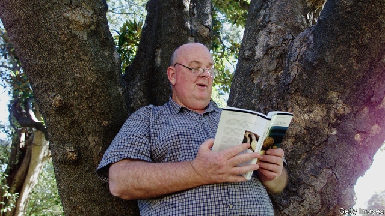

###### A bard for the left-out

# Obituary: Les Murray died on April 29th 

##### Australia’s greatest modern poet, a political controversialist, was 80 

 

> May 9th 2019 

WHEN HE GOT too curious as a baby, which was most of the time, Les Murray’s parents would tether him to a bench-leg in the yard. There, straining aslant, he took in the world that was to shape his work for good. Low scrubby hills with red cattle on them, stretching to tall woods and the creek that ran through Bunyah, a hamlet with no main road in northern New South Wales. The house, a shack of wood slabs with a tin roof, without power or much of a floor, where drought hissed out of the water tank. Hens, pigs, Bluey the cattle dog. “Lank poverty, dank poverty”, he wrote; “its pants wear through at fork and knee,/ It warms its hands over burning shames...” He came to speak for all Australia’s white rural poor, and was pleased to irritate the hell out of the liberal metropolitan intellectuals of Sydney and Melbourne by showing that his poetry came from that left-out place. One collection, called “Subhuman Redneck Poems”, won the T.S. Eliot prize. A shame that he didn’t have too much time for Eliot and his like. 

There were many prizes, for he was a great spigot of words which, once flowing, wouldn’t easily stop: poems most notably, but essays and criticism too. In 1961 he got his first poem into the Bulletin, Australia’s foremost literary magazine; by 1973 he was editor of Poetry Australia; by 1994 he was tipped to win the Nobel. When required he could squeeze into a suit, but he made his roots plain in his bulky, towering presence, his off-duty preference for shorts and bush hats, his random domestication (gravy slurped from the plate) and a gappy smile unfixed by cosmetologists. As he recited his poems his eyes would roll up in his head, as though he was a hundred miles beyond the lecture hall. 

Nature was always his first resource: shadows of barns “thin with frosted straw”, parrots “twinkling down”, cornfields “decaying/to slatternly paper”, the forest trees in spring “feathering/With gold of emergence”. Every aspect of cows pleased him: their “hull-down affinities” when grazing, their “curveting, fish-leaping” when made anxious, the “puffed felt” of their manure. He wrote too of the cities he had to work in, with their mirror skyscrapers (“Jade suits pitched frameless up the sky”), of the suburbs with their “calendared kitchens” and the “dazed white sand” of beach towns in January, but then he could write about and catch anything. When he could, he reverted to what he loved. 

His native air had given him a cornucopia of words. The dialect of Bunyah, heavily laced with the “black poetry” of swearing; prayers from the kirk (at three he was fascinated for days by the phrase “trespass against us”); Aboriginal place-names, which he later used as mantras for their rhythm and sound. At nearby Coolongolook, watching mayflies one evening on the river, he decided at 18 that he would be a poet. He became a mighty devourer of encyclopedias, libraries and other languages, but his lasting love was for “bush-syllabary”. Like the Aborigines, he meant to possess the land imaginatively with beautiful, flexible, Australian words. His longest work, “Fredy Neptune”, a novel in verse that spanned the 20th century, was written in the language of a young migrant stockman; the words his own semi-literate father used when he told stories. Digging down yet further, he “translated” the voices of animals and plants: the “me me me” dew-flash of finches in seed grass, or the rasp of a cockspur bush, “sharp-thorned and caned, nested and raised,/earth-salt by sun-sugar...” 

Round the land for years he went with his rifle, shooting at rosellas in the trees or even at eagles (“I see him yet, a wrecked thing drifting/Down the ringing air...”). He could split a playing-card edge-on at ten paces, and this same acuity was used to bring down words. The arrival of a poem was a physical thing, a tickle in the cerebrum, his muscles tensing until he was “inwardly dancing”. Good poems were as much dreamed as thought. As an editor at Poetry Australia and Quadrant he had a keen eye for words that had lost their bite, killing them as briskly as the trapped rabbits he had chopped and dropped, “still straining”, into his burlap bag. 

Almost inevitably, there was much other cruelty in his life. His father routinely beat him; his mother died of a haemorrhage, when he was 12, because it was not thought worth sending an ambulance to “some excited hillbilly”. At high school he was mercilessly bullied. He knew homelessness and also, behind his bonhomie and loud stripes and big cigars, many bouts of depression, some lasting years. Even at the height of his fame he was sure the bottom must fall out of things, as it had done before; and the petty battles of the literary scene were a constant scourge. That was not his Australia, and lofty class-based put-downs were not his values. Regularly he let prime ministers know what sort of country he wanted: a proud republic, freedom-loving, land-rooted but progressive, “dignity growing on trees/in the drystick forests”, with each citizen receiving at birth “a stout bullshit gauge”. It was certainly not liberal as metropolitans understood the word. 

Nor was it secular. (That was another thing he reproached the modernist poets for.) He shared with Aborigines a sense of the sacredness of the land and its potential for a spirituality involving all its people. This feeling was underscored when, in the early 1960s, he became a Catholic and poetry a vocation. His first collection, “The Ilex Tree”, appeared in 1965; from that point on, each set of poems evoking the sprawl and thrust and thirst of Australia was dedicated “To the glory of God”. 

His inklings of transcendence were often odd. A blazing truck careering through a town, drawing people to follow it in wonder; a man weeping in the street, leading others to long for the gift of weeping; a horse “printing neat omegas” on gravel. “We’re all so close to eternity”, he wrote, “…that we stumble over the doorstep quite often.” His doorstep was at Bunyah. In 1974 he had bought 40 acres of the old property; by the late 1990s, at last recovered from depression and at peace with his demons, he resettled there in happiness. He was still the child tethered to the bench-leg, his view slant and endlessly curious, but with one near-certainty now in his head: “God, at the end of prose,/somehow be our poem—.” 

